# C/C++ 内存管理：内存池、对象池、多线程分配与 CSAPP malloc

> 目标读者：已经会 C/C++ 基础语法，希望系统理解堆内存、内存池、对象池、多线程内存分配，以及《深入理解计算机系统》中动态内存分配器思想的学习者。
> 学习目标：不只会调用 `malloc/free`、`new/delete`，而是理解分配器如何组织堆、如何减少碎片、如何提高多线程性能、如何设计对象生命周期。
> 代码基线：完整 C++ 示例采用 C++20；CSAPP 风格 C 代码是强调布局与不变量的教学片段。
> 说明：本文对《深入理解计算机系统》中的动态内存分配器思想做原理化整理，不是原书摘录。

---

## 目录

1. [C/C++ 内存管理总览](#1-cc-内存管理总览)
2. [堆分配器要解决的问题](#2-堆分配器要解决的问题)
3. [C 与 C++ 内存管理接口](#3-c-与-c-内存管理接口)
4. [内存池的核心思想](#4-内存池的核心思想)
5. [固定大小块内存池](#5-固定大小块内存池)
6. [可变大小内存池](#6-可变大小内存池)
7. [对象池的经典方案](#7-对象池的经典方案)
8. [C++ allocator 与 PMR](#8-c-allocator-与-pmr)
9. [多线程内存分配的挑战](#9-多线程内存分配的挑战)
10. [多线程分配器经典架构](#10-多线程分配器经典架构)
11. [多线程对象管理方案](#11-多线程对象管理方案)
12. [CSAPP malloc 实现方案](#12-csapp-malloc-实现方案)
13. [碎片、对齐与安全问题](#13-碎片对齐与安全问题)
14. [工程实践选择指南](#14-工程实践选择指南)
15. [学习路线与实现练习](#15-学习路线与实现练习)

---

## 1. C/C++ 内存管理总览

学习内存管理最容易犯的错误，是把不同抽象层混成一句“从堆上申请内存”。实际上至少有四层：

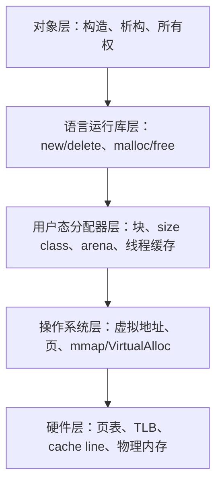
```mermaid
flowchart TB
    A["对象层：构造、析构、所有权"] --> B["语言运行库层：new/delete、malloc/free"]
    B --> C["用户态分配器层：块、size class、arena、线程缓存"]
    C --> D["操作系统层：虚拟地址、页、mmap/VirtualAlloc"]
    D --> E["硬件层：页表、TLB、cache line、物理内存"]
```

这几层回答的是不同问题：

| 层次 | 核心问题 | 常见错误 |
| --- | --- | --- |
| 对象生命周期 | `T` 何时开始、何时结束生命？谁负责结束？ | 忘记析构、重复析构、悬空引用 |
| 分配器 | 从哪一块空闲空间满足请求？如何复用？ | 碎片、元数据损坏、并发竞争 |
| 操作系统 | 哪些虚拟页映射到物理页？何时提交或回收？ | 把虚拟地址空间当成实际常驻内存 |
| 硬件 | 数据怎样进入缓存，多个 CPU 如何保持一致？ | 伪共享、NUMA 远端访问、TLB 压力 |

本文主要讲前两层，也会在多线程章节解释它们怎样与操作系统、CPU 缓存相互影响。

### 1.1 进程地址空间不是一块简单数组

典型进程的虚拟地址空间可以用下面的概念图理解。图中的方向和具体位置受平台、链接方式、ASLR 等影响，不能当成 ABI 保证：

```text
高地址
┌──────────────────────────────────────┐
│ 线程栈：调用帧、部分局部变量          │  通常按需增长
├──────────────────────────────────────┤
│ mmap 区：共享库、文件映射、大块分配    │  地址可能分散
├──────────────────────────────────────┤
│ 未映射区域                            │
├──────────────────────────────────────┤
│ 传统 heap / program break            │  分配器可能从这里取内存
├──────────────────────────────────────┤
│ .bss：零初始化的全局/静态对象         │
│ .data：已初始化的全局/静态对象        │
│ .rodata：只读常量                     │
│ .text：机器指令                       │
└──────────────────────────────────────┘
低地址
```

“堆”在日常讨论中常有两种含义：

1. 狭义上是由 program break 扩展的连续区域。
2. 广义上是动态分配器管理的全部内存，其中也可能包括 `mmap` 得到的独立映射。

因此，不能由“指针是 `malloc` 返回的”推断它一定来自某个连续 heap 区域。现代分配器通常按请求大小和策略选择不同后端。

### 1.2 一次 `new` 到底发生了什么

考虑：

```cpp
Widget* p = new Widget(42);
delete p;
```

概念上的顺序是：

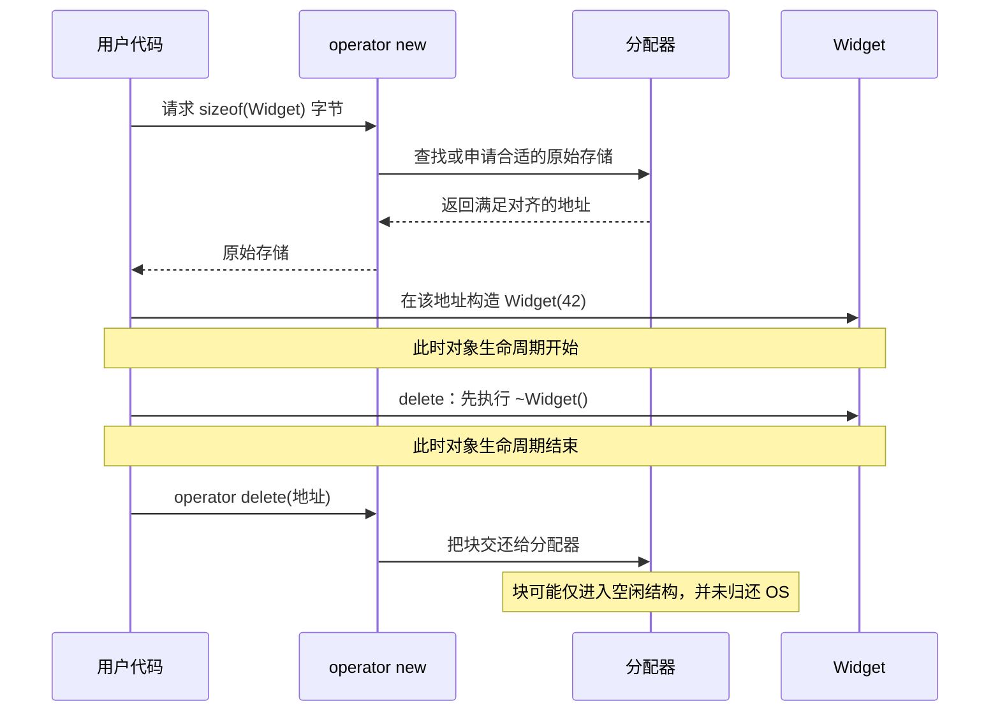
```mermaid
sequenceDiagram
    participant U as 用户代码
    participant N as operator new
    participant A as 分配器
    participant W as Widget
    U->>N: 请求 sizeof(Widget) 字节
    N->>A: 查找或申请合适的原始存储
    A-->>N: 返回满足对齐的地址
    N-->>U: 原始存储
    U->>W: 在该地址构造 Widget(42)
    Note over U,W: 此时对象生命周期开始
    U->>W: delete：先执行 ~Widget()
    Note over U,W: 此时对象生命周期结束
    U->>N: operator delete(地址)
    N->>A: 把块交还给分配器
    Note over A: 块可能仅进入空闲结构，并未归还 OS
```

若构造函数抛异常，语言会自动调用与这次 `new` 匹配的 `operator delete`，归还刚取得的原始存储。这也是“内存分配成功”与“对象构造成功”必须分开思考的原因。

### 1.3 栈、动态存储期与对象位置

常见内存区域及生命周期如下：

| 区域或来源 | 典型内容 | 谁管理存储 | 对象何时销毁 |
| --- | --- | --- | --- |
| 自动存储期 | 普通局部对象 | 编译器生成的作用域代码 | 离开作用域时 |
| 动态存储期 | `new`、`malloc` 所得存储 | 分配器与程序 | 显式释放或 RAII 包装器析构时 |
| 静态存储期 | 全局对象、命名空间变量、`static` 对象 | 加载器/运行库 | 程序结束阶段 |
| 线程存储期 | `thread_local` 对象 | 运行库 | 对应线程结束时 |

“局部变量一定在栈上”只是常见实现图景，不是理解 C++ 语义的最好方式。优化器可能把变量放进寄存器、消除对象，甚至完全不产生可观察存储。写代码时应先依据**存储期与所有权**推理，再在性能分析时研究真实布局。

### 1.4 三个必须分开的概念

原始存储、对象生命周期和资源所有权不是同一件事：

```text
原始存储：一段满足大小与对齐要求的字节
对象生命：某个 T 已在这段存储上被构造，允许按 T 使用
所有权  ：谁必须在最后执行析构并归还存储
```

例如对象池可以长期拥有一批原始存储，而其中某个 `T` 只在 `create()` 到 `destroy()` 之间存活。`destroy()` 之后，地址仍属于池，但已不能再按 `T` 读取。

### 1.5 初学者常见误解

**误解一：`malloc` 每次都直接进入内核。**

通常用户态分配器先向操作系统取得较大区域，再自行切分。命中线程缓存的小对象分配甚至可能只涉及几次指针操作。

**误解二：`free` 会立刻降低进程占用。**

`free` 通常只让块重新可供分配器使用。一个页只有在满足分配器回收条件时，才可能通过取消映射、丢弃物理页等方式返还给系统。进程指标中的虚拟大小、驻留集大小和分配器统计值也不是同一个量。

**误解三：`new` 等于“类型化的 malloc”。**

`new` 表达“取得存储并开始对象生命”，还具有构造失败清理、重载、对齐等语言规则；`malloc` 只提供原始存储。二者不能随意交叉释放。

**误解四：池一定更快。**

池化会把通用分配器的成本换成预留内存、生命周期约束、回收策略和维护复杂度。只有分配确实是瓶颈、对象分布适合池化且基准测试有收益时，这笔交换才合理。

---

## 2. 堆分配器要解决的问题

把分配器想成一个“在线空间调度器”：请求按未知顺序到达，释放时间也未知；它必须立刻给出一段连续、对齐、互不重叠的存储，同时尽量兼顾速度、空间和并发扩展性。

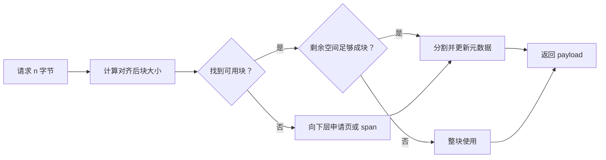
```mermaid
flowchart LR
    R["请求 n 字节"] --> A["计算对齐后块大小"]
    A --> F{"找到可用块？"}
    F -- 是 --> S{"剩余空间足够成块？"}
    S -- 是 --> P["分割并更新元数据"]
    S -- 否 --> W["整块使用"]
    F -- 否 --> O["向下层申请页或 span"]
    O --> P
    P --> Q["返回 payload"]
    W --> Q
```

一个通用分配器至少要同时处理：对齐、块查找、分割、合并、元数据、碎片、并发同步、错误检测和向操作系统申请/归还内存。任何优化都不是免费的：更快的查找通常需要更多索引，更少的锁竞争通常需要更多线程本地缓存。

### 2.1 对齐：地址与步长都必须正确

若对象要求按 `A` 字节对齐，则首地址必须满足：

```text
address mod A = 0
```

当 `A` 是 2 的幂时，常用向上取整公式为：

```cpp
aligned = (n + A - 1) & ~(A - 1);
```

例如 `n = 13, A = 8`：

```text
13 + 7 = 20 = 0b10100
~7          = ...11000
20 & ~7     = 16
```

除了首块地址，数组式内存池的**块步长**也必须是对齐值的倍数。否则第一块对齐，第二块仍可能错位：

```text
基址 0x1000，要求 16B 对齐
错误步长 24：block0 = 0x1000（对齐），block1 = 0x1018（未按 16B 对齐）
正确步长 32：block0 = 0x1000（对齐），block1 = 0x1020（对齐）
```

普通 `malloc` 返回的地址足以放置满足基本对齐要求的类型；对 `alignas(32)`、`alignas(64)` 等过对齐类型，自定义池必须显式采用对齐分配并使用匹配的释放接口。

### 2.2 从请求大小推导真实块大小

设：

- 用户请求为 `R`；
- header 为 `H`；
- footer 为 `F`；
- 对齐为 `A`；
- 最小合法块为 `M`。

教学分配器中可写成：

```text
B = max(M, align_up(H + R + F, A))
```

假设 `R=13, H=8, F=8, A=16, M=32`：

```text
H + R + F = 29
align_up(29, 16) = 32
B = 32
```

因此“请求 13 字节，实际只浪费 3 字节”并不总成立。还要计入块元数据、最小块规则，以及分配器是否让已分配块保留 footer。

### 2.3 内部碎片：已拿到但不能服务其他请求的空间

内部碎片包括对齐填充、size class 向上取整、最小块限制，以及某些统计口径下的元数据。可按场景定义：

```text
内部浪费率 = (分配器占用字节 - 用户请求字节) / 分配器占用字节
```

请求 33 字节进入 48 字节 size class，若暂不计页级余量：

```text
浪费 = 48 - 33 = 15B
浪费率 = 15 / 48 = 31.25%
```

这解释了 size class 的核心权衡：类别越密，平均向上取整浪费越小；类别越多，空闲链表、批量策略和元数据越复杂。

### 2.4 外部碎片：空闲总量足够，连续块却不够

下面总空闲量是 `16 + 32 + 16 = 64B`，但没有一块能满足 `48B` 请求：

```text
┌──────┬──────────┬──────────┬──────────────┬──────┐
│free16│ allocated│  free32  │  allocated   │free16│
└──────┴──────────┴──────────┴──────────────┴──────┘
```

外部碎片取决于**空间上是否相邻**，不是 free list 中是否相邻。链表里挨着的两个节点可能位于完全不同的页，不能合并；只有堆地址连续的相邻块才能 coalesce。分配器文献中的“物理相邻块”通常指块在堆布局中相邻，不是说它们必须映射到连续物理内存页。

常用观察指标之一是：

```text
最大空闲块占比 = largest_free_block / total_free_bytes
```

该值越低，说明空闲空间越零散。但没有单一指标能完整描述碎片，因为未来请求大小分布也会影响“这些空闲块是否有用”。

### 2.5 元数据放在哪里

典型块内元数据：

```text
低地址                                                       高地址
┌────────────┬──────────────────────────────┬─────────┐
│ header     │ payload                      │ padding │
│ size/state │ 返回给用户的区域             │         │
└────────────┴──────────────────────────────┴─────────┘
             ^ 用户指针
```

也可以把元数据放到独立数组或 radix tree 中。两种策略的权衡：

| 方式 | 优点 | 风险或成本 |
| --- | --- | --- |
| 块内 header | 从 payload 很快定位；实现直观 | 用户向前越界可能破坏元数据 |
| 带 footer 的边界标记 | 可在 `O(1)` 时间找到前块大小 | 每块额外空间；写放大 |
| 带外元数据 | 用户溢出较难直接覆盖管理信息 | 需要由地址查元数据；局部性与空间成本 |
| 空闲块复用 payload | 无额外 `next/prev` 区域 | 导致最小空闲块变大 |

### 2.6 时间、空间和局部性的三角权衡

评价分配器不能只看平均 `malloc` 纳秒数：

| 维度 | 应观察什么 |
| --- | --- |
| 时间 | 吞吐量、P50/P99 延迟、最坏扫描长度、锁等待 |
| 空间 | 峰值、活跃字节、保留但空闲字节、内部/外部碎片 |
| 局部性 | cache miss、TLB miss、NUMA 远端访问、工作集大小 |
| 可维护性 | 错误检测、统计能力、平台支持、代码复杂度 |

一个分配器可以通过给每个线程保留大量内存获得很快的局部分配，但同时让进程峰值显著增加。正确的问题不是“哪个最快”，而是“在当前对象大小、线程数、生命周期和延迟目标下，哪组权衡合适”。

---

## 3. C 与 C++ 内存管理接口

### 3.1 C 接口及边界语义

```c
void* malloc(size_t size);
void  free(void* ptr);
void* calloc(size_t count, size_t size);
void* realloc(void* ptr, size_t new_size);
```

理解这些接口要抓住失败和所有权变化：

| 调用 | 成功 | 失败/特殊情况 | 原指针状态 |
| --- | --- | --- | --- |
| `malloc(n)` | 返回至少可容纳 `n` 字节的存储 | 返回空指针；零大小行为不适合拿来写可移植逻辑 | 无原指针 |
| `calloc(k,n)` | 为数组分配，并把字节初始化为全零 | 返回空指针；实现可检测乘法溢出 | 无原指针 |
| `realloc(p,n)` | 可能原地扩缩，也可能搬迁并复制旧内容 | 失败返回空指针，原块仍有效 | 只有成功时旧 `p` 才失效 |
| `free(p)` | 归还由兼容接口获得的块 | `p == NULL` 时无操作 | 释放后 `p` 的数值即使未变，也不能解引用 |

不要直接覆盖 `realloc` 的原指针：

```c
void* tmp = realloc(p, new_size);
if (tmp == NULL) {
    /* p 仍然有效，可决定重试或清理 */
} else {
    p = tmp;
}
```

`calloc` 的“全零字节”不等于对任意 C++ 类型执行了构造，也不应被推广成“所有平台上任意类型的语义零值”。它主要适用于 C 对象表示允许这样初始化的场景。

### 3.2 C++ 把存储与对象生命连接起来

```cpp
T* one = new T(args...);
delete one;

T* many = new T[count];
delete[] many;
```

必须成对匹配：

| 获得方式 | 释放方式 |
| --- | --- |
| `malloc/calloc/realloc` | `free` |
| `new T` | `delete` |
| `new T[n]` | `delete[]` |
| 对齐版 `operator new` | 参数匹配的对齐版 `operator delete` |

数组形式可能需要记录元素数量，以便逆序调用析构函数；具体元数据布局由实现决定。正因如此，`new[]` 与 `delete` 不匹配不是“小泄漏”，而是未定义行为。

多数业务代码应先选拥有明确所有权的封装：

```cpp
auto one = std::make_unique<T>(args...);
auto many = std::make_unique<T[]>(count);
auto shared = std::make_shared<T>(args...); // 只有确实共享所有权时
std::vector<T> values(count);               // 动态数组通常首选
```

### 3.3 placement new 与显式生命周期

placement new 不分配内存，只在给定地址开始对象生命：

```cpp
#include <cstddef>
#include <memory>
#include <new>

struct Record {
    explicit Record(int id) : id(id) {}
    int id;
};

alignas(Record) std::byte storage[sizeof(Record)];

Record* p = std::construct_at(
    reinterpret_cast<Record*>(storage), 42);

// p 可在这里按 Record 使用。

std::destroy_at(p);
// storage 仍存在，但 Record 的生命周期已经结束。
```

`std::construct_at`/`std::destroy_at`（C++20）比直接写 placement new 和显式析构更清楚地表达意图。必须保证：

1. 地址满足 `alignof(T)`。
2. 可用空间至少为 `sizeof(T)`。
3. 该位置没有仍然存活且会冲突的对象。
4. 构造出的对象只析构一次。
5. 底层存储在对象整个生命期内有效。

这五条正是对象池实现的基本不变量。

### 3.4 RAII：把清理放进类型系统

RAII 不是“智能指针的别名”，而是一条设计规则：资源获取成功后，立刻交给一个析构函数能够正确释放它的对象。

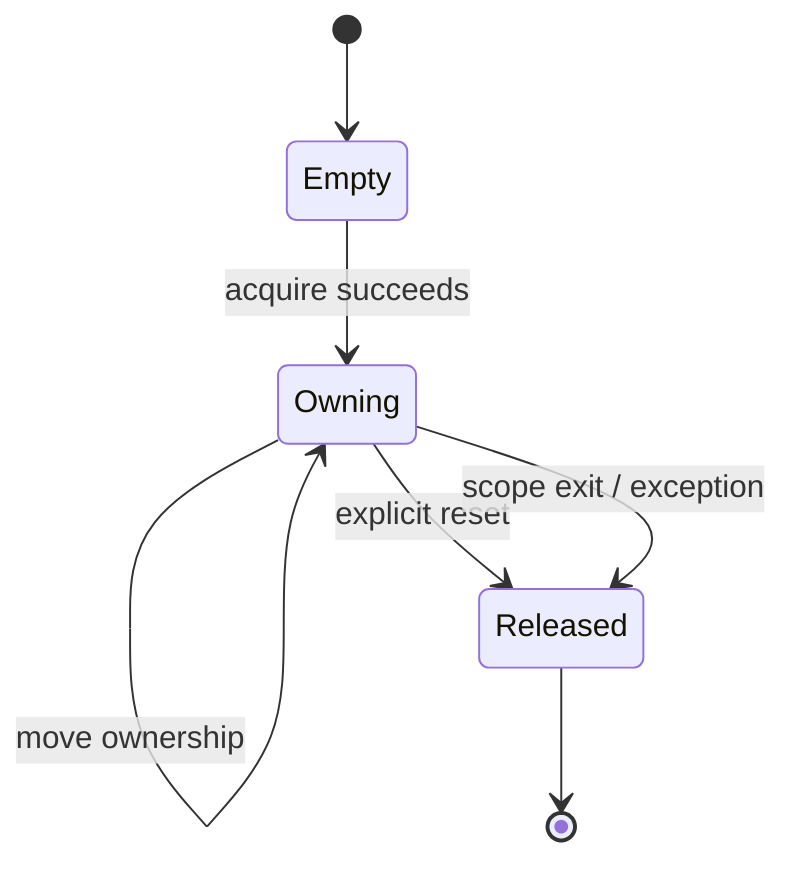
```mermaid
stateDiagram-v2
    [*] --> Empty
    Empty --> Owning: acquire succeeds
    Owning --> Owning: move ownership
    Owning --> Released: explicit reset
    Owning --> Released: scope exit / exception
    Released --> [*]
```

手工代码有多个退出路径时，清理容易遗漏：

```cpp
void process() {
    FILE* f = std::fopen("data.bin", "rb");
    if (!f) return;

    // 中间每个 return 和异常路径都必须记住 fclose。
    std::fclose(f);
}
```

RAII 包装后，正常返回和异常展开走同一条析构路径。内存池也应返回 RAII handle，而不是把“记得归还”作为调用者纪律。

### 3.5 所有权先于指针类型

看到一个 `T*`，无法判断它是拥有者、借用者，还是指向池内对象。设计接口前应先回答：

```text
唯一拥有？        -> unique_ptr 或值语义
共享拥有？        -> shared_ptr，但先确认真的需要共享生命周期
只在调用期间借用？-> T&, const T&, span, string_view 等
可能为空的借用？  -> T*，并明确不转移所有权
由池归还？        -> 带池 deleter 的 unique_ptr / 专用 handle
```

内存错误经常不是“不会调用 `delete`”，而是接口从未表达谁应该调用它。

---

## 4. 内存池的核心思想

内存池不是凭空消除分配成本，而是把成本从“每次请求”搬到“较少发生的批量扩容”：

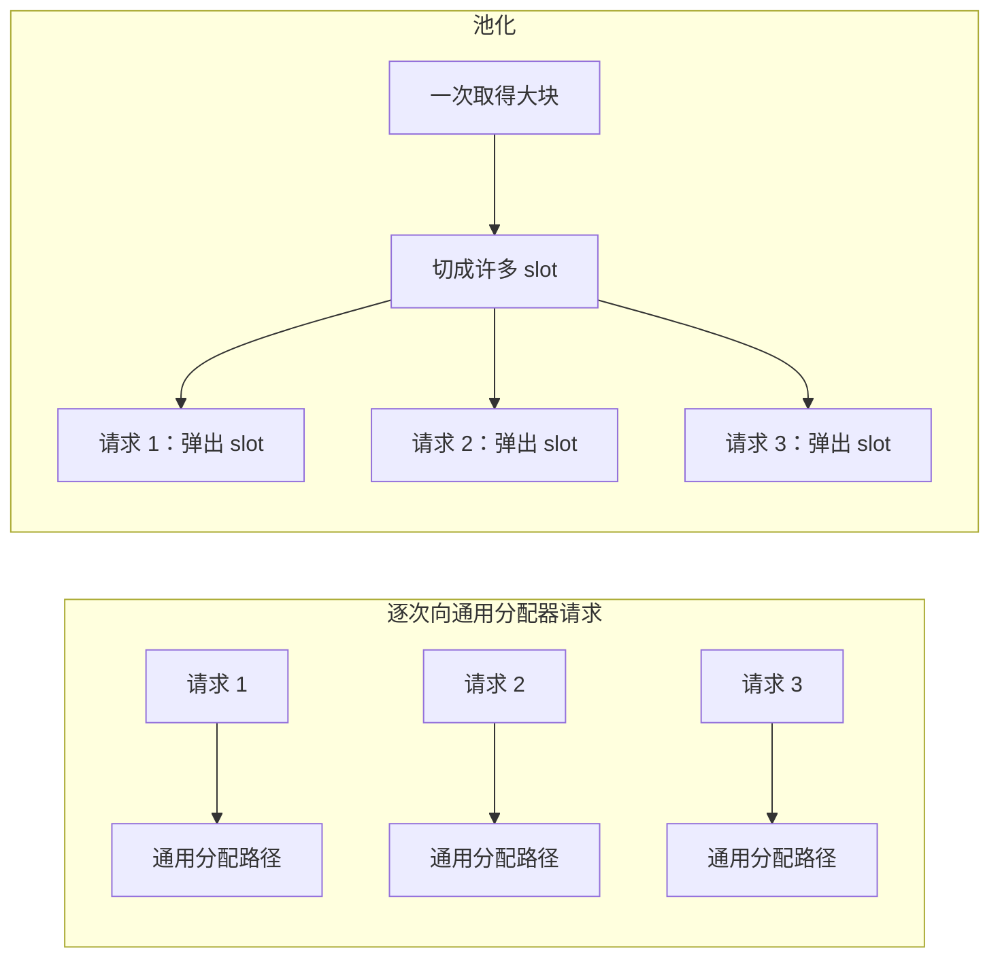
```mermaid
flowchart LR
    subgraph Without["逐次向通用分配器请求"]
        A1["请求 1"] --> G1["通用分配路径"]
        A2["请求 2"] --> G2["通用分配路径"]
        A3["请求 3"] --> G3["通用分配路径"]
    end
    subgraph With["池化"]
        B1["一次取得大块"] --> C["切成许多 slot"]
        C --> D1["请求 1：弹出 slot"]
        C --> D2["请求 2：弹出 slot"]
        C --> D3["请求 3：弹出 slot"]
    end
```

池化主要利用三个已知条件：

1. **大小规律**：对象相同大小，或可以归入少量 size class。
2. **生命周期规律**：可以单独归还，或一批对象一起结束。
3. **所有权规律**：能够判断对象属于哪个池、由谁归还、池何时销毁。

若这三个条件都不存在，池就会逐渐重新实现一个通用分配器，却没有成熟实现多年的测试与诊断能力。

### 4.1 池保存的到底是什么

要区分两种状态：

```text
free slot：只有原始存储，slot 中可暂存 free-list 指针
live slot：原始存储上已有对象，必须先析构才能重新成为 free slot
```

slot 状态机：

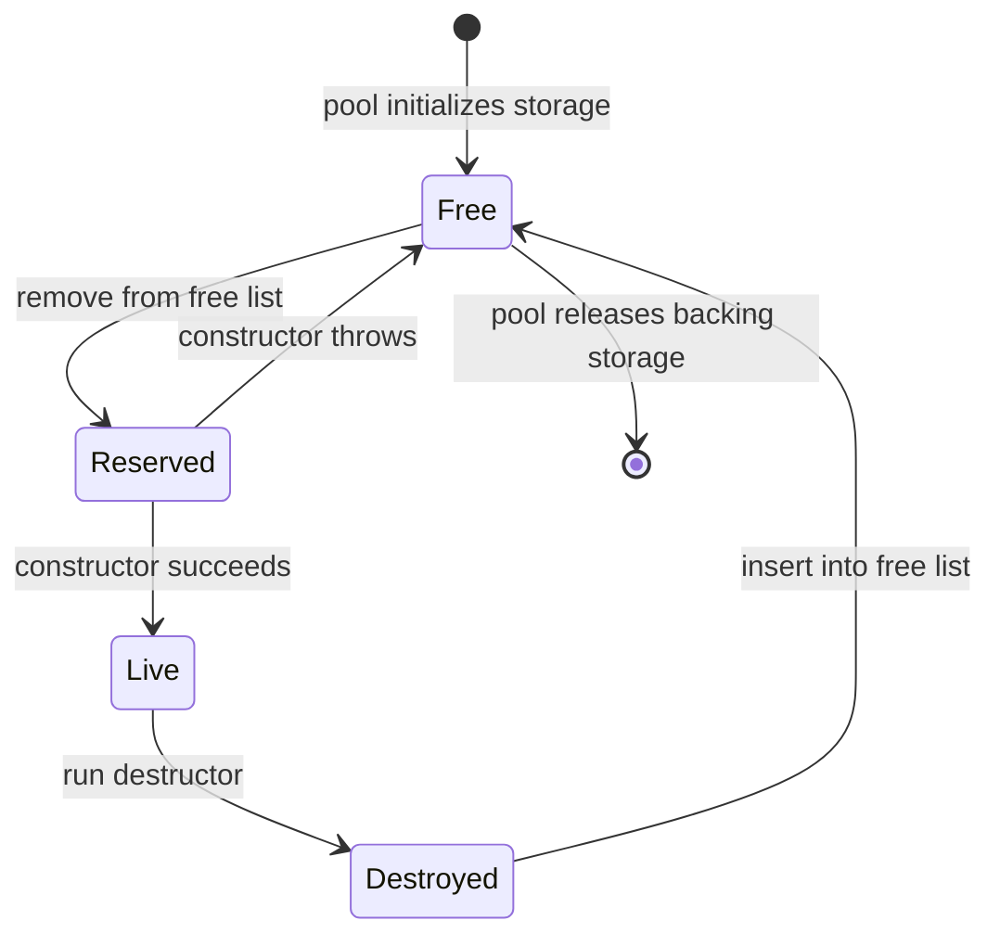
```mermaid
stateDiagram-v2
    [*] --> Free: pool initializes storage
    Free --> Reserved: remove from free list
    Reserved --> Live: constructor succeeds
    Reserved --> Free: constructor throws
    Live --> Destroyed: run destructor
    Destroyed --> Free: insert into free list
    Free --> [*]: pool releases backing storage
```

只管理 `Free <-> Reserved` 的组件是内存池；同时负责 `Live` 状态和构造/析构的组件才是对象池。

### 4.2 内存池的典型收益

典型收益不是抽象的“更快”，而是：

- 把多次下层分配合并成少数批量申请。
- 固定块 free list 的热路径可降为 `O(1)` 的链表头操作。
- 同一批对象地址接近，遍历时更可能命中相同页面与缓存。
- 固定 slot 不再为每个小对象重复保存通用块大小等元数据。
- arena 可以用一次 `release()` 代替成千上万次单对象释放。
- 业务可以设定硬容量、统计峰值，并在耗尽时选择失败、扩容或回退。

一个简单成本模型是：

```text
不池化总成本 ≈ N × 通用分配成本
池化总成本   ≈ K × 批量申请成本 + N × 本地 slot 操作 + 维护成本
```

其中 `K << N` 时池化才有潜在优势；如果 `N` 很小，维护成本可能反而占主导。

### 4.3 内存池的典型风险

| 风险 | 根因 | 工程对策 |
| --- | --- | --- |
| 错池释放 | 裸 `void*` 不携带来源 | debug 模式检查地址范围和 slot 边界；使用专用 handle |
| 重复释放 | slot 被插入 free list 两次 | debug bitmap/状态字；归还后让调用端句柄失效 |
| 池先销毁 | handle 中只保存池裸指针 | 明确 pool 必须长寿；或让控制块共享池生命周期 |
| 构造遗漏清理 | 先弹 slot，构造再抛异常 | catch 后把 slot 放回；保持强不变量 |
| 峰值偏高 | 每个线程/类别都保留余量 | 设置上限、批量归还、周期性回收空闲 span |
| 性能倒退 | 增加间接层、随机访问或锁 | 用真实请求分布做基准，不只测单线程 tight loop |
| 对齐错误 | 只对齐基址，没有对齐 stride | 同时约束基址、步长、slot 大小 |

### 4.4 设计池之前先写出六个答案

```text
1. 最小、典型、最大请求大小分别是多少？
2. 同时存活对象峰值是多少？是否存在突发峰值？
3. 对象由哪个线程创建、哪个线程销毁？
4. 池耗尽时：失败、扩容，还是回退到上游？
5. 池销毁时仍有活对象怎么办？
6. 如何检测错池释放、重复释放和泄漏？
```

没有这些答案时，先使用标准分配器并采集数据，比直接设计池更可靠。

---

## 5. 固定大小块内存池

固定大小块池适用于所有请求大小相同，或上层已经把请求归入某个固定 size class 的情况。它的价值在于把“寻找合适大小”这一步彻底消除。

### 5.1 基本结构

假设 slot 步长为 64B，共 5 个 slot，`slot1` 与 `slot3` 正在使用：

```text
连续后备存储
┌────────┬────────┬────────┬────────┬────────┐
│ slot0  │ slot1  │ slot2  │ slot3  │ slot4  │
│ free   │ live   │ free   │ live   │ free   │
└────────┴────────┴────────┴────────┴────────┘
    │                   │                   │
    └──────────────┐    └──────────────┐    │
                   ▼                   ▼    ▼
free_head ──────> slot2 ────────────> slot0 ─────> slot4 ──> null
```

free list 的顺序无需等于地址顺序。分配和释放只改链表头：

```cpp
// pop
node = free_head;
free_head = node->next;

// push
node->next = free_head;
free_head = node;
```

它们都是 `O(1)`，但在非线程安全版本中，这两组操作必须被视为不可被其他线程交错修改的临界状态。

### 5.2 为什么空闲块可以存 next 指针

一个空闲 slot 上没有存活的用户对象，因此它的前几个字节可以暂时承载链表节点：

```cpp
struct FreeNode {
    FreeNode* next;
};
```

但这会产生两个硬约束：

```text
slot_size  >= sizeof(FreeNode)
slot_align >= alignof(FreeNode)
```

若用户请求 1 字节而池仍把步长设成 1，写入 `next` 就会覆盖后续 slot。原始实现中最容易漏掉的正是这个边界。

slot 的两个阶段如下：

```text
空闲时：┌──────────────────────────────┐
        │ next 指针 │ 未使用字节        │
        └──────────────────────────────┘

借出后：┌──────────────────────────────┐
        │ 调用方可用的原始存储          │
        └──────────────────────────────┘
```

若调用方在 slot 上构造 `T`，归还给内存池前必须先结束 `T` 的生命周期。原始字节池无法替调用方猜测其中是否存在活对象。

### 5.3 简化实现骨架

下面的 C++20 教学实现修复了最小 slot、步长、过对齐和乘法溢出问题。它仍故意不提供并发安全和自动扩容，这让每条不变量保持可见。

```cpp
#include <algorithm>
#include <cassert>
#include <cstddef>
#include <cstdint>
#include <limits>
#include <memory>
#include <new>
#include <stdexcept>

class FixedBlockPool {
public:
    FixedBlockPool(std::size_t requested_size,
                   std::size_t block_count,
                   std::size_t requested_alignment = alignof(std::max_align_t))
        : alignment_(std::max(requested_alignment, alignof(FreeNode))),
          block_count_(block_count) {
        if (requested_size == 0 || block_count_ == 0 ||
            !is_power_of_two(requested_alignment)) {
            throw std::invalid_argument("invalid pool geometry");
        }

        const std::size_t payload_or_node =
            std::max(requested_size, sizeof(FreeNode));
        stride_ = align_up(payload_or_node, alignment_);

        if (block_count_ > std::numeric_limits<std::size_t>::max() / stride_) {
            throw std::bad_array_new_length();
        }

        const std::size_t bytes = stride_ * block_count_;
        buffer_ = static_cast<std::byte*>(
            ::operator new(bytes, std::align_val_t{alignment_}));

        free_list_ = nullptr;
        for (std::size_t i = 0; i < block_count_; ++i) {
            auto* node = std::construct_at(
                reinterpret_cast<FreeNode*>(buffer_ + i * stride_),
                FreeNode{free_list_});
            free_list_ = node;
        }
    }

    ~FixedBlockPool() {
        ::operator delete(buffer_, std::align_val_t{alignment_});
    }

    FixedBlockPool(const FixedBlockPool&) = delete;
    FixedBlockPool& operator=(const FixedBlockPool&) = delete;
    FixedBlockPool(FixedBlockPool&&) = delete;
    FixedBlockPool& operator=(FixedBlockPool&&) = delete;

    void* allocate() {
        if (!free_list_) {
            throw std::bad_alloc();
        }
        FreeNode* node = free_list_;
        free_list_ = node->next;
        std::destroy_at(node); // 这段存储不再承载 FreeNode。
        return node;
    }

    void deallocate(void* p) noexcept {
        if (!p) {
            return;
        }

        // 发布版本通常把错误释放视为调用方违反契约；debug 版本应保留检查。
        assert(owns(p) && "pointer does not point to a slot boundary");
        auto* node = std::construct_at(
            static_cast<FreeNode*>(p), FreeNode{free_list_});
        free_list_ = node;
    }

    [[nodiscard]] bool owns(const void* p) const noexcept {
        if (!p) {
            return false;
        }
        const auto base = reinterpret_cast<std::uintptr_t>(buffer_);
        const auto address = reinterpret_cast<std::uintptr_t>(p);
        const std::size_t bytes = stride_ * block_count_;
        return address >= base &&
               static_cast<std::size_t>(address - base) < bytes &&
               static_cast<std::size_t>(address - base) % stride_ == 0;
    }

    [[nodiscard]] std::size_t stride() const noexcept { return stride_; }

private:
    struct FreeNode {
        FreeNode* next;
    };

    static bool is_power_of_two(std::size_t n) noexcept {
        return n != 0 && (n & (n - 1)) == 0;
    }

    static std::size_t align_up(std::size_t n, std::size_t alignment) {
        if (n > std::numeric_limits<std::size_t>::max() - (alignment - 1)) {
            throw std::bad_array_new_length();
        }
        return (n + alignment - 1) & ~(alignment - 1);
    }

    std::size_t alignment_;
    std::size_t block_count_;
    std::size_t stride_{};
    std::byte* buffer_{};
    FreeNode* free_list_{};
};
```

逐行理解关键路径：

1. `alignment_` 至少能对齐 `FreeNode`。
2. `stride_` 同时容得下用户请求和 `FreeNode`，再向上对齐。
3. 后备存储用带对齐参数的 `operator new` 获得，析构时必须用匹配的重载释放。
4. 初始化阶段在每个 slot 上开始 `FreeNode` 的生命周期。
5. `allocate()` 弹出节点并结束 `FreeNode` 生命，随后该 slot 是原始存储。
6. `deallocate()` 在同一地址重新构造 `FreeNode`，再压回链表。

使用示例：

```cpp
struct alignas(32) Packet {
    int id;
    std::byte payload[28];
};

FixedBlockPool pool(sizeof(Packet), 128, alignof(Packet));

void* raw = pool.allocate();
Packet* packet = std::construct_at(static_cast<Packet*>(raw), Packet{7, {}});

// 使用 packet ...

std::destroy_at(packet);
pool.deallocate(packet);
```

注意顺序是“析构对象，再归还原始存储”，不能反过来。

### 5.4 这个实现缺什么

上面已经处理所有权范围、对齐和溢出，但仍是教学骨架：

| 缺失能力 | 为什么不能顺手加一行解决 |
| --- | --- |
| 重复释放检测 | 只检查地址属于池不够；需要每个 slot 的状态位或遍历 free list |
| 并发安全 | 给链表头加原子并不能自动解决 ABA、回收和内存上限 |
| 扩容 | 多个 chunk 后，`owns()`、销毁和空闲 span 回收都要改成分层结构 |
| 活跃块统计 | 计数器在并发下会引入共享写；需决定是否精确 |
| 泄漏报告 | 原始内存池不知道 slot 上是什么类型，也不能替用户析构 |
| guard/canary | 会改变 slot 布局和性能，应仅用于诊断配置 |

debug 版可以维护一个 `block_count` 位的 bitmap：分配时把位从 0 改 1，释放时要求从 1 改 0。这样能以较低成本检测重复释放，但生产版是否保留取决于可靠性与性能要求。

### 5.5 固定块内存池的复杂度

| 操作 | 时间复杂度 | 触碰的数据 |
| --- | --- | --- |
| 初始化 | `O(n)` | 每个 slot 一次 |
| 分配 | `O(1)` | free-list 头与一个节点 |
| 释放 | `O(1)` | free-list 头与归还节点 |
| 所属检查 | `O(1)` | 只做范围和模运算 |
| debug 位图检查 | `O(1)` | 对应状态位；并发时可能产生竞争 |

池容量为 `N`、步长为 `S` 时，后备存储是 `N × S`。若典型请求为 `R`，仅考虑 slot 取整的最坏预留浪费约为 `N × (S-R)`。这能帮助你在“选择 48B 还是 64B class”时进行量化，而不是凭感觉。

### 5.6 用不变量测试，而不只测能否分配

最小测试集应覆盖：

```text
容量：连续成功 N 次，第 N+1 次按约定失败；归还后可再次成功。
唯一性：同时借出的地址两两不同。
边界：requested_size = 1 仍不会覆盖相邻 slot。
对齐：每个返回地址 % requested_alignment == 0。
所属：池外地址、slot 内部地址都不通过 owns()。
生命周期：对象析构后才归还；构造抛异常时 slot 不丢失。
压力：随机 allocate/deallocate 后，最终可重新借出全部 N 个 slot。
```

固定块池真正值得学习的不是几十行链表代码，而是：**先写不变量，再让布局和状态转换证明这些不变量始终成立。**

---

## 6. 可变大小内存池

当请求大小可变时，困难不再是“有没有空闲 slot”，而是“应该从哪个空闲区域切、剩余部分如何管理”。经典模型可以按决策方式分类：

| 模型 | 如何决定块 | 单块释放 | 主要优势 | 主要代价 |
| --- | --- | --- | --- | --- |
| 单一空闲链表 | 扫描并比较块大小 | 支持 | 最直观 | 查找慢、碎片敏感 |
| 分离空闲链表 | 先按大小定位链表 | 支持 | 小对象查找快 | class 设计复杂 |
| Buddy | 向上取整到 2 的幂并递归二分 | 支持 | 合并伙伴快 | 内部碎片较大 |
| Slab/size class | 页组专门服务一种对象/大小 | 支持 | 局部性和吞吐量好 | 跨层回收复杂 |
| Arena | bump pointer 顺序切分 | 通常不支持 | 极简、极快 | 生命周期必须成批结束 |

选择模型的第一问不是“哪个算法高级”，而是对象生命周期是否允许放弃单块释放。若允许，arena 通常是最简单的答案；若不允许，再研究空闲块如何索引。

### 6.1 单一空闲链表

假设按地址有四个空闲块：

```text
free list: [24] -> [80] -> [40] -> [128] -> null
请求块大小：36
```

- first-fit 跳过 24，选择 80，速度取决于首次命中的位置。
- best-fit 扫描全部候选后选择 40，剩余 4 可能小到无法成块。
- next-fit 从上次停留位置开始，避免总在表头堆积扫描，但结果依赖历史。

best-fit 名字听起来最节省空间，却不保证全局碎片最少。它留下的“最小余量”如果小于最小合法块，可能变成无法复用的碎片；而使用稍大的块，有时会留下一个更有价值的中等空闲块。分配问题是在线问题，当前最优不等于未来最优。

如果链表按地址排序，释放后更容易检查邻居并合并；如果采用 LIFO 插入，释放是 `O(1)` 且刚释放的块缓存更热。组织顺序本身也是时间、碎片与局部性的权衡。

### 6.2 分离空闲链表

分离空闲链表先把搜索空间按大小划分：

```text
index 0: [16,  31]  -> free blocks ...
index 1: [32,  63]  -> free blocks ...
index 2: [64, 127]  -> free blocks ...
index 3: [128,255]  -> free blocks ...
index 4: [256, +∞)  -> free blocks ...
```

请求调整后为 56B：

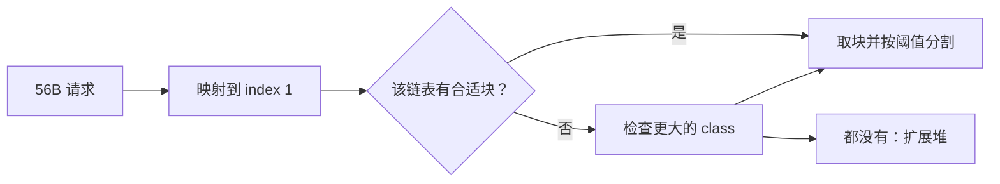
```mermaid
flowchart LR
    R["56B 请求"] --> I["映射到 index 1"]
    I --> C{"该链表有合适块？"}
    C -- 是 --> P["取块并按阈值分割"]
    C -- 否 --> N["检查更大的 class"]
    N --> P
    N --> E["都没有：扩展堆"]
```

有两类常见 class：

1. **精确 class**：链表中的块大小相同，取表头即可，适合小对象。
2. **范围 class**：链表只是一个大小区间，表内仍需 first-fit/best-fit，适合较大块。

线性 class（例如每 8B 一级）内部浪费小但类别多；指数 class（16、32、64、128）索引简单但最坏接近 50% 的取整浪费。实际分配器常在小尺寸使用较密间隔，尺寸增大后逐渐拉宽。

class 映射函数必须与边界完全一致：请求 32B 究竟进 `[16,32]` 还是 `[32,64)`，分配与释放路径必须得到同一答案，否则块会被放进错误链表。

### 6.3 Buddy 分配

Buddy 系统管理 `2^k` 大小的块。一个 order 为 `k` 的块只能拆成两个 order 为 `k-1` 的伙伴：

```text
初始 1024B（order 10）
┌──────────────────────────────────────────────────────────┐
│                         1024                             │
└──────────────────────────────────────────────────────────┘

拆一次
┌────────────────────────────┬─────────────────────────────┐
│            512             │             512             │
└────────────────────────────┴─────────────────────────────┘

左半再拆
┌──────────────┬─────────────┬─────────────────────────────┐
│     256      │     256     │             512             │
└──────────────┴─────────────┴─────────────────────────────┘
```

请求 200B 的过程：

1. 计算最小可容纳它的 order：`ceil(log2(200)) = 8`，即 256B。
2. 若 order 8 链表为空，就从更高 order 取得一块。
3. 每次二分，把暂时不用的另一半放进低一级空闲链表。
4. 返回 256B 块；此处仅取整就产生 56B 内部余量。

若区域基址满足对齐，块相对区域起点的偏移为 `offset`，大小为 `2^k`，伙伴偏移可由：

```text
buddy_offset = offset XOR 2^k
```

例：大小 256（`0x100`）的块位于偏移 `0x200`，伙伴是：

```text
0x200 XOR 0x100 = 0x300
```

释放时只有“伙伴同样空闲且 order 相同”才能合并。若伙伴已分配，或已经拆得更小，就停止合并。

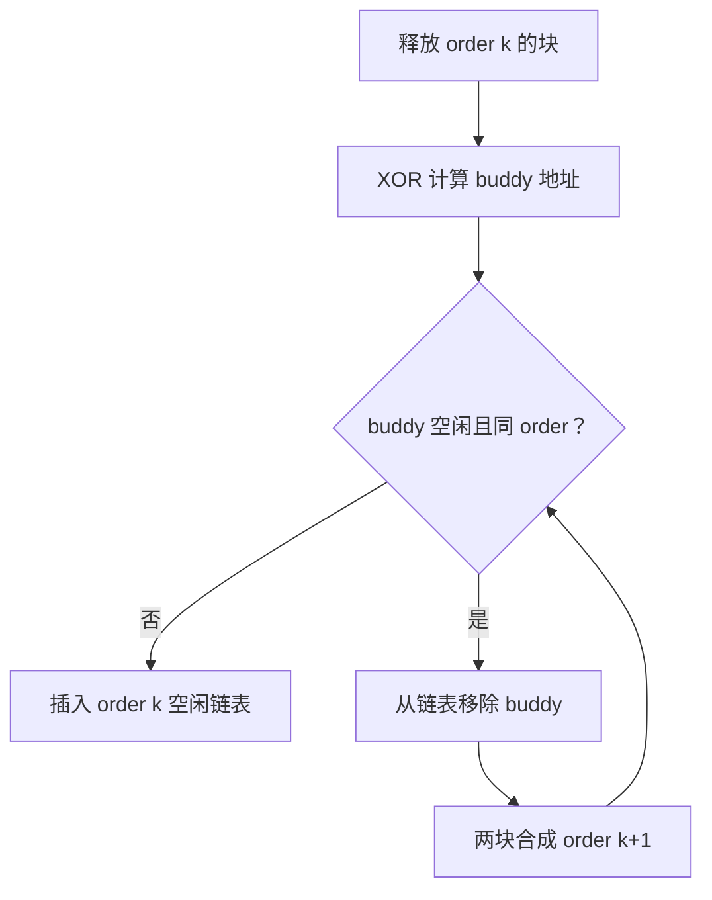
```mermaid
flowchart TD
    F["释放 order k 的块"] --> B["XOR 计算 buddy 地址"]
    B --> Q{"buddy 空闲且同 order？"}
    Q -- 否 --> L["插入 order k 空闲链表"]
    Q -- 是 --> R["从链表移除 buddy"]
    R --> M["两块合成 order k+1"]
    M --> Q
```

Buddy 的合并是高效且确定的，但请求刚超过 2 的幂边界时浪费明显，例如 513B 需要 1024B。它更适合页、较大块或对可预测合并比紧凑装箱更重要的场景。

### 6.4 Slab / size class 思路

Slab 的核心不是简单地“再放几个链表”，而是让一组页在一段时间内专门服务某种对象或 size class：

```text
64B size class
                     一个 span：4 页
             ┌───────────────────────────────┐
             │64│64│64│64│64│64│ ... │64│64│
             └───────────────────────────────┘
状态可能为： empty / partial / full
```

分配时优先从 `partial` span 取 slot；span 用满后移入 `full` 集合；释放让 full 变 partial；当 span 完全空闲时，才有机会把整组页返还给页级分配器。

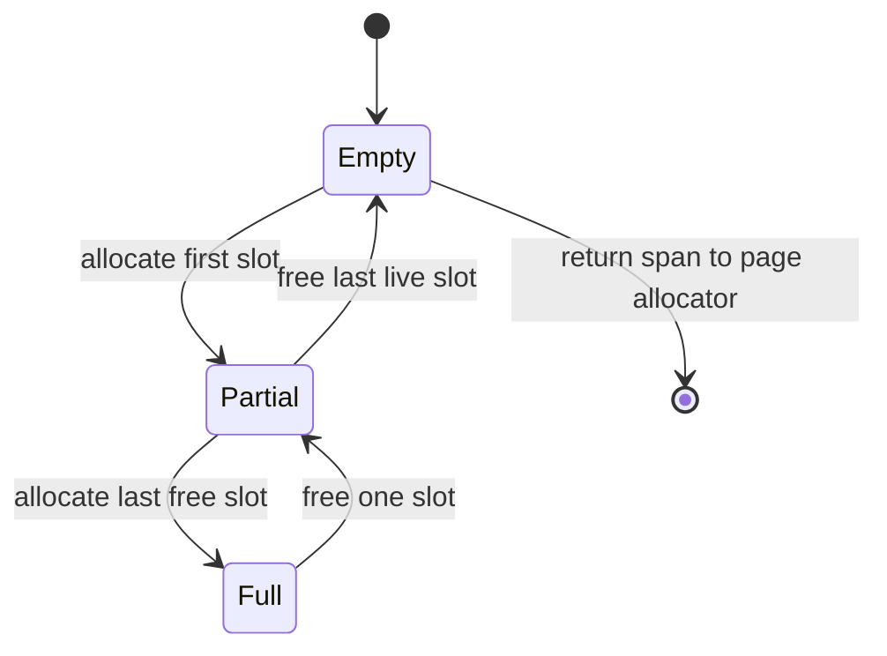
```mermaid
stateDiagram-v2
    [*] --> Empty
    Empty --> Partial: allocate first slot
    Partial --> Full: allocate last free slot
    Full --> Partial: free one slot
    Partial --> Empty: free last live slot
    Empty --> [*]: return span to page allocator
```

对象专用 slab 还可缓存构造准备工作或保存类型特定信息；通用 size-class allocator 通常只承诺字节大小与对齐，不知道对象类型。两者思想相关，但不要把“原始块复用”和“活对象状态复用”混为一谈。

一个 span 大小的设计例子：假设页为 4096B，class 为 96B。

```text
1 页可放 floor(4096 / 96) = 42 个对象，余 64B
利用率 = 42 × 96 / 4096 ≈ 98.44%
```

但还要考虑 span 元数据是否带外、slot 对齐和批量搬运数量。某些 class 用多页 span，正是为了让切分余数比例更合理。

### 6.5 区域分配器 Arena

Arena 把“每个对象何时释放”改写为“整个区域何时失效”。基本模型只有当前游标：

```text
base                                                    end
 │                                                       │
 ▼                                                       ▼
┌──────────────────────────────┬──────────────────────────┐
│ 已分配区域                    │ 尚未使用                 │
└──────────────────────────────┴──────────────────────────┘
                               ▲
                             current
```

由于每次请求的对齐可能不同，应先对齐**地址**，再检查容量：

```cpp
#include <cstddef>
#include <memory>
#include <new>
#include <stdexcept>

class BumpArena {
public:
    BumpArena(void* buffer, std::size_t capacity)
        : begin_(static_cast<std::byte*>(buffer)),
          current_(begin_),
          end_(begin_ + capacity) {}

    void* allocate(std::size_t bytes, std::size_t alignment) {
        if (bytes == 0 || alignment == 0 ||
            (alignment & (alignment - 1)) != 0) {
            throw std::invalid_argument("invalid arena request");
        }

        void* candidate = current_;
        std::size_t space = static_cast<std::size_t>(end_ - current_);
        if (std::align(alignment, bytes, candidate, space) == nullptr) {
            throw std::bad_alloc();
        }

        current_ = static_cast<std::byte*>(candidate) + bytes;
        return candidate;
    }

    void reset() noexcept { current_ = begin_; }
    [[nodiscard]] std::size_t used() const noexcept {
        return static_cast<std::size_t>(current_ - begin_);
    }

private:
    std::byte* begin_;
    std::byte* current_;
    std::byte* end_;
};
```

上例只管理原始存储，`reset()` **不会调用其中对象的析构函数**。因此有三种安全用法：

1. 只放置平凡可析构的临时数据。
2. 上层另存析构回调栈，reset 前逆序执行。
3. 使用 PMR 容器，并确保容器对象先析构、resource 后释放。

checkpoint 可以实现栈式回滚：保存 `current`，完成子任务后恢复到该位置。但只有 checkpoint 之后的对象都已结束生命周期时才能回滚。

Arena 适合编译器一次解析产生的 AST、一次请求内的临时对象、游戏单帧临时数据。它不适合长短生命周期交错：一个长寿对象夹在大量短寿对象之间，会让整片区域都无法回收。

### 6.6 用请求轨迹比较模型

设请求轨迹为：

```text
alloc A=24, alloc B=200, alloc C=40, free B, alloc D=180, free A/C/D
```

- 固定块池需要至少三个 class，或浪费大量空间。
- 分离链表可让 D 复用 B 留下的块，但要处理分割边界。
- Buddy 让 B/D 都进入 256B order，复用简单但内部余量较大。
- Arena 在 `free B` 时不能回收；若 A/B/C/D 同批结束，则末尾一次 reset 最合适。

判断模型的关键不是单个请求，而是完整的**大小分布 + 生命周期轨迹 + 线程流转**。

---

## 7. 对象池的经典方案

对象池 = 原始存储池 + 类型 `T` 的生命周期协议。它必须保证：

```text
I1. 一个 live slot 上恰好有一个 T。
I2. 一个 free slot 上没有 T，可以承载 FreeNode。
I3. 同一个 slot 不会同时出现在 free list 和调用方手中。
I4. 构造抛异常后，slot 数量不减少。
I5. 每个成功构造的 T 恰好析构一次。
```

这五条不变量比“复用对象所以更快”更重要。池代码的每一行，都应能说明它维护了哪条不变量。

### 7.1 预构造对象池

初始化时构造全部 `T`，借出和归还期间对象生命一直没有结束：

```text
池初始化             acquire              release              池销毁
   │                    │                    │                    │
   ├─ 构造 T ───────────┼─ 修改状态 ─────────┼─ reset 状态 ────────┤
   │                    │                    │                    └─ 析构 T
   └──────────────────── 对象始终存活 ────────────────────────────┘
```

它只在以下条件下合理：

- `T` 的构造建立了昂贵且可以复用的资源，例如预分配缓冲区。
- `reset()` 有完整、可测试的状态定义。
- 池内对象即使闲置也可安全持有外部资源。
- 容量上限明确，提前构造不会造成不可接受的启动或峰值成本。

“构造昂贵”本身不是理由。如果 `reset()` 最终清空并重新建立了几乎全部状态，它可能与重新构造一样贵，却更容易残留上次使用的数据。

### 7.2 延迟构造对象池

延迟构造池只预留 slot。借出时构造，归还时析构，因此复用的是地址，不是对象状态：

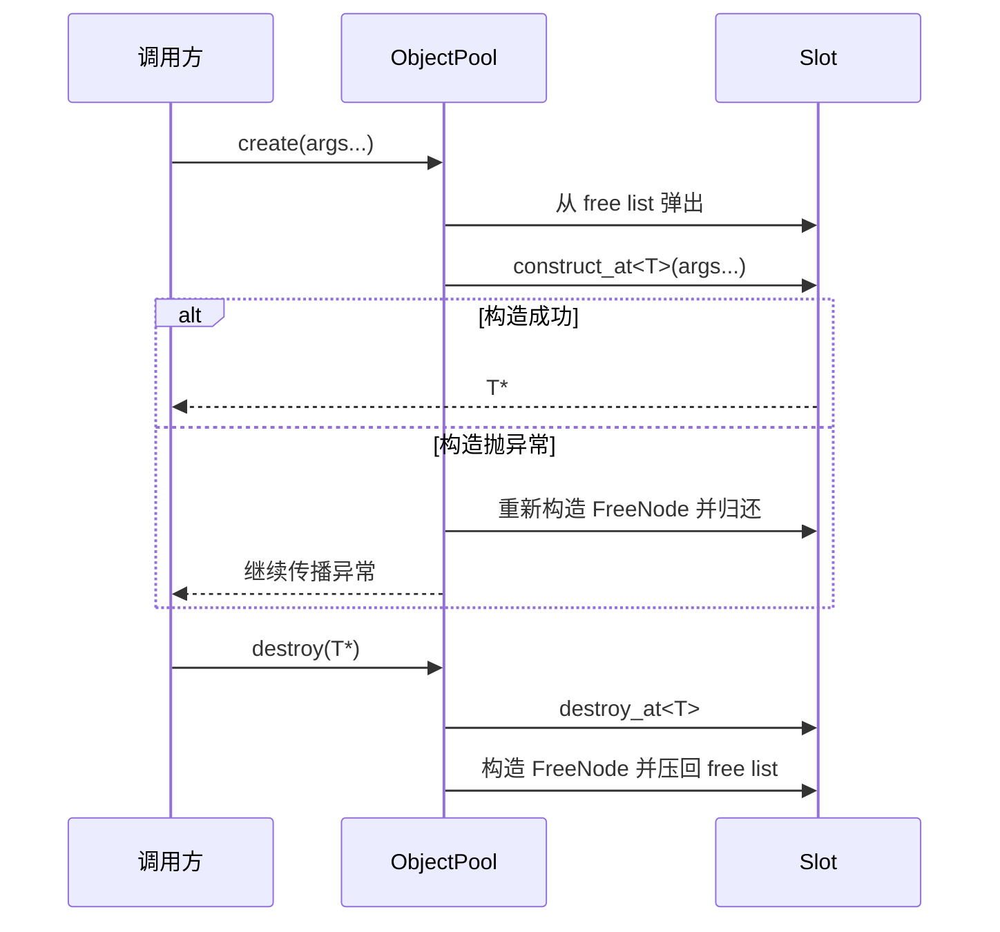
```mermaid
sequenceDiagram
    participant C as 调用方
    participant P as ObjectPool
    participant S as Slot
    C->>P: create(args...)
    P->>S: 从 free list 弹出
    P->>S: construct_at<T>(args...)
    alt 构造成功
        S-->>C: T*
    else 构造抛异常
        P->>S: 重新构造 FreeNode 并归还
        P-->>C: 继续传播异常
    end
    C->>P: destroy(T*)
    P->>S: destroy_at<T>
    P->>S: 构造 FreeNode 并压回 free list
```

这种模型更适合通用对象池，因为每次使用都从构造函数定义的有效初始状态开始。它仍不适合池比活跃 handle 更早销毁的接口。

### 7.3 简化对象池骨架

下面实现以 C++20 为基线，显式处理了 slot 大小、对齐、构造异常、重复释放 debug 状态和池析构时的活对象。为突出生命周期，它保持单线程、固定容量。

```cpp
#include <algorithm>
#include <cassert>
#include <cstddef>
#include <cstdint>
#include <memory>
#include <new>
#include <type_traits>
#include <utility>
#include <vector>

template <class T>
class ObjectPool {
    static_assert(std::is_nothrow_destructible_v<T>,
                  "pooled objects must have a non-throwing destructor");

private:
    struct FreeNode {
        FreeNode* next;
    };

    static constexpr std::size_t kSlotAlignment =
        std::max(alignof(T), alignof(FreeNode));
    static constexpr std::size_t kRawSlotSize =
        std::max(sizeof(T), sizeof(FreeNode));
    static constexpr std::size_t kSlotSize =
        (kRawSlotSize + kSlotAlignment - 1) / kSlotAlignment * kSlotAlignment;

    struct alignas(kSlotAlignment) Slot {
        std::byte bytes[kSlotSize];
    };

public:
    explicit ObjectPool(std::size_t capacity)
        : slots_(std::make_unique<Slot[]>(capacity)),
          live_(capacity, false),
          capacity_(capacity) {
        for (std::size_t i = 0; i < capacity_; ++i) {
            auto* node = std::construct_at(
                reinterpret_cast<FreeNode*>(slots_[i].bytes),
                FreeNode{free_list_});
            free_list_ = node;
        }
    }

    ~ObjectPool() noexcept {
        // 该策略选择清理遗留活对象；另一种合理策略是在 debug 构建中 assert。
        for (std::size_t i = 0; i < capacity_; ++i) {
            if (live_[i]) {
                std::destroy_at(reinterpret_cast<T*>(slots_[i].bytes));
            }
        }
    }

    ObjectPool(const ObjectPool&) = delete;
    ObjectPool& operator=(const ObjectPool&) = delete;
    ObjectPool(ObjectPool&&) = delete;
    ObjectPool& operator=(ObjectPool&&) = delete;

    template <class... Args>
    T* create(Args&&... args) {
        if (!free_list_) {
            throw std::bad_alloc();
        }

        FreeNode* node = free_list_;
        free_list_ = node->next;
        const std::size_t index = index_of(node);
        std::destroy_at(node);

        try {
            T* object = std::construct_at(
                reinterpret_cast<T*>(node), std::forward<Args>(args)...);
            live_[index] = true;
            return object;
        } catch (...) {
            auto* restored = std::construct_at(node, FreeNode{free_list_});
            free_list_ = restored;
            throw;
        }
    }

    void destroy(T* object) noexcept {
        if (!object) {
            return;
        }

        assert(owns(object) && "object does not belong to this pool");
        const std::size_t index = index_of(object);
        assert(live_[index] && "object was already returned");

        std::destroy_at(object);
        live_[index] = false;
        auto* node = std::construct_at(
            reinterpret_cast<FreeNode*>(object), FreeNode{free_list_});
        free_list_ = node;
    }

    struct Deleter {
        ObjectPool* pool;

        void operator()(T* p) const noexcept {
            pool->destroy(p);
        }
    };

    using Handle = std::unique_ptr<T, Deleter>;

    template <class... Args>
    Handle acquire(Args&&... args) {
        return Handle(create(std::forward<Args>(args)...), Deleter{this});
    }

    [[nodiscard]] bool owns(const void* p) const noexcept {
        if (!p || capacity_ == 0) {
            return false;
        }
        const auto base = reinterpret_cast<std::uintptr_t>(slots_.get());
        const auto address = reinterpret_cast<std::uintptr_t>(p);
        const std::size_t total = sizeof(Slot) * capacity_;
        return address >= base &&
               static_cast<std::size_t>(address - base) < total &&
               (address - base) % sizeof(Slot) == 0;
    }

private:
    std::size_t index_of(const void* p) const noexcept {
        const auto base = reinterpret_cast<std::uintptr_t>(slots_.get());
        const auto address = reinterpret_cast<std::uintptr_t>(p);
        return static_cast<std::size_t>((address - base) / sizeof(Slot));
    }

    std::unique_ptr<Slot[]> slots_;
    std::vector<bool> live_; // 教学用 debug 状态，不是并发位图。
    std::size_t capacity_;
    FreeNode* free_list_{};
};
```

这个实现中最重要的异常路径是：slot 已从链表弹出，但 `T` 构造失败。如果 catch 中不恢复 `FreeNode`，每失败一次池就永久少一个 slot。

`live_` 的作用也要准确理解：它不是对象本身的元数据，而是教学/debug 状态，用来验证不变量。`std::vector<bool>` 是压缩位表示，不适合直接作为并发状态表。示例还要求 `T` 的析构函数不抛异常，因为池析构和 `unique_ptr` deleter 都是清理路径；让异常逃出这类路径通常会导致终止或破坏状态。

### 7.4 这个对象池的关键问题

本例已经把原文列出的三个隐藏 bug 转化为代码约束：

```text
大小：kSlotSize >= max(sizeof(T), sizeof(FreeNode))
对齐：kSlotAlignment >= max(alignof(T), alignof(FreeNode))
存活：live_[i] 明确区分 T 与 FreeNode 状态
```

生产实现仍要决定：

- 容量耗尽是抛异常、返回空 handle、扩容，还是回退上游。
- 析构时发现活对象是主动清理、记录泄漏，还是判定程序错误。
- 多 chunk 扩容后如何由地址快速定位 chunk 和 slot。
- 是否需要统计调用栈、分配标签和高水位。
- 池本身的生命周期如何长于所有 `Handle`。

最后一条尤其重要：本例 `Deleter` 保存 `ObjectPool*`。若 handle 离开作用域时池已经销毁，deleter 会访问悬空指针。RAII 自动归还只消除了“忘记调用”，没有自动证明池活得足够久。

### 7.5 RAII 归还对象

本例的 `acquire()` 返回 `unique_ptr<T, Deleter>`。它表达的是唯一所有权，并在作用域退出、异常展开或显式 `reset()` 时归还：

```cpp
ObjectPool<Connection> pool(64);

{
    auto connection = pool.acquire(endpoint);
    connection->send(message);
} // 自动调用 pool.destroy()
```

handle 的移动不会复制所有权：

```cpp
auto a = pool.acquire(endpoint);
auto b = std::move(a);
// a 为空，b 唯一拥有该池内对象。
```

如果对象必须跨越池对象本身的词法作用域，可以让应用级 owner 同时拥有池和所有任务，或设计带共享控制块的句柄。不要简单把 `ObjectPool` 放进 `shared_ptr` 再让每个对象都保有它，除非确实接受控制块和原子引用计数成本。

### 7.6 对象重置的危险

假设网络请求对象包含：

```cpp
struct RequestContext {
    std::string user_id;
    std::vector<std::byte> body;
    Socket* socket;
    bool authenticated;
    std::function<void()> on_finish;
};
```

一个漏掉 `authenticated` 或 `on_finish` 的 `reset()`，可能把前一请求的权限或回调带入下一请求。这不只是性能 bug，也可能成为数据隔离问题。

安全评审应逐字段回答：

| 字段类型 | 归还时动作 |
| --- | --- |
| 值状态 | 恢复为构造后的明确默认值 |
| 容器 | `clear()` 是否应保留 capacity，需要按内存峰值决定 |
| 非拥有指针/视图 | 置空，避免指向已结束的外部对象 |
| 文件、socket、锁 | 明确释放；不能只清零句柄 |
| 回调 | 清空，避免捕获对象被意外延寿 |
| 安全敏感缓冲区 | 必要时可靠擦除，不能假设普通优化下的 `memset` 一定保留 |

除非保持活对象本身确实带来已测量的收益，更稳妥的默认方案是：获取时重新构造，归还时完整析构，只复用原始存储。

### 7.7 对象池何时其实没有收益

若 `T` 内部的 `std::string`、`std::vector` 每次仍向通用堆分配大量数据，只池化 `sizeof(T)` 的外壳可能几乎没有改善。应通过 allocation profile 判断成本来自：

```text
T 本体的分配？
T 内部容器的分配？
构造中的系统调用？
锁竞争？
还是 cache miss？
```

优化真正的主成本，有时意味着给内部容器传入 PMR resource，而不是为外层对象建立池。

---

## 8. C++ allocator 与 PMR

C++ 容器把“元素怎样申请存储”抽象成 allocator。传统 allocator 是编译期模板参数；C++17 PMR（polymorphic memory resource）把策略选择移动到运行时，因而同一种容器类型可以接不同内存资源。

```text
传统：std::vector<T, ArenaAllocator<T>>  // allocator 进入容器类型
PMR ：std::pmr::vector<T>               // 类型固定，构造时传 memory_resource*
```

### 8.1 allocator 的意义

```cpp
std::vector<T, MyAllocator<T>> v;
```

容器负责元素个数、构造和析构，allocator 负责原始存储。概念边界是：

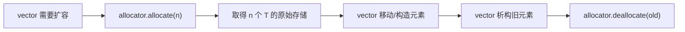
```mermaid
flowchart LR
    V["vector 需要扩容"] --> A["allocator.allocate(n)"]
    A --> R["取得 n 个 T 的原始存储"]
    R --> C["vector 移动/构造元素"]
    C --> D["vector 析构旧元素"]
    D --> F["allocator.deallocate(old)"]
```

自定义 allocator 必须满足标准要求，特别是跨类型 rebind、相等性、传播语义和异常行为。它不是只实现两个同名函数就一定能与所有容器操作正确组合。只需要运行时资源注入时，PMR 通常更容易正确落地。

### 8.2 std::pmr

PMR 的核心是抽象基类 `std::pmr::memory_resource`：

```cpp
class memory_resource {
private:
    virtual void* do_allocate(std::size_t bytes, std::size_t alignment) = 0;
    virtual void do_deallocate(void* p, std::size_t bytes,
                               std::size_t alignment) = 0;
    virtual bool do_is_equal(const memory_resource& other) const noexcept = 0;
};
```

`polymorphic_allocator<T>` 保存一个 `memory_resource*`，`std::pmr::vector<T>` 等别名使用该 allocator。常用资源的关系：

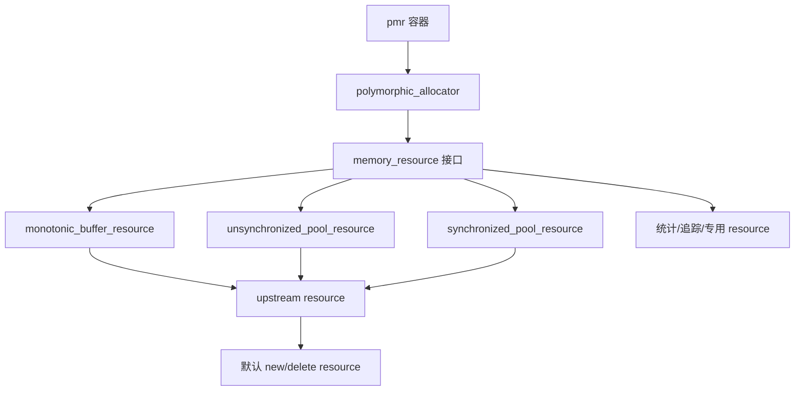
```mermaid
flowchart TB
    C["pmr 容器"] --> P["polymorphic_allocator"]
    P --> M["memory_resource 接口"]
    M --> Mono["monotonic_buffer_resource"]
    M --> UP["unsynchronized_pool_resource"]
    M --> SP["synchronized_pool_resource"]
    M --> Custom["统计/追踪/专用 resource"]
    Mono --> U["upstream resource"]
    UP --> U
    SP --> U
    U --> Default["默认 new/delete resource"]
```

resource 可以组合：本地缓冲区不足时把请求转给 upstream，统计 resource 又可包在最外层。这样能把“存储来自哪里”与容器业务逻辑分离。

### 8.3 monotonic_buffer_resource

它本质上是可增长 arena：每次分配向前推进，单次 `deallocate` 不回收，`release()` 或 resource 析构时整体释放。

```cpp
#include <array>
#include <cstddef>
#include <memory_resource>
#include <string>
#include <vector>

void parse_request() {
    std::array<std::byte, 4096> local_buffer{};

    // 不允许回退到堆；缓冲区耗尽时抛 std::bad_alloc。
    std::pmr::monotonic_buffer_resource arena(
        local_buffer.data(), local_buffer.size(),
        std::pmr::null_memory_resource());

    // arena 必须先构造，容器后构造；离开作用域时容器会先析构。
    std::pmr::vector<std::pmr::string> tokens{&arena};
    tokens.emplace_back("select");
    tokens.emplace_back("users");

    // 使用 tokens ...
} // tokens 先析构，arena 后析构。
```

这里 `null_memory_resource()` 把容量限制变成可观察失败，适合需要硬内存预算的路径。若改用默认 upstream，初始缓冲区耗尽后 resource 会继续从上游申请，功能更稳健但不再是固定预算。

最重要的生命周期规则是：

```text
memory_resource 必须比所有使用它的容器及容器元素活得更久。
```

不能返回引用了局部 arena 的 PMR 容器，也不能在容器仍存活时调用 `arena.release()` 后继续使用或析构其中非平凡对象。

### 8.4 pool_resource

`unsynchronized_pool_resource` 为不同块大小维护池，不做内部同步；`synchronized_pool_resource` 在资源层提供多线程同步。两者都会把超出池策略的大请求转给 upstream。

```cpp
#include <memory_resource>
#include <vector>

std::pmr::pool_options options{
    .max_blocks_per_chunk = 64,
    .largest_required_pool_block = 256,
};

std::pmr::unsynchronized_pool_resource pool(options);
std::pmr::vector<int> values{&pool};
```

要准确区分两个“线程安全”：

- `synchronized_pool_resource` 允许多个线程安全地调用该资源的分配/释放操作。
- 它不会让共享的 `std::pmr::vector` 自动支持并发 `push_back`。

容器本身仍要遵循标准容器的并发访问规则。

### 8.5 PMR 最容易踩的三个坑

**资源悬空。** 容器只保存 resource 指针，不拥有 resource。局部 resource 结束后把容器带出作用域，会留下悬空资源关系。

**跨资源移动成本误判。** 两个 PMR 容器使用不同 resource 时，某些移动赋值不能简单窃取底层指针，可能需要逐元素移动。必须以具体操作的 allocator 传播规则为准。

**只优化外层。** `std::pmr::vector<std::string>` 的 vector 存储来自 PMR，但普通 `std::string` 的内部字符仍使用其默认 allocator。需要递归使用资源时，应采用 allocator-aware/PMR 元素类型，例如 `std::pmr::string`。

### 8.6 什么时候优先 PMR

| 需求 | 建议 |
| --- | --- |
| 请求级批量释放 | `monotonic_buffer_resource` |
| 单线程重复小块 | `unsynchronized_pool_resource` |
| 多线程共享 resource | 先评估线程私有资源；确需共享再用 synchronized 版本 |
| 统计/标签/故障注入 | 自定义 `memory_resource` 包装 upstream |
| 单一固定类型极致热路径 | 专用对象池可能更直接，但需基准证明 |

如果标准 PMR 能表达生命周期和性能目标，应优先采用它；手写 allocator 的主要门槛不是分配函数，而是所有容器操作、异常路径、对齐和资源生命周期都必须正确。

---

## 9. 多线程内存分配的挑战

单线程池只需维护“哪些 slot 空闲”；多线程还必须回答“谁可以修改这些状态、状态何时对其他核可见、内存最终由谁回收”。主要矛盾如下：

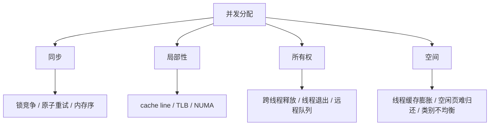
```mermaid
flowchart TB
    R["并发分配"] --> S["同步"]
    R --> L["局部性"]
    R --> O["所有权"]
    R --> M["空间"]
    S --> S1["锁竞争 / 原子重试 / 内存序"]
    L --> L1["cache line / TLB / NUMA"]
    O --> O1["跨线程释放 / 线程退出 / 远程队列"]
    M --> M1["线程缓存膨胀 / 空闲页难归还 / 类别不均衡"]
```

优化顺序应是：先建立正确所有权与同步，再减少共享写，最后才考虑无锁结构。

### 9.1 全局锁的问题

最简单且经常正确的第一版是：

```cpp
std::lock_guard lock(mutex_);
return allocate_from_shared_free_list();
```

锁本身不必然昂贵。无竞争时，成熟互斥量路径可能很短；真正的问题是所有线程不断写同一锁状态和同一链表头：

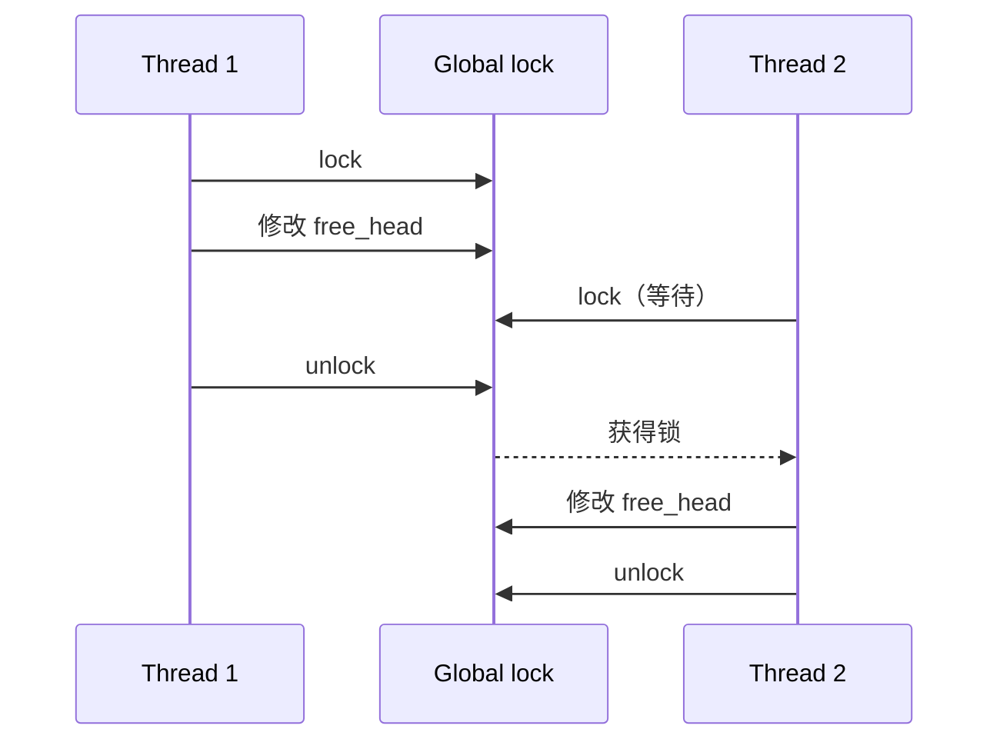
```mermaid
sequenceDiagram
    participant T1 as Thread 1
    participant L as Global lock
    participant T2 as Thread 2
    T1->>L: lock
    T1->>L: 修改 free_head
    T2->>L: lock（等待）
    T1->>L: unlock
    L-->>T2: 获得锁
    T2->>L: 修改 free_head
    T2->>L: unlock
```

当临界区很短但调用极频繁时，锁所在 cache line 在 CPU 间迁移，等待和一致性流量可能超过实际链表操作。核数增加后吞吐量不再线性增长，尾延迟也会因排队放大。

但若对象构造本身需要毫秒级 I/O，而池操作每秒只发生少量次数，全局锁可能是最容易证明且完全足够的方案。必须测量竞争比例，而不是看到 `mutex` 就重写成 lock-free。

### 9.2 伪共享

CPU 缓存一致性通常以 cache line 为单位。线程虽然修改不同变量，只要变量共享一条缓存行，写权限仍可能在核心间来回转移：

```text
同一 cache line（示意为 64B）
┌───────────────────────┬───────────────────────┐
│ Thread A 写 counter_a │ Thread B 写 counter_b │
└───────────────────────┴───────────────────────┘
        核心 A                         核心 B
             写入会让对方缓存中的整条 line 失效
```

这叫“伪”共享，因为源代码层面没有共享同一个变量，但硬件粒度造成了共享写竞争。

常见对策是把高频写字段分开：

```cpp
struct alignas(64) LocalStats {
    std::uint64_t allocations{};
    std::uint64_t frees{};
};
```

不过 64B 只是常见值，不是可移植常量；C++17 提供 `std::hardware_destructive_interference_size` 供实现暴露建议间隔，但支持度和平台特性仍需验证。过度 padding 也会增大工作集、降低 cache 利用率，所以只隔离经 profile 证明的高频写字段。

还要区分真共享：若多个线程必须修改同一个全局计数器，对齐只能避免它与别的字段互相影响，不能消除该计数器自身的一致性成本。统计值可改为每线程累加、读取时汇总。

### 9.3 跨线程释放

线程 A 分配、线程 B 释放时，有三种基本策略：

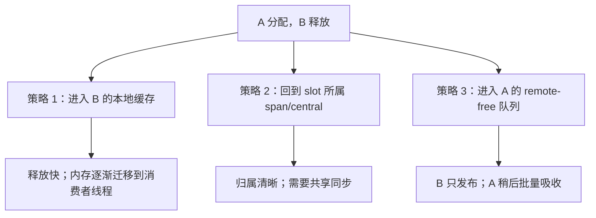
```mermaid
flowchart TB
    O["A 分配，B 释放"] --> C["策略 1：进入 B 的本地缓存"]
    O --> S["策略 2：回到 slot 所属 span/central"]
    O --> R["策略 3：进入 A 的 remote-free 队列"]
    C --> C1["释放快；内存逐渐迁移到消费者线程"]
    S --> S1["归属清晰；需要共享同步"]
    R --> R1["B 只发布；A 稍后批量吸收"]
```

没有普遍最优答案：

| 策略 | 优点 | 隐患 |
| --- | --- | --- |
| 当前线程缓存 | free 热路径短 | 生产/消费不对称时内存不断转移，原线程可能缺块 |
| 所属 span/central | 页归属与回收容易统计 | 高频跨线程 free 争用中心元数据 |
| owner 远程队列 | 保持线程/NUMA 局部性，可批量处理 | owner 不再运行或退出时必须有接管机制 |

设计前要用真实轨迹回答：跨线程释放比例是多少、方向是否单向、owner 线程是否长寿、释放延迟是否允许批量吸收。

### 9.4 NUMA：地址相近不等于访问代价相同

在 NUMA 系统中，CPU 访问本地内存节点通常比远端节点成本低。页面首次被哪个线程触碰、线程后来迁移到哪个 CPU、对象交给哪个线程，都可能改变实际延迟。

```text
NUMA node 0                         NUMA node 1
┌──────────────┐                    ┌──────────────┐
│ CPU 0 / CPU 1│                    │ CPU 2 / CPU 3│
│ local memory │<--- interconnect -->│ local memory │
└──────────────┘                    └──────────────┘
```

线程本地 arena 能减少锁，但如果线程迁移或对象长期交给远端节点处理，也可能产生远端访问。NUMA 优化通常需要线程亲和性、first-touch 策略和按节点统计共同配合；仅把池声明成 `thread_local` 并不足够。

### 9.5 每线程缓存带来的空间放大

假设有 64 个线程、20 个 size class，每个 class 最多缓存 32 个对象，平均 slot 为 128B，仅理论上限就是：

```text
64 × 20 × 32 × 128B = 5 MiB
```

若线程数量短时间暴增、class 更大或批量阈值更高，保留量会迅速增加。高性能分配器通常要配套：

- 每线程总缓存上限，而不只是每 class 上限。
- 低频 class 的自适应批量大小。
- 超阈值批量返还 central。
- 线程退出时清空本地缓存。
- 周期性把完全空闲 span 返还页级结构。

因此“减少锁”常以“增加暂存内存”为代价。

### 9.6 C++ 内存模型仍然适用

只要多个线程无同步地读写同一普通对象且至少一个是写，就可能发生 data race，程序行为未定义。把 `free_head` 声明为原子只保护了 head 本身，不会自动保护：

- 节点何时仍然存活。
- `next` 何时对读取线程可见。
- slot 是否被两个线程同时构造对象。
- 统计字段是否被并发修改。

并发池的正确性证明必须覆盖整个状态，而不是仅指出“这里用了 CAS”。

---

## 10. 多线程分配器经典架构

现代通用分配器通常把频繁的小请求留在局部层，把较少发生的批量操作和页级操作放到共享层：

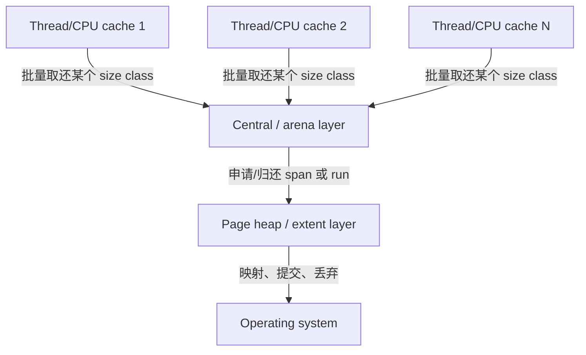
```mermaid
flowchart TB
    T1["Thread/CPU cache 1"] -->|"批量取还某个 size class"| C["Central / arena layer"]
    T2["Thread/CPU cache 2"] -->|"批量取还某个 size class"| C
    T3["Thread/CPU cache N"] -->|"批量取还某个 size class"| C
    C -->|"申请/归还 span 或 run"| P["Page heap / extent layer"]
    P -->|"映射、提交、丢弃"| O["Operating system"]
```

具体产品的命名和边界不同，但分层思路相似：越靠上操作越频繁、粒度越小、越强调无锁或少锁；越靠下操作越少、粒度越大、越适合共享协调。

### 10.1 Thread Cache

Thread Cache 通常不是一个链表，而是“每个小 size class 一条本地 free list”：

```text
Thread A cache
┌──────────┬────────────────────────────────┐
│ class 16 │ slot -> slot -> slot           │
│ class 32 │ slot -> slot                   │
│ class 48 │ empty                          │
│ ...      │ ...                            │
└──────────┴────────────────────────────────┘
```

命中本地链表时，热路径不需要访问共享锁；但 thread-local 访问、分支、统计和安全加固仍有成本，不能把它理解成“免费”。本地缓存还需要慢路径来补货、清理和处理线程退出。

### 10.2 Central Cache

Central 层协调多个线程缓存，并持有某 size class 的 partial span。它的关键作用是**批量传输**：

```text
一次加锁取得 32 个 slot
每个 slot 分摊的共享层成本 ≈ 一次共享操作成本 / 32
```

若一次中心操作连锁等待总计约 320ns，批量 32 个时，理想化分摊约 10ns/slot；但批量越大，本地保留和不均衡越严重。因此批量大小应依据 class 大小、使用频率和缓存预算调节。

中心层常按 class 分片锁，而不是所有 class 共用一把锁。这样 32B 和 256B 请求不会争同一个链表头。

### 10.3 Page Heap

页级层管理 span/run/extent，即一组连续虚拟页。它负责：

- 为 size class 提供新的页组。
- 拆分较大空闲 extent。
- 合并相邻空闲 extent。
- 决定何时保留虚拟地址、何时让物理页可回收。
- 处理绕过小对象缓存的大请求。

操作系统接口因平台而异，POSIX 系统常见 `mmap/munmap` 及相关页回收提示，Windows 常见 `VirtualAlloc/VirtualFree`。`brk/sbrk` 适合教学理解传统 heap，但实际策略由分配器和平台决定。

“归还页面”也可能有不同层次：取消映射会释放虚拟地址范围；丢弃物理页但保留映射，可以让未来在同一地址重新提交。不同方式的延迟、RSS 表现和地址空间影响不同。

### 10.4 Size Class

小请求先由映射函数归类，例如：

```text
请求：  1..8 | 9..16 | 17..24 | 25..32 | 33..48 | 49..64
class：    8 |    16 |     24 |     32 |     48 |     64
```

请求 37B 进入 48B class，向上取整浪费 11B。class 设计同时影响：

- 平均和最坏内部碎片。
- 一个 span 可切出多少 slot。
- 每线程需要维护多少链表。
- 批量搬运一批对象占多少字节。
- 对齐是否满足该范围内的请求。

大请求通常不再逐级向上取整到小对象 class，而是按页数或更细粒度单独管理，以避免巨大的内部碎片。

### 10.5 Span / Run

一个 span 的概念布局：

```text
Span metadata（可带外保存）
┌──────────────────────────────────────────────┐
│ class=64 │ capacity=128 │ live=91 │ owner=2 │
└──────────────────────────────────────────────┘
                           │
                           ▼
8KiB 页组
┌────┬────┬────┬────┬────┬────┬────────┬────┐
│64B │64B │64B │64B │64B │64B │  ...   │64B │
└────┴────┴────┴────┴────┴────┴────────┴────┘
```

需要记录的状态至少包括 class、容量、空闲表示、已用数量和归属。空闲表示可以是链表、bitmap 或编码索引。bitmap 紧凑且方便找空位；链表 pop/push 简单，并可直接复用空闲 slot。

当 `live == 0` 时，span 才能离开该 class 并回到页级层。若每个 span 都残留一个长寿对象，大量页面会无法整片回收，这是一种页级碎片。

### 10.6 常见分配路径

小对象快路径与慢路径：

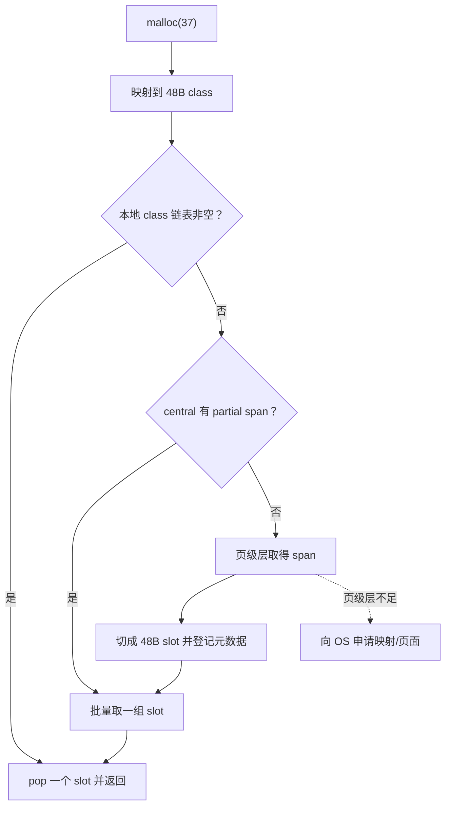
```mermaid
flowchart TD
    R["malloc(37)"] --> M["映射到 48B class"]
    M --> T{"本地 class 链表非空？"}
    T -- 是 --> H["pop 一个 slot 并返回"]
    T -- 否 --> C{"central 有 partial span？"}
    C -- 是 --> B["批量取一组 slot"]
    B --> H
    C -- 否 --> P["页级层取得 span"]
    P --> K["切成 48B slot 并登记元数据"]
    K --> B
    P -. 页级层不足 .-> O["向 OS 申请映射/页面"]
```

释放路径必须先由地址或元数据定位 class/span，然后依据本地阈值和跨线程策略处理。大对象通常绕开 thread cache，直接进入页级或独立映射路径；阈值是实现策略，不应在应用中假定具体数字。

### 10.7 tcmalloc / jemalloc / mimalloc 的共同思想

这些分配器并不是同一算法的不同品牌，线程/CPU 缓存、arena、page/segment、远程释放和元数据组织都有各自设计。可以抽象出的共同问题是：

- 用 size class 快速处理小对象。
- 让高频路径尽量局部化。
- 批量在局部层与共享层之间迁移。
- 用页组管理底层连续空间。
- 为大对象选择独立路径。
- 在吞吐量、尾延迟、碎片、驻留内存和安全加固间权衡。

学习共同模型有助于阅读实现，但做工程选择时必须查看目标版本、平台和工作负载，不能用这里的抽象替代具体文档与基准。

### 10.8 一条跨层释放时序

假设线程 B 释放由线程 A 所属 span 分配的对象，采用 remote queue：

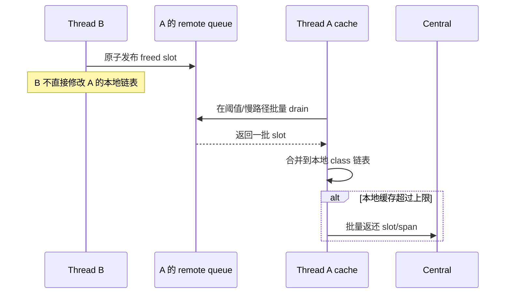
```mermaid
sequenceDiagram
    participant B as Thread B
    participant R as A 的 remote queue
    participant A as Thread A cache
    participant C as Central
    B->>R: 原子发布 freed slot
    Note over B: B 不直接修改 A 的本地链表
    A->>R: 在阈值/慢路径批量 drain
    R-->>A: 返回一批 slot
    A->>A: 合并到本地 class 链表
    alt 本地缓存超过上限
        A->>C: 批量返还 slot/span
    end
```

队列必须解决 owner 线程退出、发布可见性和重复释放。批量 drain 降低共享原子操作频率，但会延迟实际复用。

### 10.9 评估分配器的基准矩阵

只测单线程“分配后立刻释放同一大小”会极度偏向本地缓存。至少加入：

| 维度 | 测试取值示例 |
| --- | --- |
| 线程数 | 1、物理核数一半、物理核数、过量线程 |
| 大小分布 | 固定小块、阶梯 class 边界、真实采样分布、大块混合 |
| 生命周期 | 立即释放、随机延迟、长短对象交错 |
| 线程流转 | 本线程释放、固定比例跨线程释放、单生产多消费 |
| 指标 | ops/s、P50/P99、RSS 峰值、活跃/保留字节、CPU、cache miss |

必须防止编译器消除测试，预热缓存，并报告机器、编译器、分配器版本和统计方法。吞吐量提升但 RSS 翻倍，不一定满足真实目标。

---

## 11. 多线程对象管理方案

分配器回答“字节放在哪里”，对象管理还要回答“哪条执行流拥有对象、谁可以访问、谁结束生命”。先选所有权模型，再选池结构：

| 所有权事实 | 更自然的方案 |
| --- | --- |
| 对象从不离开工作线程 | 每线程对象池 |
| 可跨线程，但操作频率低 | 全局池 + mutex |
| 跨线程频繁且可均匀散列 | 分片池 |
| 单向生产消费 | 所有权随队列移动，消费者归还 |
| 多方确实共享生命周期 | 明确同步 + `shared_ptr`/侵入式计数等 |

所有权模型不清时，无锁 free list 只会让错误更难重现。

### 11.1 每线程对象池

```cpp
thread_local ObjectPool<Job> local_jobs{/* capacity */ 256};
```

这种代码只有在 `Job` 不跨线程归还，或已实现远程释放协议时才成立。还要考虑：

- `thread_local` 初始化可能在每个首次使用的线程发生。
- 线程退出时析构本地池；若其他线程仍持有其对象，立即产生悬空状态。
- 线程池中的长寿工作线程适合本地缓存；频繁创建销毁的短线程会反复建立池。
- 每线程固定容量会让内存上限乘以线程数。

因此它适合线程亲和的解析上下文、工作线程私有任务节点等，而不是默认适合所有“多线程程序”。

### 11.2 全局对象池加锁

全局锁把复杂状态机串行化，是建立正确基线的好方法：

```cpp
Handle acquire(...) {
    std::lock_guard lock(mutex_);
    return pool_.acquire(...);
}

void release(T* p) {
    std::lock_guard lock(mutex_);
    pool_.destroy(p);
}
```

但 `Handle` 的 deleter 需要调用带锁的 `release()`，不能绕过包装直接触碰底层 pool。还应避免在持锁时执行可能很慢或回调外部代码的构造/析构，否则临界区不可控。可采用“两阶段”设计：锁内取得原始 slot，锁外构造；构造失败再锁内归还。这样异常路径也必须严密维护状态。

先测全局锁版的锁等待时间和吞吐扩展曲线。如果它满足目标，就没有必要承担更复杂模型的正确性成本。

### 11.3 分片对象池

```text
pool[hash(thread_id) % shard_count]
```

每个 shard 有独立锁和 free list：

```text
Thread hash ─┬─> shard 0 [lock | free list]
             ├─> shard 1 [lock | free list]
             ├─> shard 2 [lock | free list]
             └─> shard 3 [lock | free list]
```

要避免两个常见问题：

1. **映射不稳定**：线程 ID 哈希不等于 CPU 亲和性，线程迁移后局部性可能变化。
2. **元数据伪共享**：多个 shard 的锁和计数器紧邻存放，仍可能占同一 cache line。

释放时可按当前线程选 shard，也可把对象归还原 shard。后一种需要在对象或带外元数据中记录 `shard_id`，但能保持容量平衡。热点不均匀时，可从富余 shard 批量窃取或回到中心层。

### 11.4 无锁 free list

Treiber stack 可以用原子 CAS 更新 head。下面只是说明核心同步，成立前提是节点存储在 pop 期间不会被释放或复用于不兼容用途；这一前提将在下一节展开。

```cpp
#include <atomic>

struct Node {
    Node* next;
};

class LockFreeFreeList {
public:
    void push(Node* node) noexcept {
        node->next = head_.load(std::memory_order_relaxed);
        while (!head_.compare_exchange_weak(
            node->next, node,
            std::memory_order_release,
            std::memory_order_relaxed)) {
            // 失败时，node->next 已更新为最新 head，继续重试。
        }
    }

    Node* pop() noexcept {
        Node* old = head_.load(std::memory_order_acquire);
        while (old != nullptr &&
               !head_.compare_exchange_weak(
                   old, old->next,
                   std::memory_order_acquire,
                   std::memory_order_relaxed)) {
            // 失败时，old 已更新为最新 head。
        }
        return old;
    }

private:
    std::atomic<Node*> head_{nullptr};
};
```

`release` 发布保证另一个线程经 `acquire` 看到该节点前，也能看到 push 前写入的 `next` 和必要初始化。但仅有这些 memory order 仍未解决 ABA，也未证明 `old->next` 在读取时安全。

即使算法正确，无锁也只意味着某个线程能持续取得进展，不意味着公平、不等待或更低尾延迟。高竞争下 CAS 失败循环会消耗 CPU，并持续争用 head 所在 cache line。

### 11.5 ABA 问题

初始链表 `A -> B -> C`，发生如下交错：

| 时刻 | Thread 1 | Thread 2 | head |
| --- | --- | --- | --- |
| t0 | 读取 `old=A`，并准备把 head 改为 `B` | | A |
| t1 | 暂停 | pop A | B |
| t2 | | pop B | C |
| t3 | | push A，此时 A->C | A |
| t4 | CAS 看到 head 仍为 A，于是错误地写入旧 `B` | | B |

Thread 1 只比较地址，无法识别 head 经历了 `A -> B -> C -> A`。这就是 ABA；最终它可能把已经不在链表中的 B 重新设为 head，破坏结构。

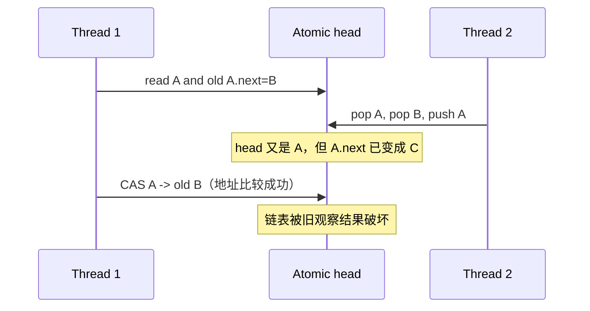
```mermaid
sequenceDiagram
    participant T1 as Thread 1
    participant H as Atomic head
    participant T2 as Thread 2
    T1->>H: read A and old A.next=B
    T2->>H: pop A, pop B, push A
    Note over H: head 又是 A，但 A.next 已变成 C
    T1->>H: CAS A -> old B（地址比较成功）
    Note over H: 链表被旧观察结果破坏
```

解决方案处理的是两个相关但不同的问题：

- **带版本标签的 head**：比较 `(pointer, counter)`，让“同地址的新一代”不再等于旧值；还要保证打包方式、原子宽度和计数器回绕可接受。
- **Hazard Pointer**：线程先宣布正在访问哪个节点，回收方延迟复用/释放受保护节点。
- **Epoch/RCU 类回收**：节点退休后，等所有可能持有旧引用的读者越过安全点再回收。
- **节点永不返还且延迟复用**：在固定池的特定约束下可简化存储回收，但 ABA 本身仍需按实际算法证明。

“内存没有 `delete`”不自动消除 ABA，因为 slot 被 pop 后可能承载用户对象，再次 push 时仍可出现相同地址的不同逻辑代次。

### 11.6 引用计数

```cpp
std::shared_ptr<T>
```

`shared_ptr` 解决共享生命周期，不自动解决对象内容的并发访问：

```cpp
auto p = std::make_shared<Counter>();
// 多个线程持有不同 shared_ptr 副本，控制块生命周期操作可并发进行。
// 但若它们同时写 p->value，Counter 自身仍需 mutex/atomic 等同步。
```

代价包括控制块、引用计数原子读改写，以及最后一个引用在哪个线程释放就可能在哪个线程执行析构。实时或低尾延迟路径要注意“最后一次 release”可能触发昂贵析构。

循环拥有应改成至少一条 `weak_ptr` 边，但更根本的问题是先画出所有权图，判断共享所有权是否必要。队列传递任务时，`unique_ptr` 的移动常比所有参与方共享更清晰。

### 11.7 生产者消费者对象流转

```text
生产者创建对象 -> 队列 -> 消费者处理 -> 归还对象池
```

队列应传递拥有型 handle，而不是同时让生产者和消费者都以为自己负责释放：

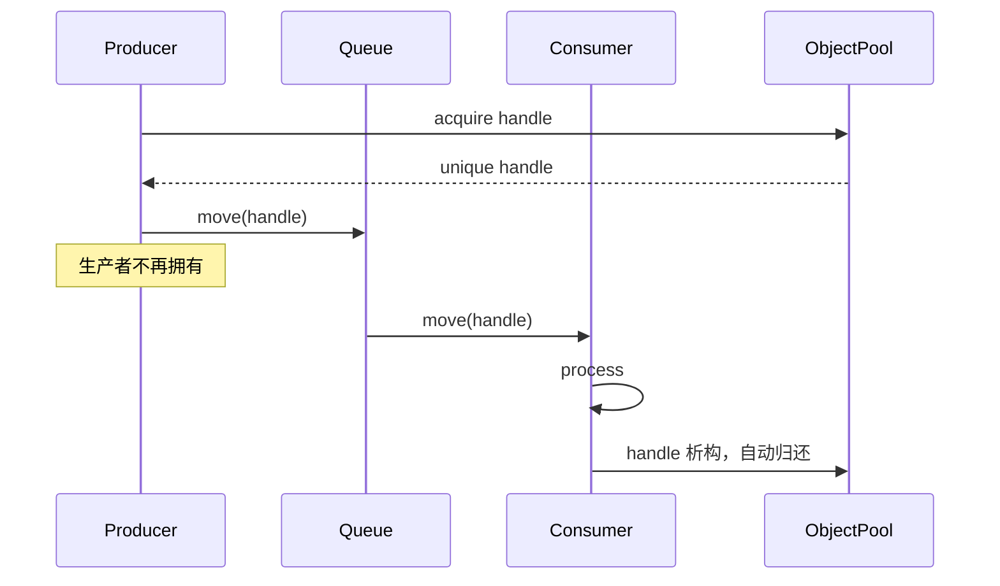
```mermaid
sequenceDiagram
    participant P as Producer
    participant Q as Queue
    participant C as Consumer
    participant O as ObjectPool
    P->>O: acquire handle
    O-->>P: unique handle
    P->>Q: move(handle)
    Note over P: 生产者不再拥有
    Q->>C: move(handle)
    C->>C: process
    C->>O: handle 析构，自动归还
```

异常、队列关闭和取消路径都应保持同一规则：谁当前持有 handle，谁的析构负责归还。若队列拒绝入队，移动是否发生必须由 API 契约清楚表达。

若对象必须回到生产者本地池，handle 的 deleter 可发布到 remote-free 队列；如果生产者已退出，则控制层必须把归还请求转交 central，而不是访问已销毁的 thread-local pool。

### 11.8 从 mutex 到并发优化的安全演进

```text
第 1 步：单线程池 + 完整不变量测试
第 2 步：一把 mutex，建立可验证并发基线
第 3 步：按 class 或 shard 分锁，测量竞争是否下降
第 4 步：加入线程缓存与批量传输，测量空间放大
第 5 步：仅在数据证明需要时，引入无锁队列和正式回收方案
```

每一步都应与前一步做随机并发测试、长时间压力测试和 sanitizer 检查。并发设计的成熟度体现在可证明的状态转换，不体现在使用了多少原子操作。

---

## 12. CSAPP malloc 实现方案

《深入理解计算机系统》（CSAPP）的动态分配器模型不是某个系统 `malloc` 的源码复刻，而是一套逐层演进的教学框架：先让每个块自描述，再实现线性查找、分割与边界标记合并，最后把隐式链表改成显式/分离空闲链表。

为了避免把某个实验模板的常量误当成普遍规则，本节统一使用符号：

| 符号 | 含义 | 本节推演值 |
| --- | --- | --- |
| `W` | 一个 header/footer word 的字节数 | 8B |
| `A` | 块与 payload 的对齐 | 16B |
| `MIN` | 最小合法块大小 | 32B |
| `bp` | 指向 payload 开始处的 block pointer | - |

不同教材版本、实验框架和目标 ABI 可能使用不同常量。算法依据是“块大小必须满足布局和对齐”，不是死记 8 或 16。

### 12.1 块结构

教学基线让每个块都有 header 与 footer：

```text
低地址                                                           高地址
                 bp
                  │
                  ▼
┌────────────────┬────────────────────────┬──────────┬────────────────┐
│ header (W)     │ payload                │ padding  │ footer (W)     │
│ size | alloc   │ 返回给用户             │ 可选     │ size | alloc   │
└────────────────┴────────────────────────┴──────────┴────────────────┘
         ◄──────────────── block size ───────────────────────────────►
```

`size` 是整个块大小，不只是 payload 大小。若块按 16B 对齐，合法大小的低 4 位原本都为 0，可以复用其中若干位保存状态：

```text
size = 0x50 = 80B = ...0101 0000
已分配 header = size | 0x1 = 0x51
空闲 header   = size | 0x0 = 0x50
读取 size     = header & ~0xF
读取 alloc    = header & 0x1
```

不要把所有低位都随意使用；每一位必须有定义，并与对齐掩码一致。

一组教学宏可以写成：

```c
#include <stddef.h>
#include <stdint.h>

#define WSIZE      (sizeof(size_t))
#define ALIGNMENT  ((size_t)16)
#define ALLOC_MASK ((size_t)0x1)
#define SIZE_MASK  (~(ALIGNMENT - (size_t)1))

#define PACK(size, allocated) ((size) | ((allocated) ? ALLOC_MASK : 0))
#define GET(p)                  (*(size_t*)(p))
#define PUT(p, value)           (*(size_t*)(p) = (value))
#define GET_SIZE(p)             (GET(p) & SIZE_MASK)
#define GET_ALLOC(p)            (GET(p) & ALLOC_MASK)

#define HDRP(bp)       ((char*)(bp) - WSIZE)
#define FTRP(bp)       ((char*)(bp) + GET_SIZE(HDRP(bp)) - 2 * WSIZE)
#define NEXT_BLKP(bp)  ((char*)(bp) + GET_SIZE(HDRP(bp)))
#define PREV_BLKP(bp)  ((char*)(bp) - GET_SIZE((char*)(bp) - 2 * WSIZE))
```

这些宏依赖堆已经正确对齐、地址有效且元数据未损坏，只适合受控教学实现。工业实现会进一步处理别名、硬化、元数据位置和平台细节。

### 12.2 为什么需要 header

```c
free(p);
```

接口只给 payload 地址，不给大小。`HDRP(p)` 向前一个 word 找到 header，分配器由此得到：

- 当前块占多少字节，从而定位下一物理块。
- 当前块是否已经分配。
- 若扩展状态位，还可记录前块是否已分配等信息。

这也解释了为什么向 payload 前方越界写特别危险：它可能把普通数据错误直接变成分配器结构损坏，直到未来 `free` 或合并时才崩溃。

### 12.3 为什么需要 footer

从当前块 header 能直接算出下一块，但无法知道前一块从哪里开始，因为块是可变长的。前一块 footer 紧邻当前 header，记录其大小：

```text
             当前 bp
                │
                ▼
┌──────────────┬──────────────┬──────────────┬──────────────┐
│ prev header  │ prev payload │ prev footer  │ curr header  │
│ size = 80    │              │ size = 80    │              │
└──────────────┴──────────────┴──────────────┴──────────────┘
                               ▲
                               └─ 读 80，向前跳 80B 找前块
```

header/footer 组成边界标记，使前后合并都能在 `O(1)` 定位邻居。代价是每个块多一个 word。

常见优化是：只为空闲块保留 footer，并在当前 header 中增加 `prev_alloc` 位。若前块已分配，无需读其 footer；若前块空闲，才读取 footer 找大小。这个优化节省已分配块空间，但更新任何块状态时都要同步维护下一块的 `prev_alloc`，不适合在尚未掌握基线前直接跳入。

### 12.4 序言块和结尾块

```text
低地址
┌─────────┬─────────────────────────────┬────────────────────┬───────────────┐
│ padding │ prologue：大小固定、标为占用 │ normal blocks ...  │ epilogue hdr  │
└─────────┴─────────────────────────────┴────────────────────┴───────────────┘
高地址
```

序言块伪装成永远占用的前邻居，结尾 header 伪装成大小 0、永远占用的后邻居。于是普通块合并代码无需为“堆第一块/最后一块”增加大量分支。

sentinel 的一般思想是用合法哨兵状态吸收边界情况；它并没有消除边界，而是让边界也满足普通算法的前置条件。

### 12.5 隐式空闲链表

“隐式”表示 next 关系没有保存指针，而是隐含在当前块大小中：

```text
bp_next = bp_current + size(current)

┌───────────┬────────────────┬───────────┬────────────────┐
│ alloc 32  │ free 80        │ alloc 48  │ free 128       │
└───────────┴────────────────┴───────────┴────────────────┘
     │               │              │              │
     └── +32 ───────►└── +80 ──────►└── +48 ─────►
```

扫描会经过所有块，包括已分配块；若堆有 `B` 个块，first-fit 最坏是 `O(B)`。它的优势是布局直观，非常适合验证分割与合并，而不是追求工业吞吐量。

基本查找：

```c
static void* find_fit(size_t asize) {
    for (void* bp = heap_first_block();
         GET_SIZE(HDRP(bp)) != 0;
         bp = NEXT_BLKP(bp)) {
        if (!GET_ALLOC(HDRP(bp)) && GET_SIZE(HDRP(bp)) >= asize) {
            return bp;
        }
    }
    return NULL;
}
```

### 12.6 查找策略

#### first-fit

从头找第一个足够块，通常检查数量较少，但频繁切割前部可能积累小碎片。

#### next-fit

保存 rover，从上次位置继续，走到结尾后回绕。它把扫描分散到整个堆，但缓存局部性和碎片结果依赖请求轨迹。

#### best-fit

选择满足请求的最小块。隐式链表若要保证真正 best，通常要扫描整个堆；它减少当前剩余量，却可能制造无法使用的微小块。

以空闲块 `[48, 80, 64, 128]`、请求调整大小 56 为例：

| 策略 | 选择 | 直观结果 |
| --- | --- | --- |
| first-fit | 80 | 余 24，小于 `MIN=32` 时整块使用 |
| next-fit | 取决于 rover | 结果依历史而变 |
| best-fit | 64 | 余 8，通常整块使用；本次内部余量较小 |

策略好坏必须通过完整 trace 的吞吐量和峰值利用率评价，单次选择无法证明。

### 12.7 放置与分割

先把 payload 请求 `request` 调整成块大小 `asize`：

```text
asize = max(MIN, align_up(request + header + footer, A))
```

计算前必须防止 `request + overhead` 溢出。对 `request=24, W=8, A=16, MIN=32`：

```text
24 + 8 + 8 = 40
align_up(40,16) = 48
asize = 48
```

在 128B 空闲块中放置：

```text
放置前
┌──────────────────────────────────────────────────────────────┐
│ free 128                                                     │
└──────────────────────────────────────────────────────────────┘

放置后：128 - 48 = 80 >= MIN，可以分割
┌───────────────────────┬──────────────────────────────────────┐
│ alloc 48              │ free 80                              │
└───────────────────────┴──────────────────────────────────────┘
```

```c
static void place(void* bp, size_t asize) {
    size_t current = GET_SIZE(HDRP(bp));
    size_t remainder = current - asize;

    if (remainder >= MIN_BLOCK_SIZE) {
        PUT(HDRP(bp), PACK(asize, 1));
        PUT(FTRP(bp), PACK(asize, 1));

        void* rest = NEXT_BLKP(bp);
        PUT(HDRP(rest), PACK(remainder, 0));
        PUT(FTRP(rest), PACK(remainder, 0));
    } else {
        PUT(HDRP(bp), PACK(current, 1));
        PUT(FTRP(bp), PACK(current, 1));
    }
}
```

如果余量小于 `MIN`，它无法容纳合法 header/footer 与最小 payload，就让本次分配吃掉整块；余量转化为当前块内部碎片，避免在堆上留下永久不可用的“假空闲块”。

### 12.8 释放与合并

`free(bp)` 先把当前 header/footer 标空闲，再调用 `coalesce(bp)`。合并依据物理邻居而不是 free-list 邻居。

四种状态图，`A` 表示 allocated，`F` 表示 free，`X` 为刚释放块：

```text
Case 1: [ A ][ X ][ A ] -> [ A ][ F ][ A ]
Case 2: [ A ][ X ][ F ] -> [ A ][    F    ]
Case 3: [ F ][ X ][ A ] -> [    F    ][ A ]
Case 4: [ F ][ X ][ F ] -> [       F       ]
```

```c
static void* coalesce(void* bp) {
    int prev_alloc = GET_ALLOC(FTRP(PREV_BLKP(bp)));
    int next_alloc = GET_ALLOC(HDRP(NEXT_BLKP(bp)));
    size_t size = GET_SIZE(HDRP(bp));

    if (prev_alloc && next_alloc) {
        return bp;
    }

    if (prev_alloc && !next_alloc) {
        size += GET_SIZE(HDRP(NEXT_BLKP(bp)));
        PUT(HDRP(bp), PACK(size, 0));
        PUT(FTRP(bp), PACK(size, 0));
        return bp;
    }

    if (!prev_alloc && next_alloc) {
        size += GET_SIZE(HDRP(PREV_BLKP(bp)));
        bp = PREV_BLKP(bp);
        PUT(HDRP(bp), PACK(size, 0));
        PUT(FTRP(bp), PACK(size, 0));
        return bp;
    }

    size += GET_SIZE(HDRP(PREV_BLKP(bp))) +
            GET_SIZE(HDRP(NEXT_BLKP(bp)));
    bp = PREV_BLKP(bp);
    PUT(HDRP(bp), PACK(size, 0));
    PUT(FTRP(bp), PACK(size, 0));
    return bp;
}
```

Case 4 中必须在覆盖元数据前保存所需大小。显式空闲链表版本还要先把参与合并的旧节点从 free list 删除，再把合并后的单一节点插入，否则链表会保留指向块内部的陈旧节点。

### 12.9 立即合并与延迟合并

立即合并让 `free` 承担工作，保证堆中没有相邻空闲块；延迟合并可能在分配失败、定期扫描或特定阈值时再处理。

```text
轨迹：free 64 -> malloc 64
立即合并：可能先与邻块合并成 128，又立刻分割回 64 + 64
延迟合并：可能直接复用刚释放的 64
```

但另一条轨迹 `free 64 + free 64 -> malloc 120` 中，立即合并能马上得到 128B。选择取决于 trace；教学实现通常采用立即合并，因为它建立了“任意两个空闲块不物理相邻”的强不变量，heap checker 更容易验证。

### 12.10 扩展堆

当 `find_fit` 失败，`extend_heap(size)` 向教学运行环境申请更多连续堆空间。新增区域覆盖旧 epilogue：

```text
扩展前： ... [last block][epilogue]
扩展后： ... [last block][new free block][new epilogue]
```

步骤：

1. 把扩展量向上调整到对齐与最小块要求。
2. 请求底层扩展；失败时返回空指针。
3. 旧 epilogue 位置成为新空闲块 header。
4. 在末尾写新 epilogue header。
5. 与原最后一块尝试 coalesce。

常按 `max(asize, CHUNK_SIZE)` 扩展，而不是每次只申请当前所需大小，以摊薄下层调用；`CHUNK_SIZE` 太大则会抬高峰值。末端空闲块是最容易被扩展后直接合并的块。

### 12.11 隐式链表 allocator 的核心流程

完整控制流：

```mermaid
flowchart TD
    M["mm_malloc(request)"] --> Z{"request == 0？"}
    Z -- 是 --> N["返回 NULL"]
    Z -- 否 --> O{"request + overhead 溢出？"}
    O -- 是 --> N
    O -- 否 --> A["计算 asize"]
    A --> F["find_fit(asize)"]
    F --> Q{"找到？"}
    Q -- 是 --> P["place：必要时分割"]
    Q -- 否 --> E["extend_heap(max(asize, chunk))"]
    E --> X{"扩展成功？"}
    X -- 否 --> N
    X -- 是 --> P
    P --> R["返回 payload"]
```

```mermaid
flowchart LR
    F0["mm_free(bp)"] --> G{"bp == NULL？"}
    G -- 是 --> D["直接返回"]
    G -- 否 --> S["读取块大小"]
    S --> W["header/footer 标空闲"]
    W --> C["coalesce(bp)"]
```

一次完整 trace：

```text
初始：[free 128]

malloc(24): asize=48
结果：[alloc 48][free 80]

malloc(40): asize=64，80-64=16 < MIN，所以整块占用
结果：[alloc 48][alloc 80]

free(第一个块)：前后都占用，不合并
结果：[free 48][alloc 80]

free(第二个块)：前块空闲、后面是占用 epilogue，与前合并
结果：[free 128]
```

这条 trace 同时展示了分割阈值、内部碎片和合并恢复。

### 12.12 显式空闲链表改进

显式链表只连接空闲块，物理顺序和链表顺序是两套关系：

```text
物理堆： [free A][alloc][free B][alloc][free C]
             │            │             │
空闲表头 ───►B ◄─────────►C ◄──────────►A
```

空闲块复用 payload 保存 `prev/next`：

```text
┌────────┬──────────┬──────────┬────────────┬────────┐
│ header │ prev ptr │ next ptr │ free space │ footer │
└────────┴──────────┴──────────┴────────────┴────────┘
```

在 64 位指针、8B header/footer 下，空闲块至少需要 `8 + 8 + 8 + 8 = 32B`，这正是最小块大小必须随结构变化重新推导的原因。

显式链表操作不变量：

```text
head->prev == NULL
node->next != NULL  => node->next->prev == node
node->prev != NULL  => node->prev->next == node
链表中的每个节点在物理堆中标记为空闲
每个物理空闲块在链表中恰好出现一次
```

LIFO 插入是 `O(1)` 且有时间局部性；按地址排序插入更慢，但可影响 fit 与合并管理。无论哪种，分割与合并都必须按“先移除旧节点，再写新布局，再插入新节点”的顺序维护一致性。

### 12.13 分离空闲链表进一步改进

把显式链表按大小区间拆分：

```text
class 0 [32,  63] : 48 -> 32 -> ...
class 1 [64, 127] : 96 -> 80 -> ...
class 2 [128,255] : 192 -> ...
class 3 [256,511] : ...
```

请求从目标 class 开始；没有合适块时再检查更大 class。释放或合并后，块大小可能改变，必须放入重新计算的 class。合并前也要从各自原 class 删除邻块。

索引函数可按区间表、位宽或分段规则实现，但必须满足：

```text
同一个 size 在插入与查找时映射一致；
所有合法 size 都有 class；
边界不会越界；
大于最大精细区间的块仍有兜底链表。
```

分离链表把最坏扫描从“全堆块数”缩小到候选 class 的空闲块数，是从教学 allocator 到更现实设计的重要一步，但还没有线程缓存、页级回收和大对象独立路径。

### 12.14 CSAPP allocator 的学习价值

这套模型的价值在于能从不变量推导代码：

```text
块可遍历      -> header 的 size 必须合法且对齐
可向前合并    -> footer 或 prev-size/prev-alloc 信息必须可靠
不重叠        -> 分割后的两个块大小之和必须等于原块
不丢空闲块    -> free-list 与物理空闲块一一对应
边界统一      -> prologue/epilogue 始终保持哨兵状态
```

高性能优化都可以解释为改变某个成本：显式链表减少无关扫描，分离链表缩小候选集合，省略已分配 footer 减少空间，延迟合并改变 free 的工作量，线程缓存减少共享访问。

### 12.15 `realloc` 应怎样思考

教学版可先采用“分配新块、复制、释放旧块”：

```text
new = mm_malloc(new_size)
copy min(old_payload_size, new_size) 字节
mm_free(old)
return new
```

正确性细节：

- `ptr == NULL` 时等价于分配。
- `new_size == 0` 时应按教学接口明确约定；常见简化是释放原块并返回空指针，不要含糊依赖不同语言版本或库实现的零大小细节。
- 失败时必须保留原块不变。
- 复制量不能用旧**块总大小**，要扣除元数据并限制为新请求大小。
- 复制区域可能重叠时使用满足语义的拷贝方式；新旧独立分配通常不重叠。

优化路径可依次尝试：

1. 新大小仍适合当前块：原地保留，余量足够时分割。
2. 下一物理块空闲且合并后足够：原地向后扩展。
3. 位于堆尾：尝试扩展 heap 后原地增长。
4. 都不行：再分配、复制、释放。

`realloc` 是检验你是否真正理解块大小、payload 大小、失败语义和合并顺序的综合题。

### 12.16 Heap checker：让布局自己证明正确

每次关键操作后可在 debug 构建调用 `mm_checkheap()`，验证：

```text
1. prologue/epilogue 格式正确。
2. 每个 payload 满足 ALIGNMENT。
3. 每个块 size >= MIN 且是 ALIGNMENT 的倍数。
4. header 与 footer 一致。
5. 块遍历不越过 heap 边界，最终恰好到 epilogue。
6. 立即合并策略下不存在相邻空闲块。
7. 显式链表 prev/next 对称、无环、节点都在 heap 内。
8. 物理空闲块数量等于 free-list 节点数量。
```

调试分配器最有效的方式不是等随机崩溃，而是在最早破坏不变量的操作后立即报告块地址、大小和前后邻居。还应使用短 trace 穷举边界：零请求、最小请求、恰好不分割、恰好可分割、四种 coalesce、扩展失败和 `realloc` 失败。

---

## 13. 碎片、对齐与安全问题

分配器错误往往具有延迟性：越界发生在请求 A，元数据直到释放 B 时才被读取，因此崩溃位置不等于错误位置。诊断策略要尽量在状态第一次被破坏时失败。

### 13.1 常见内存错误

| 错误 | 最小例子 | 为什么危险 |
| --- | --- | --- |
| 泄漏 | 覆盖最后一个拥有指针 | 长期服务 RSS 增长；析构资源也未释放 |
| double free | 同一 slot 两次入 free list | 链表成环或同一地址被借给两个调用者 |
| use-after-free | `free(p)` 后读取 `*p` | 地址可能已承载新对象或分配器指针 |
| 越界 | 写 `p[size]` | 覆盖相邻对象、header、canary |
| 错配释放 | `new[]` 对应 `delete` | 释放协议和数组析构信息不匹配，行为未定义 |
| 未初始化读取 | 读取 `malloc` 新块 | 结果不确定，可能泄露旧数据 |
| invalid free | 释放栈地址、内部地址或错池地址 | 分配器按伪造 header 修改任意状态 |
| 整数溢出 | `malloc(count * size)` 未检查 | 分配小块后按大数组写入，造成越界 |
| 悬空 view | 返回局部 `string_view/span` | view 不拥有存储，源对象结束后立即失效 |

double free 如何让 free list 损坏：

```text
初始：free_head -> A -> B
错误地再次 free(A)：A.next = free_head，也就是 A.next = A
结果：free_head -> A ─┐
                  ▲   │
                  └───┘
```

后续两次 allocate 可能返回同一个 A，两个活对象开始占用同一地址。debug 状态位应在插链前发现它，而不是等待业务数据相互覆盖。

### 13.2 先防整数溢出

数组字节数不能直接写成：

```c
void* p = malloc(count * element_size); // 乘法可能回绕
```

可显式检查：

```c
#include <stdint.h>
#include <stdlib.h>

void* allocate_array(size_t count, size_t element_size) {
    if (element_size != 0 && count > SIZE_MAX / element_size) {
        return NULL;
    }
    return malloc(count * element_size);
}
```

`calloc(count, element_size)` 的接口保留了两个操作数，常见实现能够检测乘法溢出，但调用方仍要按失败路径处理空指针。分配器内部的 `request + overhead + alignment - 1` 同样需要逐步检查加法溢出。

### 13.3 Debug 技术如何分层

```mermaid
flowchart TB
    S["编译期/运行期诊断"] --> A["ASan：越界、UAF、部分 double free"]
    S --> U["UBSan：部分未定义行为"]
    S --> L["LSan/平台工具：泄漏"]
    S --> T["ThreadSanitizer：数据竞争"]
    S --> V["Valgrind 等动态分析工具"]
    S --> C["自定义 heap checker / canary / guard page"]
```

Clang/GCC 常见调试构建示例：

```bash
clang++ -std=c++20 -O1 -g \
  -fsanitize=address,undefined -fno-omit-frame-pointer \
  pool_test.cpp -o pool_test
./pool_test
```

数据竞争通常单独使用 ThreadSanitizer 构建：

```bash
clang++ -std=c++20 -O1 -g \
  -fsanitize=thread -fno-omit-frame-pointer \
  concurrent_pool_test.cpp -o concurrent_pool_test
./concurrent_pool_test
```

具体 sanitizer 能否组合、支持哪些平台，应以所用编译器版本为准。诊断构建不能替代不变量测试：自定义池若从一整块合法映射内部错误地返回相邻 slot，ASan 未必天然知道你的内部 slot 边界，需要显式 poisoning 接口或 canary 才能更早发现。

### 13.4 Canary、red zone 与 guard page

canary 在 payload 前后放固定模式：

```text
┌────────────┬────────────────────┬────────────┐
│ 0xA5...    │ user payload       │ 0x5A...    │
│ left guard │                    │ right guard│
└────────────┴────────────────────┴────────────┘
```

释放时验证两侧模式，可以发现部分越界；但越界后再写回原值、跨越 guard 或直接跳到其他地址时可能漏报。Canary 是概率/约定检测，不是内存隔离。

guard page 把不可访问页面放在分配区域旁边，越界触页时立即触发故障：

```text
[不可访问页][用户映射][不可访问页]
```

它定位清楚但页面粒度开销大，适合大对象、采样或诊断模式，不适合给每个几十字节对象配置两页。

red zone 是故意留出的不可用区域，配合 sanitizer shadow memory 或 canary 检测邻接越界。所有这些方法都会改变布局与时序，发布版仍需依靠正确所有权和边界检查。

### 13.5 Debug 填充值

诊断模式常用不同字节模式表示状态：

```text
fresh： 0xCD 0xCD ...  暗示尚未初始化
freed： 0xDD 0xDD ...  让释放后读取更明显
guard： 0xA5 0xA5 ...  用于边界核验
```

具体数值没有标准含义，不能在业务逻辑中依赖。编译器也可能删除没有可观察效果的普通清零；安全敏感数据要使用平台/标准环境提供的可靠擦除设施，并验证生成行为。

填充值只能提高可见性：读取 `0xDD` 仍是 use-after-free，不能因为“暂时读到旧值”就认为地址尚未复用。

### 13.6 对齐 API

常见接口及配对规则：

| 接口 | 关键约束 | 释放 |
| --- | --- | --- |
| C `aligned_alloc(a,n)` | `a` 合法，且标准 C 接口要求 `n` 是 `a` 的整数倍 | `free` |
| POSIX `posix_memalign(&p,a,n)` | `a` 是 2 的幂且满足其接口倍数约束；以返回码判断成功 | `free` |
| C++ 对齐 `operator new` | 传 `std::align_val_t{a}` | 匹配的对齐 `operator delete` |
| Windows `_aligned_malloc` | 平台专用 | `_aligned_free` |

过对齐对象示例：

```cpp
struct alignas(64) CacheLineState {
    std::uint64_t counter;
};

void* raw = ::operator new(
    sizeof(CacheLineState), std::align_val_t{alignof(CacheLineState)});
auto* state = std::construct_at(
    static_cast<CacheLineState*>(raw), CacheLineState{});

std::destroy_at(state);
::operator delete(raw, std::align_val_t{alignof(CacheLineState)});
```

分配和释放重载必须匹配。更高层代码通常应直接使用 `new CacheLineState` 或 RAII 容器，让语言自动选择正确的过对齐分配路径；手写形式用于理解池的后备存储协议。

### 13.7 碎片要用数据定义

建议同时记录：

```text
requested_bytes：调用方请求总量
active_bytes：当前活跃块占用
reserved_bytes：分配器从下层保留总量
resident_bytes：实际驻留物理内存的系统指标
largest_free_block：最大连续空闲块
```

可派生：

```text
块内开销/取整 ≈ active_bytes - requested_bytes
保留空闲量     = reserved_bytes - active_bytes
```

但 `reserved` 不等于 `resident`，且分配器元数据、页缓存和系统记账会使等式只是分析框架。记录按 size class 的请求次数、活跃峰值与空闲 span 数，通常比单个“碎片率”更能指导参数调整。

### 13.8 自定义池的诊断不变量

发布版追求热路径，debug 版应追求尽早失败：

```text
地址在某个已登记 chunk 内；
地址恰好落在 slot 边界；
slot 当前状态允许这次转换；
free list 无环，节点无重复；
free_count + live_count == capacity；
所有返回地址满足承诺对齐；
canary 未改变；
池销毁时活对象数符合策略。
```

每次随机操作后全量检查虽然慢，却非常适合测试。找到最短失败序列后，再关闭全量检查做压力与性能测试。

---

## 14. 工程实践选择指南

内存优化的起点应是对象轨迹和性能证据，而不是先选一个听起来更高级的 allocator。

```mermaid
flowchart TD
    A["默认分配器 + RAII"] --> B{"profile 证明分配是瓶颈？"}
    B -- 否 --> K["保持简单，优化真正热点"]
    B -- 是 --> C{"对象是否同批结束？"}
    C -- 是 --> D["arena / monotonic PMR"]
    C -- 否 --> E{"大小是否固定或 class 很少？"}
    E -- 是 --> F["固定块池 / 对象池"]
    E -- 否 --> G{"瓶颈是否为全局并发分配？"}
    G -- 是 --> H["评估成熟通用分配器"]
    G -- 否 --> I["定制 PMR resource 或局部数据结构"]
    D --> J["用真实 trace 验证延迟、峰值与正确性"]
    F --> J
    H --> J
    I --> J
```

### 14.1 什么时候用默认分配器

以下情况优先标准容器、智能指针和默认分配器：

- 分配不在 CPU 或尾延迟热点中。
- 对象大小和生命周期高度不规则。
- 峰值内存由业务数据本身而非 allocator 元数据主导。
- 团队更需要 sanitizer、调试器和第三方库的直接兼容。
- 代码路径不够稳定，暂时没有可靠 trace。

默认分配器并不代表“没有优化”；它通常已经具备 size class、缓存和页管理。专用池必须证明自己利用了额外业务约束，而不只是重复实现这些能力。

### 14.2 什么时候用对象池

对象池的必要条件：

```text
同一类型或固定 slot；
创建/销毁足够频繁且已被 profile 识别；
同时存活数量可估计；
归还协议和池生命周期清楚；
池化后真正减少了主要成本。
```

常见候选包括固定格式消息节点、游戏 ECS 某类组件、任务节点和连接状态对象。但“连接构造昂贵”可能来自 TLS 握手或系统调用，复用 C++ 对象地址并不会消除这些成本；需要拆解构造路径后再决定是对象池、连接池还是缓冲区池。

容量策略必须写进接口：

| 耗尽策略 | 适用 | 风险 |
| --- | --- | --- |
| 返回失败 | 可降级或背压的实时系统 | 调用方必须完整处理 |
| 扩容 chunk | 峰值偶发且允许增长 | 回收策略更复杂 |
| 回退上游 | 正确性优先、池只做加速 | 归还时必须识别来源 |
| 阻塞等待 | 资源本身稀缺且可等待 | 死锁与尾延迟风险 |

### 14.3 什么时候用 arena

Arena 最强的信号是生命周期天然分代：

```text
请求开始 ── 构造许多临时对象 ── 请求结束，全部失效
帧开始   ── 产生临时命令/碰撞数据 ── 帧结束，全部失效
解析开始 ── 构造语法节点 ── 编译单元整体销毁
```

如果只需要一两个对象提前释放，不必破坏 arena 模型；让少量内存多活一会儿可能仍是最佳权衡。如果存在少量跨代长寿对象，应把它们复制/提升到长寿 resource，而不是让它们引用即将 reset 的 arena。

需要析构的对象应让 owner 在 arena release 前结束其生命。PMR resource 只管理存储，不替容器或任意 placement-new 对象自动执行析构。

### 14.4 什么时候换通用分配器

当整个进程中多种第三方组件都频繁分配，局部池难以覆盖，而 profile 明确指向通用分配路径时，可以评估 jemalloc、tcmalloc、mimalloc 或平台提供的其他成熟实现。

切换前后至少保持：

- 相同业务输入与并发度。
- 相同预热、运行时间和统计窗口。
- 吞吐量与 P50/P95/P99 延迟。
- RSS/峰值/稳定后保留量。
- CPU、上下文切换、page fault、cache miss。
- 跨线程释放和线程波动场景。

还要验证部署链接方式、动态库是否都走目标 allocator、sanitizer 与 profiling 工具兼容性，以及故障时的诊断能力。微基准胜出不代表完整服务胜出。

### 14.5 不建议手写通用 malloc 的场景

若需求只是“可能更快”、没有真实 trace、没有长期 fuzz/并发/碎片测试和跨平台维护预算，就不应手写通用 malloc。

合理的自定义边界通常是：

- 教学 allocator，用于理解块和不变量。
- 固定 slot 池，用于单一受控类型。
- request/frame arena，用业务生命周期换取简单释放。
- 统计/故障注入 memory resource，用于可观测性。

一旦需要任意大小、任意线程、任意生命周期、大对象、页回收和安全硬化，你已经进入通用分配器问题域。

### 14.6 用四张图做优化前调查

在实现前采集：

1. 请求大小直方图：看 class 边界和主要字节量。
2. 同时存活对象曲线：看容量与突发峰值。
3. 生命周期分布：看是否适合 arena 或分代。
4. 创建线程到释放线程的流向矩阵：看 remote free 是否重要。

例如跨线程矩阵：

| alloc \ free | T0 | T1 | T2 |
| --- | ---: | ---: | ---: |
| T0 | 80% | 15% | 5% |
| T1 | 10% | 85% | 5% |
| T2 | 40% | 40% | 20% |

前两行适合较强本地缓存；T2 分配的对象大量由其他线程释放，需要单独研究 owner/central 策略。这样的数据比“程序是多线程的”更有决策价值。

### 14.7 上线所需可观测性

专用池至少暴露：

```text
capacity / live / free / high_watermark
allocation_failures / upstream_fallbacks
chunk_count / reserved_bytes
remote_free_queue_depth
每 size class 的请求数与缓存量
```

计数器本身不能成为热点。可采用线程本地近似统计、采样或低频汇总。告警应围绕持续耗尽、remote queue 堆积和保留内存异常，而不是只看累计分配次数。

---

## 15. 学习路线与实现练习

学习目标不是背下某种 free list，而是能面对新场景，从约束推导布局、状态和验证方法。每个阶段都按“画图 -> 写不变量 -> 实现 -> 构造反例 -> 测量”进行。

### 第一阶段：理解接口和生命周期

**要回答的问题：**

```text
原始存储何时取得和归还？
T 的生命周期何时开始和结束？
异常发生时谁清理？
拥有者和借用者在类型中如何表达？
```

**练习：**

1. 在对齐字节数组上用 `construct_at/destroy_at` 构造一个记录构造/析构次数的对象。
2. 写一个带自定义 deleter 的 `unique_ptr` 管理 `FILE*`。
3. 为三个错误样例运行 ASan：越界、use-after-free、double free，并解释报告中的“分配栈/释放栈/错误栈”。

**验收：** 正常、提前返回和构造抛异常三条路径中，资源都恰好释放一次。

### 第二阶段：实现固定块内存池

**先写不变量：**

```text
free_count + live_count == capacity
free list 节点互不重复
所有返回地址对齐
live slot 不在 free list
```

**实现顺序：**

1. 固定容量、单线程、不扩容。
2. 处理 `slot >= sizeof(void*)` 与 stride 对齐。
3. 加 debug bitmap、`owns()` 和高水位统计。
4. 随机执行十万次分配/释放，每步与一个简单参考模型比较。

**边界用例：** 请求 1B、过对齐类型、容量 1、池耗尽、错池地址、slot 内部地址、重复释放。

### 第三阶段：实现对象池

在固定块池上增加类型生命周期：

```text
free slot -> reserve -> construct T -> live T
构造失败 -> 恢复 free slot
live T -> destroy T -> free slot
```

让测试类型支持“第 k 次构造故意抛异常”，验证失败后仍能借出全部容量。再返回 `unique_ptr<T, Deleter>`，测试移动、异常展开和显式 reset。

最后写一个故意让 handle 比 pool 长寿的反例，解释为什么 RAII handle 仍需要资源生命周期约束，并设计应用层 owner 修复它。

### 第四阶段：实现 CSAPP 风格 malloc

按以下顺序演进，每一步保留测试：

```text
隐式链表 + first-fit
-> 分割与四种立即合并
-> mm_realloc 基线
-> 显式双向空闲链表
-> 分离空闲链表
-> 可选 prev_alloc 优化
```

为 `mm_checkheap` 加入第 12.16 节的全部不变量。准备可读 trace：

```text
a 24        # 分配 id=a，payload 24
a 40
f 0         # 释放第 0 个活对象
a 8
r 1 96      # realloc
f 1
f 2
```

每步打印物理块图和 free list，出现错误时能定位第一条破坏状态的操作。之后才运行大 trace 比较吞吐量和峰值利用率。

### 第五阶段：多线程优化

不要从 CAS 开始。演进顺序：

1. 用一把 mutex 包装固定块池，在 ThreadSanitizer 下跑随机并发测试。
2. 改成 2、4、8、16 个 shard，对比锁等待、吞吐和内存。
3. 加每线程小缓存与批量取还，测不同 batch size。
4. 构造 A 分配、B 释放的 trace，实现并测试 remote queue。
5. 手工复现 ABA 时序，再选择带版本 head 或成熟回收方案。

报告必须同时给出正确性、吞吐量、P99 和峰值内存，不能只给 ops/s。

### 综合练习：从需求推导模型

需求：解析服务有 16 个固定工作线程；每请求产生 200 到 2000 个短寿 AST 节点，全部随请求结束；少量编译结果会进入全局缓存。

推导：

```text
AST 同批结束            -> 每请求 monotonic arena
工作线程固定            -> 可在线程上下文复用 arena 后备 buffer
结果比请求长寿          -> 复制/移动到长寿 resource，不能引用 request arena
请求间需要隔离          -> 请求结束前析构必要对象，再 release/reset
容量有长尾              -> 初始本地 buffer + 有界或可统计 upstream
```

若直接给每个 AST 节点做全局无锁对象池，不仅增加归还操作，也让本来清晰的批量生命周期变复杂。独立解决问题的能力，就体现在能从生命周期约束排除不必要的模型。

### 最终自检问题

面对一个未知内存问题，应能依次回答：

```text
1. 我管理的是原始存储，还是活对象？
2. 请求大小、对齐、峰值和生命周期分布是什么？
3. 谁分配、谁释放，是否跨线程？
4. 每种 slot/block 状态是什么，合法转换有哪些？
5. 元数据放在哪里，最小块如何推导？
6. 失败、异常、耗尽和线程退出时怎样保持不变量？
7. 用什么 checker、sanitizer 和随机 trace 证明正确？
8. 用什么指标证明它比默认方案更合适？
```

---

## 一句话总结

C/C++ 内存管理的主线不是记忆 API，而是把问题拆成四步：

```text
用生命周期决定所有权，
用大小与对齐推导布局，
用状态不变量证明分配、释放和并发转换，
用真实 trace 同时验证正确性、延迟、碎片和局部性。
```

固定块池利用大小固定，arena 利用生命周期成批，线程缓存利用访问局部，CSAPP allocator 则把块、元数据、查找、分割与合并全部变成可观察模型。理解这些约束后，面对未知问题时应先寻找“可利用的规律”，再选择最小且可证明的实现。
