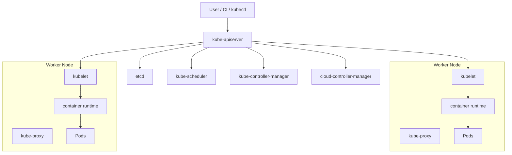

# Kubernetes：功能、架构设计与详细使用教程

> 目标读者：已经了解 Linux、Docker 或后端服务部署，希望系统学习 Kubernetes 的初学者。
> 学习目标：理解 Kubernetes 为什么存在、能做什么、内部架构如何协作，并能独立用 YAML 和 `kubectl` 部署、暴露、扩缩容、更新、排障一个应用。
> 说明：本文依据 Kubernetes 官方文档整理，偏原理化和实践化讲解，不是官方文档全文翻译。Kubernetes 版本、API 细节和最佳实践会演进，生产环境以官方当前文档和集群版本为准。

---

## 目录

1. [Kubernetes 解决什么问题](#1-kubernetes-解决什么问题)
2. [一句话理解 Kubernetes](#2-一句话理解-kubernetes)
3. [Kubernetes 的核心功能](#3-kubernetes-的核心功能)
4. [最重要的心智模型：声明式 API 与控制循环](#4-最重要的心智模型声明式-api-与控制循环)
5. [Kubernetes 集群架构](#5-kubernetes-集群架构)
6. [控制平面组件](#6-控制平面组件)
7. [节点组件](#7-节点组件)
8. [插件与扩展组件](#8-插件与扩展组件)
9. [Kubernetes 对象模型](#9-kubernetes-对象模型)
10. [Pod：最小调度与运行单元](#10-pod最小调度与运行单元)
11. [工作负载控制器](#11-工作负载控制器)
12. [Service、Ingress 与网络模型](#12-serviceingress-与网络模型)
13. [配置、密钥与存储](#13-配置密钥与存储)
14. [调度、资源与弹性伸缩](#14-调度资源与弹性伸缩)
15. [安全与权限模型](#15-安全与权限模型)
16. [详细使用教程：从零部署一个 Web 应用](#16-详细使用教程从零部署一个-web-应用)
17. [常用 kubectl 命令](#17-常用-kubectl-命令)
18. [排障方法](#18-排障方法)
19. [生产实践清单](#19-生产实践清单)
20. [常见误区](#20-常见误区)
21. [学习路线](#21-学习路线)
22. [官方资料](#22-官方资料)

---

## 1. Kubernetes 解决什么问题

在没有 Kubernetes 之前，部署一个服务通常要自己处理很多问题：

```text
把程序打包成镜像
找机器运行容器
容器挂了要重启
机器挂了要迁移
服务副本要扩缩容
新版本要滚动发布
服务之间要发现彼此
外部流量要进入集群
配置和密钥要注入
日志、监控、权限、网络隔离要统一管理
```

如果只有一个服务、两台机器，手写脚本还能勉强维护。

但当系统变成几十个服务、上百个副本、多环境、多团队、多云资源时，人工维护会迅速失控。

Kubernetes 要解决的是：

```text
如何把大量容器化应用，以声明式、自动化、可恢复、可扩展的方式运行在一组机器上。
```

它不是简单的“容器启动工具”。

它更像一个分布式操作系统的控制层：

- 应用以对象形式提交。
- 集群不断观察实际状态。
- 控制器持续把实际状态修正到期望状态。
- 节点负责真正运行容器。

## 2. 一句话理解 Kubernetes

Kubernetes 可以理解为：

> 一个通过声明式 API 管理容器化应用部署、调度、服务发现、伸缩、恢复、配置、存储和权限的容器编排平台。

再简化：

```text
Kubernetes = 声明式 API + 控制器调谐 + 容器运行平台
```

用户告诉 Kubernetes：

```text
我希望运行 3 个 nginx 副本。
我希望它们对外暴露为一个稳定服务。
我希望升级镜像时滚动更新。
我希望容器不健康时自动重启。
```

Kubernetes 负责不断让集群接近这个状态。

### 2.1 Kubernetes 不是什么

Kubernetes 不是：

- 一个单机容器运行时。
- 一个完整 PaaS。
- 一个 CI/CD 系统。
- 一个日志系统。
- 一个监控系统。
- 一个数据库。
- 一个服务网格。

但它可以和这些系统集成。

例如：

- containerd 负责真正运行容器。
- Prometheus 负责监控。
- Fluent Bit 或其他组件负责日志采集。
- Argo CD 或 Flux 负责 GitOps。
- Istio 或 Linkerd 负责服务网格。
- CSI 插件负责存储接入。

Kubernetes 的核心价值是统一抽象和自动化控制。

## 3. Kubernetes 的核心功能

### 3.1 容器编排

Kubernetes 可以把容器运行在集群节点上。

它会考虑：

- 哪台机器资源足够。
- 哪些节点可用。
- Pod 是否有调度约束。
- 是否要避开某些节点。
- 是否需要亲和或反亲和。
- 是否满足存储、网络、设备等要求。

### 3.2 自愈能力

Kubernetes 会持续观察状态。

常见自愈行为：

- 容器崩溃后重启。
- Pod 被删除后重新创建。
- 节点不可用后迁移由控制器管理的 Pod。
- 健康检查失败后重启容器或停止接流量。

但要注意：

```text
Kubernetes 能重启容器，不代表能自动修复应用逻辑 bug。
```

如果应用启动就崩溃，它会反复重启，进入 `CrashLoopBackOff`。

### 3.3 服务发现与负载均衡

Pod IP 会变化，不能让客户端直接依赖 Pod IP。

Kubernetes 用 Service 提供稳定访问入口。

典型效果：

```text
多个 Pod 副本 -> 一个稳定 Service 名称和虚拟 IP
```

集群内可以通过 DNS 访问：

```text
http://web.default.svc.cluster.local
```

### 3.4 滚动更新与回滚

Deployment 可以管理无停机滚动更新。

例如：

```text
旧版本 Pod 逐步减少
新版本 Pod 逐步增加
服务流量持续可用
```

如果新版本有问题，可以回滚到上一个版本。

### 3.5 自动伸缩

Kubernetes 支持多种伸缩方式：

- 手动扩缩容。
- Horizontal Pod Autoscaler：按指标调整 Pod 副本数。
- Vertical Pod Autoscaler：调整资源请求和限制。
- Cluster Autoscaler 或云厂商节点自动伸缩：调整节点数量。

### 3.6 配置与密钥管理

ConfigMap 用来保存非敏感配置。

Secret 用来保存敏感配置，例如 token、密码、证书。

它们可以以环境变量或文件形式注入 Pod。

### 3.7 存储编排

容器本身通常是临时的。

Kubernetes 通过 Volume、PersistentVolume、PersistentVolumeClaim、StorageClass 和 CSI 插件管理持久化存储。

### 3.8 安全与多租户

Kubernetes 提供：

- Namespace。
- ServiceAccount。
- RBAC。
- NetworkPolicy。
- Pod Security Admission。
- Secret。
- Admission Webhook。
- ResourceQuota。

这些能力一起构成集群内的隔离、授权和治理基础。

## 4. 最重要的心智模型：声明式 API 与控制循环

Kubernetes 最核心的思想不是“运行容器”，而是：

```text
用户声明期望状态，控制器不断把实际状态调谐到期望状态。
```

### 4.1 期望状态与实际状态

例如你提交一个 Deployment：

```yaml
apiVersion: apps/v1
kind: Deployment
metadata:
  name: web
spec:
  replicas: 3
  selector:
    matchLabels:
      app: web
  template:
    metadata:
      labels:
        app: web
    spec:
      containers:
        - name: web
          image: nginx:1.27-alpine
```

你不是在说：

```text
请立刻在某台机器上启动 3 个容器。
```

你是在说：

```text
我希望集群中长期保持 3 个符合这个模板的 Pod。
```

如果少了一个，控制器补一个。

如果多了一个，控制器删一个。

如果版本变化，控制器按策略更新。

### 4.2 控制循环

控制器的工作可以抽象成：

```text
while true:
    current = observe_cluster_state()
    desired = read_desired_state_from_api()
    diff = compare(desired, current)
    take_actions_to_reduce(diff)
```

这就是 Kubernetes 的调谐思想。

### 4.3 为什么声明式更适合分布式系统

命令式方式像这样：

```text
启动容器 A
启动容器 B
修改负载均衡
删除旧容器
```

如果中间失败，系统可能停在半路。

声明式方式更像：

```text
最终我要 3 个新版本副本可用。
```

控制器可以反复重试，直到状态收敛。

这正适合不可靠的分布式环境。

## 5. Kubernetes 集群架构

Kubernetes 集群由两大部分组成：

- Control Plane：控制平面。
- Worker Node：工作节点。



### 5.1 控制平面负责决策

控制平面负责：

- 暴露 Kubernetes API。
- 存储集群状态。
- 调度 Pod。
- 运行控制器。
- 与云厂商资源交互。

它不直接运行你的业务容器。

### 5.2 工作节点负责运行

工作节点负责：

- 运行 Pod。
- 拉取镜像。
- 挂载存储。
- 设置网络。
- 汇报状态。
- 执行健康检查。

## 6. 控制平面组件

### 6.1 kube-apiserver

`kube-apiserver` 是 Kubernetes API 的入口。

所有操作都要经过它：

```text
kubectl -> kube-apiserver -> etcd / controllers / scheduler / kubelet
```

它负责：

- API 请求认证。
- 授权。
- Admission 控制。
- 对象校验。
- 读写对象状态。
- watch 事件分发。

Kubernetes 的所有组件本质上都围绕 API Server 协作。

### 6.2 etcd

`etcd` 是一致性键值存储，用来保存集群状态。

它保存：

- Pod。
- Deployment。
- Service。
- ConfigMap。
- Secret。
- Node。
- RBAC。
- 其他 API 对象。

如果说 API Server 是入口，etcd 就是集群状态的持久化存储。

生产环境必须重视 etcd：

- 定期备份。
- 使用高可用部署。
- 控制访问权限。
- 监控磁盘和延迟。

### 6.3 kube-scheduler

`kube-scheduler` 负责把还没有绑定节点的 Pod 分配到合适节点。

它会考虑：

- CPU 和内存请求。
- 节点可用性。
- nodeSelector。
- node affinity。
- pod affinity / anti-affinity。
- taints 和 tolerations。
- topology spread constraints。
- 存储约束。
- 端口约束。

调度不是“随机找一台机器”，而是过滤和打分。

### 6.4 kube-controller-manager

`kube-controller-manager` 运行一组控制器。

例如：

- Deployment 控制器。
- ReplicaSet 控制器。
- Job 控制器。
- Node 控制器。
- EndpointSlice 控制器。
- Namespace 控制器。
- Garbage Collector。

控制器的工作是观察状态并调谐状态。

### 6.5 cloud-controller-manager

`cloud-controller-manager` 用于和云厂商资源交互。

例如：

- 创建云负载均衡。
- 管理云磁盘。
- 获取节点云元数据。
- 处理云平台路由。

本地集群或裸金属集群可能没有完整 cloud-controller-manager 能力。

## 7. 节点组件

### 7.1 kubelet

`kubelet` 是每个节点上的核心代理。

它负责：

- 从 API Server 获取分配给本节点的 Pod。
- 调用容器运行时创建容器。
- 挂载 Volume。
- 执行探针。
- 汇报 Pod 和 Node 状态。

可以理解为：

```text
kubelet = 节点上的执行者
```

### 7.2 container runtime

容器运行时负责真正运行容器。

常见运行时：

- containerd。
- CRI-O。

Kubernetes 通过 CRI 与容器运行时交互。

### 7.3 kube-proxy

`kube-proxy` 负责实现 Service 的网络转发规则。

它会在节点上维护转发规则，把访问 Service 的流量转发到后端 Pod。

现代集群中，有些 CNI 插件会替代或增强 kube-proxy 的能力。

## 8. 插件与扩展组件

Kubernetes 本体只定义核心控制和对象模型，很多能力由插件实现。

### 8.1 CNI 网络插件

CNI 插件负责 Pod 网络。

常见插件：

- Calico。
- Cilium。
- Flannel。
- Antrea。

它们通常负责：

- Pod IP 分配。
- Pod 之间通信。
- NetworkPolicy。
- 跨节点路由。

### 8.2 CoreDNS

CoreDNS 提供集群 DNS。

例如 Service `web` 在 namespace `demo` 中，可以通过：

```text
web.demo.svc.cluster.local
```

被访问。

### 8.3 CSI 存储插件

CSI 插件负责连接外部存储系统。

例如：

- 云磁盘。
- NFS。
- Ceph。
- 本地存储。
- 分布式块存储。

### 8.4 Ingress Controller

Ingress 只是 Kubernetes API 对象。

真正处理 HTTP/HTTPS 流量的是 Ingress Controller。

常见实现：

- ingress-nginx。
- Traefik。
- HAProxy Ingress。
- 云厂商负载均衡控制器。

### 8.5 Metrics Server

Metrics Server 提供基础资源指标。

HPA 通常依赖它获取 CPU、内存指标。

如果没有 Metrics Server，`kubectl top` 和基于 CPU 的 HPA 可能无法工作。

## 9. Kubernetes 对象模型

### 9.1 对象的基本结构

Kubernetes 对象通常长这样：

```yaml
apiVersion: apps/v1
kind: Deployment
metadata:
  name: web
  namespace: demo
  labels:
    app: web
spec:
  replicas: 3
status:
  availableReplicas: 3
```

关键字段：

| 字段 | 含义 |
| --- | --- |
| `apiVersion` | API 组和版本 |
| `kind` | 对象类型 |
| `metadata` | 名称、命名空间、标签、注解等元数据 |
| `spec` | 用户声明的期望状态 |
| `status` | Kubernetes 记录的实际状态 |

用户主要写 `spec`。

系统主要更新 `status`。

### 9.2 Namespace

Namespace 用于在一个集群中划分逻辑空间。

常见用途：

- 区分环境：`dev`、`test`、`prod`。
- 区分团队：`team-a`、`team-b`。
- 配合 RBAC、ResourceQuota、NetworkPolicy 做隔离。

不要把 Namespace 理解成强安全边界。它只是隔离体系中的一层。

### 9.3 Labels 与 Selectors

Label 是键值对，用于标记对象。

Selector 用于选择一组对象。

Service 通过 selector 找 Pod。

Deployment 通过 selector 管理 ReplicaSet 和 Pod。

示例：

```yaml
metadata:
  labels:
    app: web
    tier: frontend
```

好的 Label 设计会让运维、监控、发布和排障都更清楚。

### 9.4 Annotations

Annotation 也是键值对，但通常用于非选择性元数据。

例如：

- 构建版本。
- 负责人。
- Ingress Controller 配置。
- 自动化工具记录。

不要用 Annotation 做选择器。

## 10. Pod：最小调度与运行单元

Pod 是 Kubernetes 中最小的调度单元。

一个 Pod 可以包含一个或多个容器。

同一个 Pod 内的容器共享：

- 网络命名空间。
- Pod IP。
- localhost。
- 可选 Volume。
- 生命周期。

### 10.1 为什么不是直接调度容器

Kubernetes 调度 Pod，而不是单个容器，是因为有些容器天然需要一起运行。

例如：

```text
主应用容器 + sidecar 日志代理
主应用容器 + sidecar 代理
主应用容器 + init container 初始化数据
```

这些容器需要共享网络和存储，并作为一个整体被调度。

### 10.2 Pod 生命周期

常见状态：

- Pending：还未调度或镜像未拉取完成。
- Running：至少一个容器正在运行。
- Succeeded：所有容器成功结束。
- Failed：至少一个容器失败结束。
- Unknown：节点状态无法确认。

常见等待原因：

- `ImagePullBackOff`：镜像拉取失败。
- `CrashLoopBackOff`：容器反复崩溃。
- `CreateContainerConfigError`：配置错误。
- `ErrImagePull`：镜像拉取错误。

### 10.3 探针

Kubernetes 常用三类探针：

| 探针 | 作用 |
| --- | --- |
| livenessProbe | 判断容器是否需要重启 |
| readinessProbe | 判断 Pod 是否可以接收流量 |
| startupProbe | 判断慢启动应用是否启动完成 |

不要把 liveness 和 readiness 混用。

如果 readiness 失败，Pod 会从 Service 后端移除。

如果 liveness 失败，容器会被重启。

## 11. 工作负载控制器

直接创建 Pod 通常不是生产实践。

生产中一般使用控制器管理 Pod。

### 11.1 Deployment

Deployment 用于无状态应用。

它提供：

- 副本管理。
- 滚动更新。
- 回滚。
- 扩缩容。
- 与 ReplicaSet 协作。

适合：

- Web 服务。
- API 服务。
- 无状态 worker。

### 11.2 ReplicaSet

ReplicaSet 保证某个 Pod 模板有指定数量副本。

通常不直接使用 ReplicaSet，而是由 Deployment 自动创建和管理。

### 11.3 StatefulSet

StatefulSet 用于有状态应用。

特点：

- 稳定网络标识。
- 稳定存储。
- 有序部署和缩容。

适合：

- 数据库。
- 消息队列。
- 需要稳定身份的服务。

但生产数据库上 Kubernetes 需要谨慎设计存储、备份、恢复和运维自动化。

### 11.4 DaemonSet

DaemonSet 确保每个或部分节点运行一个 Pod。

适合：

- 日志采集代理。
- 监控 agent。
- 网络插件。
- 存储 agent。

### 11.5 Job 与 CronJob

Job 用于一次性任务。

CronJob 用于定时任务。

例如：

- 数据迁移。
- 批处理。
- 定时清理。
- 定时同步。

## 12. Service、Ingress 与网络模型

### 12.1 Kubernetes 网络基本原则

Kubernetes 网络模型通常假设：

- 每个 Pod 有自己的 IP。
- Pod 之间可以直接通信。
- 节点可以和 Pod 通信。
- Service 提供稳定访问入口。

具体实现取决于 CNI 插件。

### 12.2 Service

Service 为一组 Pod 提供稳定访问入口。

常见类型：

| 类型 | 作用 |
| --- | --- |
| ClusterIP | 集群内部访问，默认类型 |
| NodePort | 通过每个节点端口暴露 |
| LoadBalancer | 通过云负载均衡暴露 |
| ExternalName | 映射外部 DNS 名称 |

Service 通常通过 selector 找后端 Pod。

### 12.3 EndpointSlice

EndpointSlice 保存 Service 后端端点信息。

当 Pod 变化时，EndpointSlice 会更新。

这比旧的 Endpoints 对象更适合大规模集群。

### 12.4 Ingress

Ingress 用于声明 HTTP/HTTPS 路由。

例如：

```text
https://example.com/api -> api-service
https://example.com/web -> web-service
```

注意：

```text
只有 Ingress 对象不够，还必须有 Ingress Controller。
```

### 12.5 Gateway API

Gateway API 是比 Ingress 更现代、更具表达力的流量入口 API。

它更适合复杂流量治理、多团队共享网关和更清晰的角色分工。

初学者可以先学 Service 和 Ingress，再了解 Gateway API。

### 12.6 NetworkPolicy

NetworkPolicy 用于控制 Pod 之间的网络访问。

例如：

```text
只允许 frontend 访问 backend。
只允许 backend 访问 database。
禁止其他 namespace 访问生产服务。
```

NetworkPolicy 是否生效取决于 CNI 插件是否支持。

## 13. 配置、密钥与存储

### 13.1 ConfigMap

ConfigMap 用于非敏感配置。

例如：

- 配置文件。
- 环境变量。
- 应用开关。
- URL。

它可以被挂载为文件，也可以注入为环境变量。

### 13.2 Secret

Secret 用于敏感信息。

例如：

- 密码。
- token。
- TLS 证书。
- 私有镜像仓库凭据。

注意：

```text
Secret 默认只是以 API 对象形式管理敏感数据，不等于自动提供完整安全方案。
```

生产环境应考虑：

- RBAC 最小权限。
- 加密静态存储。
- 外部密钥管理系统。
- 避免把 Secret 打进镜像。
- 避免在日志中打印 Secret。

### 13.3 Volume

Volume 解决容器内数据临时共享或持久化问题。

常见 Volume：

- emptyDir。
- configMap。
- secret。
- persistentVolumeClaim。
- projected。

### 13.4 PV、PVC、StorageClass

持久化存储核心对象：

| 对象 | 含义 |
| --- | --- |
| PersistentVolume | 集群中的一块存储资源 |
| PersistentVolumeClaim | 应用对存储的申请 |
| StorageClass | 动态创建存储的模板 |

典型流程：

```text
应用创建 PVC -> StorageClass 动态创建 PV -> Pod 挂载 PVC
```

## 14. 调度、资源与弹性伸缩

### 14.1 requests 与 limits

资源配置是 Kubernetes 生产实践的基础。

```yaml
resources:
  requests:
    cpu: "100m"
    memory: "128Mi"
  limits:
    cpu: "500m"
    memory: "512Mi"
```

含义：

- requests：调度时保证的资源。
- limits：容器最多能使用的资源上限。

没有 requests，调度器无法正确判断资源。

没有 limits，应用可能抢占过多资源。

但 CPU limit 设置过低也可能导致应用被 throttling。

### 14.2 QoS

Kubernetes 会根据资源配置给 Pod 分 QoS 类别。

常见类别：

- Guaranteed。
- Burstable。
- BestEffort。

节点资源紧张时，不同 QoS 的 Pod 被驱逐优先级不同。

### 14.3 节点选择

常见调度控制：

- nodeSelector。
- node affinity。
- pod affinity。
- pod anti-affinity。
- taints。
- tolerations。
- topology spread constraints。

简单场景用 nodeSelector。

复杂场景用 affinity 和 topology spread。

### 14.4 HPA

Horizontal Pod Autoscaler 根据指标调整副本数。

常见依据：

- CPU。
- 内存。
- 自定义指标。
- 外部指标。

使用 HPA 前通常要安装 Metrics Server 或指标适配器。

## 15. 安全与权限模型

### 15.1 ServiceAccount

Pod 运行时可以绑定 ServiceAccount。

ServiceAccount 决定 Pod 访问 Kubernetes API 的身份。

不要让业务 Pod 默认拥有过大权限。

### 15.2 RBAC

RBAC 由几类对象组成：

- Role。
- ClusterRole。
- RoleBinding。
- ClusterRoleBinding。

示例原则：

```text
只授予需要的 namespace。
只授予需要的 resource。
只授予需要的 verb。
```

### 15.3 Pod Security

Pod Security Standards 通常分为：

- Privileged。
- Baseline。
- Restricted。

生产环境应尽量向 Restricted 靠拢。

常见安全设置：

- 不用 root 用户运行。
- 禁止特权容器。
- 只读根文件系统。
- 去除不必要 Linux capabilities。
- 设置 seccomp profile。

### 15.4 Admission

Admission 控制可以在对象写入 API 前做校验或变更。

常见用途：

- 禁止使用 `latest` 镜像。
- 强制设置资源 requests。
- 注入 sidecar。
- 校验安全策略。
- 强制标签规范。

### 15.5 镜像安全

生产环境应考虑：

- 镜像扫描。
- 固定镜像 tag 或 digest。
- 私有仓库权限。
- 最小基础镜像。
- SBOM 和签名验证。

## 16. 详细使用教程：从零部署一个 Web 应用

本教程假设你已经有一个可用 Kubernetes 集群。

可以是：

- kind。
- minikube。
- Docker Desktop Kubernetes。
- 云厂商托管 Kubernetes。
- kubeadm 自建集群。

### 16.1 检查环境

```bash
kubectl version --client
kubectl cluster-info
kubectl get nodes
```

如果 `kubectl get nodes` 能看到节点，说明客户端已经能访问集群。

### 16.2 创建 Namespace

新建文件 `namespace.yaml`：

```yaml
apiVersion: v1
kind: Namespace
metadata:
  name: demo
  labels:
    name: demo
```

应用：

```bash
kubectl apply -f namespace.yaml
kubectl get ns demo
```

### 16.3 创建 ConfigMap

新建 `configmap.yaml`：

```yaml
apiVersion: v1
kind: ConfigMap
metadata:
  name: web-config
  namespace: demo
data:
  APP_ENV: "demo"
  WELCOME_TEXT: "Hello Kubernetes"
```

应用：

```bash
kubectl apply -f configmap.yaml
kubectl get configmap web-config -n demo
```

### 16.4 创建 Deployment

新建 `deployment.yaml`：

```yaml
apiVersion: apps/v1
kind: Deployment
metadata:
  name: web
  namespace: demo
  labels:
    app: web
spec:
  replicas: 2
  revisionHistoryLimit: 5
  selector:
    matchLabels:
      app: web
  strategy:
    type: RollingUpdate
    rollingUpdate:
      maxUnavailable: 1
      maxSurge: 1
  template:
    metadata:
      labels:
        app: web
    spec:
      containers:
        - name: web
          image: nginx:1.27-alpine
          ports:
            - containerPort: 80
          envFrom:
            - configMapRef:
                name: web-config
          resources:
            requests:
              cpu: "100m"
              memory: "128Mi"
            limits:
              cpu: "500m"
              memory: "256Mi"
          readinessProbe:
            httpGet:
              path: /
              port: 80
            initialDelaySeconds: 3
            periodSeconds: 5
          livenessProbe:
            httpGet:
              path: /
              port: 80
            initialDelaySeconds: 10
            periodSeconds: 10
```

应用：

```bash
kubectl apply -f deployment.yaml
kubectl rollout status deployment/web -n demo
kubectl get pods -n demo -o wide
```

观察 Deployment、ReplicaSet、Pod：

```bash
kubectl get deployment,rs,pod -n demo
```

你会看到 Deployment 创建 ReplicaSet，ReplicaSet 创建 Pod。

### 16.5 创建 Service

新建 `service.yaml`：

```yaml
apiVersion: v1
kind: Service
metadata:
  name: web
  namespace: demo
spec:
  type: ClusterIP
  selector:
    app: web
  ports:
    - name: http
      port: 80
      targetPort: 80
```

应用：

```bash
kubectl apply -f service.yaml
kubectl get svc,endpointslice -n demo
```

本地转发访问：

```bash
kubectl port-forward svc/web 8080:80 -n demo
```

然后访问：

```bash
curl http://127.0.0.1:8080
```

### 16.6 创建 Ingress

如果你的集群已经安装 Ingress Controller，可以创建 `ingress.yaml`：

```yaml
apiVersion: networking.k8s.io/v1
kind: Ingress
metadata:
  name: web
  namespace: demo
spec:
  ingressClassName: nginx
  rules:
    - host: web.demo.local
      http:
        paths:
          - path: /
            pathType: Prefix
            backend:
              service:
                name: web
                port:
                  number: 80
```

应用：

```bash
kubectl apply -f ingress.yaml
kubectl get ingress -n demo
```

注意：

```text
没有 Ingress Controller 时，创建 Ingress 对象不会自动带来外部访问能力。
```

### 16.7 扩缩容

手动扩容：

```bash
kubectl scale deployment web --replicas=4 -n demo
kubectl get pods -n demo
```

缩容：

```bash
kubectl scale deployment web --replicas=2 -n demo
```

### 16.8 滚动更新

修改镜像：

```bash
kubectl set image deployment/web web=nginx:1.27.5-alpine -n demo
kubectl rollout status deployment/web -n demo
kubectl rollout history deployment/web -n demo
```

如果发现新版本有问题，回滚：

```bash
kubectl rollout undo deployment/web -n demo
kubectl rollout status deployment/web -n demo
```

### 16.9 查看日志与进入容器

查看日志：

```bash
kubectl logs deployment/web -n demo
```

进入某个 Pod：

```bash
kubectl get pods -n demo
kubectl exec -it POD_NAME -n demo -- sh
```

### 16.10 模拟排障

查看 Pod 详情：

```bash
kubectl describe pod POD_NAME -n demo
```

查看事件：

```bash
kubectl get events -n demo --sort-by=.lastTimestamp
```

如果镜像写错，可能出现：

```text
ImagePullBackOff
ErrImagePull
```

如果应用启动就退出，可能出现：

```text
CrashLoopBackOff
```

### 16.11 创建 PVC 示例

如果集群有默认 StorageClass，可以创建 PVC。

`pvc.yaml`：

```yaml
apiVersion: v1
kind: PersistentVolumeClaim
metadata:
  name: web-data
  namespace: demo
spec:
  accessModes:
    - ReadWriteOnce
  resources:
    requests:
      storage: 1Gi
```

应用：

```bash
kubectl apply -f pvc.yaml
kubectl get pvc -n demo
```

如果一直 Pending，通常说明：

- 没有默认 StorageClass。
- 存储插件没有安装。
- 存储容量或访问模式不满足。

### 16.12 清理资源

```bash
kubectl delete -f ingress.yaml --ignore-not-found
kubectl delete -f service.yaml
kubectl delete -f deployment.yaml
kubectl delete -f configmap.yaml
kubectl delete -f pvc.yaml --ignore-not-found
kubectl delete -f namespace.yaml
```

## 17. 常用 kubectl 命令

### 17.1 查看资源

```bash
kubectl get nodes
kubectl get ns
kubectl get pods -A
kubectl get deploy,svc,ingress -n demo
kubectl get pod POD_NAME -n demo -o yaml
```

### 17.2 观察变化

```bash
kubectl get pods -n demo -w
kubectl rollout status deployment/web -n demo
kubectl describe deployment web -n demo
```

### 17.3 日志与调试

```bash
kubectl logs POD_NAME -n demo
kubectl logs deployment/web -n demo
kubectl exec -it POD_NAME -n demo -- sh
kubectl port-forward svc/web 8080:80 -n demo
```

### 17.4 应用配置

```bash
kubectl apply -f app.yaml
kubectl diff -f app.yaml
kubectl delete -f app.yaml
```

### 17.5 临时命令

```bash
kubectl run tmp-shell --rm -it --image=busybox:1.36 -- sh
```

临时命令适合排查网络和 DNS，但生产配置应写成声明式 YAML。

## 18. 排障方法

排障时不要先猜。

按层次看：

```text
对象是否存在？
控制器是否创建了子对象？
Pod 是否调度成功？
镜像是否拉取成功？
容器是否启动成功？
探针是否通过？
Service 是否选中了 Pod？
Ingress Controller 是否工作？
网络策略是否阻断？
资源是否不足？
```

### 18.1 Pod Pending

常见原因：

- CPU 或内存 requests 太高。
- 没有可用节点。
- 节点 taint 不允许调度。
- PVC 未绑定。
- nodeSelector 或 affinity 不满足。

查看：

```bash
kubectl describe pod POD_NAME -n demo
```

### 18.2 ImagePullBackOff

常见原因：

- 镜像名错误。
- tag 不存在。
- 私有仓库没有凭据。
- 节点无法访问镜像仓库。

查看：

```bash
kubectl describe pod POD_NAME -n demo
```

### 18.3 CrashLoopBackOff

常见原因：

- 应用启动即退出。
- 环境变量缺失。
- 配置文件错误。
- 依赖服务不可达。
- livenessProbe 配错导致反复重启。

查看：

```bash
kubectl logs POD_NAME -n demo --previous
kubectl describe pod POD_NAME -n demo
```

### 18.4 Service 无法访问

检查顺序：

```bash
kubectl get svc web -n demo
kubectl get endpointslice -n demo
kubectl get pods -n demo --show-labels
```

重点看：

- Service selector 是否匹配 Pod labels。
- Pod readiness 是否为 true。
- targetPort 是否正确。
- NetworkPolicy 是否阻断。

### 18.5 Ingress 不生效

检查：

```bash
kubectl get ingress -n demo
kubectl describe ingress web -n demo
kubectl get pods -A | grep -i ingress
```

重点看：

- 是否安装 Ingress Controller。
- `ingressClassName` 是否匹配。
- DNS 是否指向入口地址。
- TLS Secret 是否正确。
- 后端 Service 是否可用。

## 19. 生产实践清单

### 19.1 应用配置

```text
是否设置 requests 和 limits？
是否配置 readinessProbe？
是否配置 livenessProbe？
是否避免使用 latest 镜像？
是否使用 ConfigMap 管理非敏感配置？
是否使用 Secret 管理敏感配置？
是否有优雅终止逻辑？
```

### 19.2 发布策略

```text
Deployment 是否配置滚动更新策略？
是否保留足够 revisionHistory？
是否有回滚流程？
是否有灰度或金丝雀发布方案？
是否用 PDB 保护关键服务可用性？
```

### 19.3 安全

```text
Pod 是否避免 root 运行？
是否禁用特权容器？
RBAC 是否最小权限？
Secret 是否启用静态加密？
是否启用 Pod Security Admission？
是否配置 NetworkPolicy？
镜像是否经过扫描？
```

### 19.4 可观测性

```text
是否有应用日志采集？
是否有指标采集？
是否有告警？
是否有分布式追踪？
是否监控 Pod 重启次数？
是否监控 Deployment 不可用副本？
是否监控节点资源和磁盘？
```

### 19.5 集群运维

```text
etcd 是否定期备份？
控制平面是否高可用？
节点升级是否有流程？
是否有容量规划？
是否测试过节点故障？
是否限制 namespace 资源配额？
是否有准入策略防止危险配置？
```

## 20. 常见误区

### 20.1 误区：Pod 是长期稳定身份

Pod 是临时对象。

可能随时被删除、迁移、重建。

如果需要稳定访问入口，用 Service。

如果需要稳定身份和存储，用 StatefulSet。

### 20.2 误区：Service 就是外部负载均衡

Service 是 Kubernetes 内部抽象。

`LoadBalancer` 类型通常需要云厂商或裸金属负载均衡实现支持。

### 20.3 误区：Secret 默认就绝对安全

Secret 需要配合：

- RBAC。
- 静态加密。
- 审计。
- 外部密钥管理。
- 最小权限。

### 20.4 误区：livenessProbe 越激进越好

过于激进的 livenessProbe 会导致容器被频繁重启。

很多时候应该先配置 readinessProbe，确保不健康实例不接流量。

### 20.5 误区：Kubernetes 会自动解决所有应用问题

Kubernetes 解决的是编排和控制问题。

应用仍然要自己处理：

- 幂等。
- 数据一致性。
- 优雅关闭。
- 重试退避。
- 超时。
- 连接池。
- 数据备份。

## 21. 学习路线

### 21.1 第一阶段：会用

先掌握：

- Pod。
- Deployment。
- Service。
- ConfigMap。
- Secret。
- Namespace。
- kubectl。

能完成：

```text
部署应用 -> 暴露服务 -> 查看日志 -> 扩缩容 -> 滚动更新 -> 回滚 -> 删除资源
```

### 21.2 第二阶段：理解架构

重点理解：

- kube-apiserver。
- etcd。
- scheduler。
- controller-manager。
- kubelet。
- kube-proxy。
- container runtime。
- CNI。

能说清楚：

```text
kubectl apply 一个 Deployment 后，Kubernetes 内部发生了什么。
```

### 21.3 第三阶段：面向生产

学习：

- requests / limits。
- probes。
- HPA。
- PDB。
- RBAC。
- NetworkPolicy。
- PV/PVC/StorageClass。
- Ingress / Gateway API。
- 日志、监控、告警。

### 21.4 第四阶段：扩展 Kubernetes

学习：

- CRD。
- Controller。
- Operator pattern。
- Admission Webhook。
- Helm。
- Kustomize。
- GitOps。

## 22. 官方资料

建议优先阅读官方文档：

- [Kubernetes Overview](https://kubernetes.io/docs/concepts/overview/)
- [Kubernetes Components](https://kubernetes.io/docs/concepts/overview/components/)
- [Cluster Architecture](https://kubernetes.io/docs/concepts/architecture/)
- [Pods](https://kubernetes.io/docs/concepts/workloads/pods/)
- [Deployments](https://kubernetes.io/docs/concepts/workloads/controllers/deployment/)
- [Service](https://kubernetes.io/docs/concepts/services-networking/service/)
- [Ingress](https://kubernetes.io/docs/concepts/services-networking/ingress/)
- [ConfigMaps](https://kubernetes.io/docs/concepts/configuration/configmap/)
- [Secrets](https://kubernetes.io/docs/concepts/configuration/secret/)
- [Persistent Volumes](https://kubernetes.io/docs/concepts/storage/persistent-volumes/)
- [Learn Kubernetes Basics](https://kubernetes.io/docs/tutorials/kubernetes-basics/)

最后用一条主线收束：

```text
Kubernetes 不是魔法。
它用 API 对象描述期望状态，
用控制器持续调谐实际状态，
用调度器选择节点，
用 kubelet 在节点上运行 Pod，
用 Service、存储、配置和安全对象把应用组织成可运行的生产系统。
```
