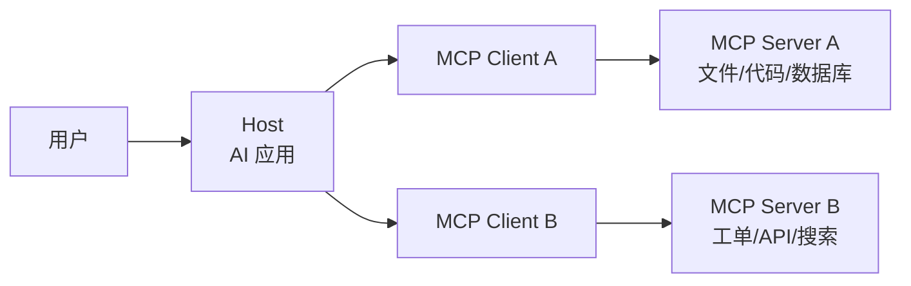

# 大模型时代的 MCP 协议与 MCP Server 设计教程

> 目标读者：已经了解大模型、API、命令行或简单 Web 开发，但第一次系统学习 MCP 的初学者。
> 学习目标：理解 MCP 为什么出现、它解决什么问题、Host/Client/Server 如何协作，以及如何从零设计一个简单、清晰、安全的 MCP Server。
> 说明：本文依据官方 MCP 文档与 `2025-11-25` 版规范整理，用中文做原理化讲解，不是规范全文翻译。实际工程以官方最新规范和 SDK 文档为准。

---

## 目录

1. [大模型为什么需要 MCP](#1-大模型为什么需要-mcp)
2. [一句话理解 MCP](#2-一句话理解-mcp)
3. [从接口混乱到统一协议](#3-从接口混乱到统一协议)
4. [MCP 的三个核心角色](#4-mcp-的三个核心角色)
5. [MCP 的两层架构](#5-mcp-的两层架构)
6. [MCP 的生命周期](#6-mcp-的生命周期)
7. [Server 提供的三类能力](#7-server-提供的三类能力)
8. [Client 侧能力：Roots、Sampling、Elicitation](#8-client-侧能力rootssamplingelicitation)
9. [传输层：stdio 与 Streamable HTTP](#9-传输层stdio-与-streamable-http)
10. [JSON-RPC 消息模型](#10-json-rpc-消息模型)
11. [如何设计 MCP Server](#11-如何设计-mcp-server)
12. [Tool 设计方法](#12-tool-设计方法)
13. [Resource 设计方法](#13-resource-设计方法)
14. [Prompt 设计方法](#14-prompt-设计方法)
15. [安全、权限、日志与错误处理](#15-安全权限日志与错误处理)
16. [简单示例：Notes MCP Server](#16-简单示例notes-mcp-server)
17. [初学者学习路线](#17-初学者学习路线)
18. [设计检查清单](#18-设计检查清单)
19. [官方资料](#19-官方资料)

---

## 1. 大模型为什么需要 MCP

大模型本身擅长理解语言、生成文本、推理和规划，但它有几个天然限制：

- 它不知道你本地文件、数据库、业务系统里的实时数据。
- 它不能天然调用你的内部 API、命令行工具、代码仓库、工单系统。
- 它生成的答案可能需要外部事实校验。
- 它要完成真实任务时，经常需要“读数据、调工具、写结果”。

因此，大模型时代的应用不再只是：

```text
用户问题 -> 大模型 -> 文本回答
```

而更像：

```text
用户目标 -> 大模型理解与规划 -> 调用外部工具/读取外部上下文 -> 综合结果 -> 给出答案或执行任务
```

问题是：外部系统太多了。

一个 AI IDE 可能想连接 Git、文件系统、测试框架、数据库、浏览器、部署平台。一个企业 AI 助手可能想连接 CRM、知识库、工单系统、日志平台、数据仓库。每个系统都有自己的认证、协议、数据格式和调用方式。

如果每个 AI 应用都为每个外部系统单独做适配，工程会迅速失控。

MCP 要解决的正是这个问题。

## 2. 一句话理解 MCP

MCP，全称 Model Context Protocol，可以理解为：

> 让 AI 应用以统一方式连接外部数据、工具和工作流的开放协议。

更直观地说，MCP 像是大模型应用与外部世界之间的标准接口。

可以用三个层次理解：

| 层次 | 初学者理解 | 工程理解 |
| --- | --- | --- |
| 目的 | 让大模型能用外部能力 | 统一 AI 应用与外部系统的连接方式 |
| 形式 | 一套通信规则 | 基于 JSON-RPC 的协议、能力协商与消息格式 |
| 结果 | 模型能查资料、调工具、走流程 | Host 可以接入多个 Server，每个 Server 暴露 Tools、Resources、Prompts |

不要把 MCP 理解成一个大模型。MCP 不是 LLM。

不要把 MCP 理解成一个向量数据库。MCP 可以连接向量数据库，但它本身不是向量数据库。

不要把 MCP 理解成一个 Agent 框架。MCP 可以服务 Agent 应用，但它本身主要是通信协议和能力接口。

更准确的定位是：

```text
MCP = AI 应用连接外部上下文与工具的标准协议
```

## 3. 从接口混乱到统一协议

假设有三个 AI 应用：

- AI IDE
- 企业聊天助手
- 自动化运维助手

又有四类外部系统：

- Git 仓库
- PostgreSQL 数据库
- Jira 工单
- 本地文件系统

如果没有统一协议，可能要做很多专用适配：

```text
AI IDE -> Git 适配
AI IDE -> PostgreSQL 适配
AI IDE -> Jira 适配
AI IDE -> 文件系统适配

聊天助手 -> Git 适配
聊天助手 -> PostgreSQL 适配
聊天助手 -> Jira 适配
聊天助手 -> 文件系统适配

运维助手 -> Git 适配
运维助手 -> PostgreSQL 适配
运维助手 -> Jira 适配
运维助手 -> 文件系统适配
```

这就是 `N x M` 连接问题。

MCP 的思路是把外部系统封装成 MCP Server，AI 应用只需要理解 MCP：

```text
AI 应用 -> MCP Client -> MCP Server -> 外部系统
```

这样，AI 应用不必理解每个系统的细节；外部系统也不必为每个 AI 应用写一套接入逻辑。

### 3.1 一流系统课的思考方式

学习 MCP 时，不要先背术语，而要先问：

1. **谁在发起任务？**
   用户在 Host 中提出目标。

2. **谁在决定是否调用工具？**
   通常是 Host 中的大模型和应用逻辑决定调用哪个工具。

3. **谁真正执行外部操作？**
   MCP Server 执行或代理执行。

4. **谁负责权限和用户确认？**
   Host 与 Server 都要承担一部分责任。Host 负责向用户展示、确认和编排；Server 负责最小权限、输入校验和安全边界。

5. **协议保证什么，不保证什么？**
   MCP 规定通信方式和能力描述，但不会自动保证业务逻辑安全，也不会自动替你设计权限系统。

这类问题比“某个字段怎么写”更重要。字段可以查文档，边界想不清楚会导致系统不可靠。

## 4. MCP 的三个核心角色

MCP 架构中最重要的三个角色是 Host、Client、Server。



### 4.1 Host：用户实际使用的 AI 应用

Host 是用户直接交互的应用。

例如：

- AI IDE
- 桌面聊天应用
- Web 版 AI 助手
- 自动化开发工具
- 企业内部 AI 工作台

Host 的责任通常包括：

- 展示对话界面或任务界面。
- 运行或调用大模型。
- 管理用户会话。
- 创建 MCP Client。
- 展示工具调用结果。
- 在敏感操作前请求用户确认。

初学者可以把 Host 理解为：

```text
Host = 装着大模型、用户界面和 MCP Client 的 AI 应用
```

### 4.2 Client：Host 内部的连接器

MCP Client 通常运行在 Host 内部。

一个 Host 可以连接多个 MCP Server。按照官方架构，一个 Host 通常会为每个 Server 创建一个对应的 Client。

Client 的责任包括：

- 与某个 Server 建立连接。
- 完成初始化和能力协商。
- 发送 `tools/list`、`tools/call`、`resources/read` 等请求。
- 接收 Server 返回的数据。
- 把 Server 能力转交给 Host 和模型使用。

初学者可以把 Client 理解为：

```text
Client = Host 里负责和某一个 Server 说 MCP 语言的连接对象
```

### 4.3 Server：暴露外部能力的程序

MCP Server 是真正把外部系统能力封装出来的程序。

例如：

- 文件系统 Server：读取、搜索、写入文件。
- Git Server：查看提交、分支、diff。
- 数据库 Server：执行安全查询。
- 文档 Server：检索知识库。
- 业务系统 Server：查询订单、创建工单、更新状态。

Server 对外暴露的通常不是随意接口，而是三类标准能力：

- Tools
- Resources
- Prompts

初学者可以把 Server 理解为：

```text
Server = 把某个外部系统整理成 AI 可发现、可调用能力的适配程序
```

### 4.4 三个角色不要混淆

| 问题 | 通常是谁负责 |
| --- | --- |
| 用户在哪里输入问题 | Host |
| 大模型在哪里运行或被调用 | Host |
| 谁维护到某个 Server 的连接 | Client |
| 谁声明自己有哪些工具 | Server |
| 谁真正访问数据库或文件 | Server |
| 谁决定把哪个工具交给模型 | Host |
| 谁执行 `tools/call` 请求 | Server |

一个常见误区是：“MCP Server 会主动控制大模型。”

通常不是。MCP Server 提供能力，Host 和模型决定如何使用这些能力。

## 5. MCP 的两层架构

官方架构可以理解为两层：

- Data layer：数据层，定义消息语义、生命周期、能力、请求和响应。
- Transport layer：传输层，定义消息如何在进程或网络之间移动。

```text
应用语义：Tools / Resources / Prompts / Lifecycle / Capabilities
---------------------------------------------------------------
消息协议：JSON-RPC 2.0
---------------------------------------------------------------
传输方式：stdio 或 Streamable HTTP
```

### 5.1 Data layer：说什么

Data layer 关心的是：

- 如何初始化。
- 如何协商协议版本和能力。
- 如何列出工具。
- 如何调用工具。
- 如何列出和读取资源。
- 如何提供 Prompt 模板。
- 如何发送通知、进度、日志和错误。

它回答的问题是：

```text
双方应该发送什么结构的消息？
每条消息是什么意思？
哪些功能需要先声明能力？
什么时候可以调用哪些方法？
```

### 5.2 Transport layer：怎么送

Transport layer 关心的是：

- 消息从哪里发到哪里。
- 是本地进程通信，还是网络通信。
- 如何分隔消息。
- 如何处理 HTTP 连接、SSE、认证等。

它回答的问题是：

```text
JSON-RPC 消息如何从 Client 到 Server？
Server 如何把响应送回 Client？
日志能不能写到 stdout？
远程 Server 如何认证？
```

把这两层分开理解很重要。

例如，`tools/call` 是 Data layer 的方法；它可以通过 stdio 传输，也可以通过 Streamable HTTP 传输。

## 6. MCP 的生命周期

MCP 不是一连接上就随便调用。它有明确的生命周期。

可以简化为四步：

```text
1. 初始化 initialize
2. 初始化完成 initialized
3. 正常操作 operation
4. 关闭 shutdown
```

### 6.1 初始化阶段

Client 首先发送 `initialize` 请求。

请求里通常包含：

- Client 支持的协议版本。
- Client 的能力。
- Client 信息。

Server 返回：

- Server 选择或支持的协议版本。
- Server 的能力。
- Server 信息。
- 可选的使用说明。

这一步的意义是：

```text
先确认双方会说同一种 MCP 语言，再开始正式协作。
```

如果没有初始化，Client 不应该直接调用工具或读取资源。

### 6.2 initialized 通知

Client 收到 Server 的初始化响应后，会发送 `notifications/initialized`。

这表示：

```text
初始化已经完成，可以进入正常操作阶段。
```

### 6.3 正常操作阶段

进入 operation 阶段后，Client 可以根据协商出的能力调用对应功能。

例如：

- 如果 Server 声明了 `tools` 能力，Client 可以请求 `tools/list`。
- 如果 Server 声明了 `resources` 能力，Client 可以请求 `resources/list` 或 `resources/read`。
- 如果 Server 声明了 `prompts` 能力，Client 可以请求 `prompts/list` 或 `prompts/get`。

关键原则是：

```text
只使用双方在初始化阶段协商过的能力。
```

### 6.4 关闭阶段

关闭阶段通常由传输方式决定。

- stdio 模式下，Host 可能结束子进程。
- HTTP 模式下，Client 可能关闭会话或不再发送请求。

工程上要注意：

- 清理资源。
- 关闭文件句柄、数据库连接、网络连接。
- 不要在关闭过程中留下未完成的写操作。

## 7. Server 提供的三类能力

MCP Server 最常见的三类能力是：

- Tools：工具。
- Resources：资源。
- Prompts：提示模板。

这是初学者最需要掌握的部分。

### 7.1 Tools：模型可调用的动作

Tool 是可执行函数。

典型例子：

- `search_docs(query)`：搜索文档。
- `query_database(sql)`：查询数据库。
- `create_ticket(title, description)`：创建工单。
- `run_tests(target)`：运行测试。
- `get_weather(city)`：查询天气。

Tool 的核心特点：

- 它通常会执行计算、查询或外部动作。
- 它有输入参数。
- 它有返回结果。
- 它可能有副作用。
- 它通常由模型通过 Host 决定是否调用。

可以把 Tool 理解为：

```text
Tool = Server 暴露给 AI 使用的函数
```

### 7.2 Resources：应用可读取的上下文数据

Resource 是上下文数据。

典型例子：

- `file:///project/README.md`
- `db://schema/users`
- `git://repo/current-branch`
- `notes://all`
- `docs://api/authentication`

Resource 的核心特点：

- 它通常是“读”的对象。
- 它用 URI 标识。
- 它给模型提供上下文。
- 它不应该被设计成主要执行动作的接口。

可以把 Resource 理解为：

```text
Resource = Server 暴露给 AI 应用读取的资料、状态或上下文
```

### 7.3 Prompts：可复用的任务模板

Prompt 是可复用的提示模板或工作流入口。

典型例子：

- `review_code`：代码审查模板。
- `summarize_notes`：总结笔记模板。
- `write_release_note`：生成发布说明模板。
- `debug_error`：调试错误模板。

Prompt 的核心特点：

- 它不是工具执行结果。
- 它也不是普通资源。
- 它是 Server 提供给 Host 的“推荐对话结构”或“任务模板”。

可以把 Prompt 理解为：

```text
Prompt = Server 提供的可复用提问方式和任务流程
```

### 7.4 三者如何选择

判断一个能力应该做成 Tool、Resource 还是 Prompt，可以用这张表：

| 需求 | 更适合 |
| --- | --- |
| 查询、计算、创建、更新、删除 | Tool |
| 暴露只读上下文、文件、状态、文档 | Resource |
| 提供可复用任务模板或对话流程 | Prompt |
| 需要输入参数并执行动作 | Tool |
| 需要通过 URI 读取内容 | Resource |
| 需要引导模型怎样完成某类任务 | Prompt |

例如，一个知识库 MCP Server 可以这样设计：

| 能力 | 类型 | 例子 |
| --- | --- | --- |
| 搜索知识库 | Tool | `search_articles(query)` |
| 读取某篇文章 | Resource | `kb://article/123` |
| 生成知识库问答摘要 | Prompt | `answer_from_kb(question)` |

## 8. Client 侧能力：Roots、Sampling、Elicitation

除了 Server 暴露能力，Client 也可以向 Server 声明一些能力。

初学者先理解三个概念即可：

- Roots
- Sampling
- Elicitation

### 8.1 Roots：告诉 Server 可访问边界

Roots 可以理解为 Host 或 Client 告诉 Server：

```text
你可以围绕这些根目录或 URI 工作。
```

例如：

- 当前项目目录。
- 用户选择的工作区。
- 某个文档集合。

它的意义是限制上下文边界，避免 Server 假设自己可以访问所有东西。

### 8.2 Sampling：Server 请求 Host 使用模型

Sampling 允许 Server 请求 Client/Host 调用大模型生成内容。

这听起来有点绕：

```text
Server 本身不一定有模型，但它可以请求 Host 侧模型帮忙生成。
```

例如，一个数据分析 Server 可能读取到一组统计结果，然后请求 Host 侧模型帮忙生成解释文本。

初学者要记住：

- Sampling 是 Client 侧能力。
- Server 不能假设所有 Host 都支持 Sampling。
- 如果要用，必须通过能力协商确认。

### 8.3 Elicitation：Server 请求用户补充信息

Elicitation 可以理解为：

```text
Server 发现执行任务还缺少信息，于是请求 Host 向用户询问。
```

例如：

- 创建工单前缺少优先级。
- 查询报表前缺少时间范围。
- 执行部署前缺少环境选择。

这比 Server 自己乱猜更安全。

## 9. 传输层：stdio 与 Streamable HTTP

MCP 标准传输主要包括：

- stdio
- Streamable HTTP

### 9.1 stdio：本地 Server 最常见

stdio 模式下，Host 启动一个本地 Server 子进程。

通信方式是：

```text
Client -> Server stdin
Server -> Client stdout
日志 -> stderr
```

适合场景：

- 本地文件系统 Server。
- 本地开发工具 Server。
- 个人脚本封装。
- 需要访问本机资源的工具。

stdio 的重要规则：

```text
stdout 只能输出合法 MCP 消息。
日志、调试信息、print 调试都应该写到 stderr。
```

如果你在 stdio Server 中随便 `print("debug")` 到 stdout，可能会破坏 MCP 消息流。

### 9.2 Streamable HTTP：远程或多客户端场景

Streamable HTTP 适合远程服务或多客户端访问。

典型场景：

- 企业内部统一 MCP 服务。
- 多个 AI 应用访问同一个业务系统。
- Server 部署在云端。
- 需要 HTTP 认证、会话、网关和审计。

HTTP 模式通常要额外考虑：

- 认证和授权。
- 会话管理。
- 速率限制。
- Origin 校验。
- 本地服务绑定地址。
- 访问日志和审计。

如果 Server 只给本地开发使用，stdio 更简单。

如果 Server 要多人共享、远程访问、集中管控，HTTP 更合适。

### 9.3 选择建议

| 场景 | 推荐传输 |
| --- | --- |
| 初学者本地练习 | stdio |
| 本地 IDE 插件 | stdio |
| 访问本机项目文件 | stdio |
| 企业共享服务 | Streamable HTTP |
| 需要统一认证和审计 | Streamable HTTP |
| 多个 Host 同时连接 | Streamable HTTP |

## 10. JSON-RPC 消息模型

MCP 使用 JSON-RPC 2.0 作为消息基础。

JSON-RPC 的核心概念很简单：

- Request：带 `id` 的请求，需要响应。
- Response：对应某个请求的结果或错误。
- Notification：不带 `id` 的通知，不需要响应。

### 10.1 请求

概念示例：

```json
{
  "jsonrpc": "2.0",
  "id": 1,
  "method": "tools/list",
  "params": {}
}
```

含义是：

```text
请列出 Server 暴露的工具。
```

### 10.2 响应

概念示例：

```json
{
  "jsonrpc": "2.0",
  "id": 1,
  "result": {
    "tools": [
      {
        "name": "search_notes",
        "title": "Search notes",
        "description": "Search notes by keyword.",
        "inputSchema": {
          "type": "object",
          "properties": {
            "keyword": {
              "type": "string"
            }
          },
          "required": ["keyword"]
        }
      }
    ]
  }
}
```

含义是：

```text
Server 返回了一个名为 search_notes 的工具，并说明了它需要 keyword 参数。
```

### 10.3 通知

概念示例：

```json
{
  "jsonrpc": "2.0",
  "method": "notifications/initialized"
}
```

含义是：

```text
Client 通知 Server：初始化流程已完成。
```

### 10.4 初学者应该抓住什么

不需要一开始就背所有 JSON 字段。

先抓住四点：

1. MCP 消息是结构化 JSON。
2. Request 有 `id`，Response 用同一个 `id` 对应。
3. Method 表示要做什么，比如 `tools/list`、`tools/call`。
4. 能不能调用某个 Method，取决于初始化阶段协商出的能力。

## 11. 如何设计 MCP Server

设计 MCP Server 时，不要先写代码。先画清楚边界。

一流工程课通常会从这几个问题开始：

```text
这个 Server 代表哪个外部系统？
它只读还是可写？
用户最常见的任务是什么？
哪些操作有风险？
哪些数据不能暴露给模型？
哪些能力应该做成 Tool，哪些应该做成 Resource？
如果模型传入错误参数，Server 如何处理？
如果 Host 不支持某个能力，Server 如何降级？
```

### 11.1 第一步：定义 Server 的领域边界

一个 MCP Server 最好围绕一个清晰领域。

好的边界：

- `github-repo-server`：围绕 GitHub 仓库。
- `postgres-readonly-server`：围绕只读数据库查询。
- `company-docs-server`：围绕企业文档检索。
- `local-notes-server`：围绕本地笔记。

不好的边界：

- `everything-server`：什么都做，权限和行为难以控制。
- `tools-server`：名字太泛，无法表达能力边界。
- `admin-server`：风险过高，职责不清。

领域边界越清楚，模型越容易正确选择工具，用户也越容易理解风险。

### 11.2 第二步：列出用户任务

不要从 API 开始，而要从任务开始。

例如设计一个笔记 Server，用户任务可能是：

- 新增一条笔记。
- 搜索笔记。
- 读取全部笔记。
- 总结笔记。

再转成 MCP 能力：

| 用户任务 | MCP 能力 |
| --- | --- |
| 新增笔记 | Tool：`add_note` |
| 搜索笔记 | Tool：`search_notes` |
| 读取全部笔记 | Resource：`notes://all` |
| 总结笔记 | Prompt：`summarize_notes` |

这样设计出来的接口更贴近用户目标。

### 11.3 第三步：区分读、写、危险操作

把操作分成三类：

| 类型 | 例子 | 设计策略 |
| --- | --- | --- |
| 只读 | 搜索、查看、列出 | 可以设计得更便捷 |
| 普通写入 | 新增笔记、创建草稿 | 明确返回写入结果 |
| 高风险写入 | 删除、转账、部署、发邮件 | 拆分步骤、要求确认、保留审计 |

MCP 协议本身提供通信规则，但业务风险需要你自己设计。

不要把危险操作藏在描述模糊的工具里。

例如：

```text
不推荐：manage_user(action, data)
推荐：get_user(user_id)
推荐：disable_user(user_id, reason)
推荐：delete_user_permanently(user_id, confirmation_token)
```

### 11.4 第四步：设计能力描述

模型会读工具的名称、描述和参数 Schema。

因此，Tool 描述不是写给人类 API 文档看的，它也是写给模型看的。

好的描述应该说明：

- 这个工具做什么。
- 什么时候应该用。
- 输入参数有什么约束。
- 是否有副作用。
- 返回结果代表什么。

示例：

```text
search_notes:
Search local notes by keyword. Use this when the user wants to find existing notes.
This tool is read-only and does not modify notes.
```

差的描述：

```text
do search
note tool
useful function
```

描述越清楚，模型越不容易乱用。

### 11.5 第五步：设计失败路径

一个合格的 Server 不只考虑成功。

要提前设计：

- 参数缺失怎么办？
- 参数类型错误怎么办？
- 查询结果为空怎么办？
- 外部 API 超时怎么办？
- 权限不足怎么办？
- 用户请求越权怎么办？
- 写入失败怎么办？

错误信息应该帮助 Host 和模型恢复，而不是泄漏内部细节。

例如：

```text
推荐：Permission denied: this server can only read notes under the configured notes directory.
不推荐：Traceback... /Users/alice/secrets/internal_token...
```

## 12. Tool 设计方法

Tool 是 MCP Server 里最容易被滥用、也最需要设计纪律的部分。

### 12.1 Tool 应该小而明确

好的 Tool 像一个清晰函数。

```text
add_note(title, content)
search_notes(keyword)
get_order(order_id)
create_ticket(title, description, priority)
```

差的 Tool 像一个万能入口。

```text
execute(action, payload)
run(command)
manage(data)
do_task(instruction)
```

万能工具看起来灵活，但会带来问题：

- 模型难以判断什么时候调用。
- 参数难以校验。
- 权限难以控制。
- 审计日志难以理解。
- 出错后难以恢复。

初学者应遵循：

```text
一个 Tool 只做一类清晰动作。
```

### 12.2 Tool 名称要表达意图

推荐命名：

- 动词 + 对象。
- 使用领域词。
- 避免缩写和内部黑话。

示例：

| 不推荐 | 推荐 |
| --- | --- |
| `exec` | `run_project_tests` |
| `q` | `search_customer_records` |
| `modify` | `update_ticket_status` |
| `db` | `query_readonly_database` |

名称不是给程序员炫技的，是给 Host、模型和用户共同理解的。

### 12.3 输入参数要结构化

Tool 参数应该通过 JSON Schema 清楚表达。

设计参数时要考虑：

- 类型：string、number、boolean、array、object。
- 必填字段。
- 枚举值。
- 字符串长度。
- 数值范围。
- 默认值。

例如，创建工单不应该只给一个自由文本：

```text
不推荐：create_ticket(text)
```

更好的设计：

```text
推荐：create_ticket(title, description, priority, assignee)
```

这样模型更容易填对参数，Server 也更容易校验。

### 12.4 区分查询工具与写入工具

读写混在一起会增加风险。

不推荐：

```text
handle_ticket(action, id, data)
```

推荐：

```text
get_ticket(ticket_id)
search_tickets(query)
create_ticket(title, description)
update_ticket_status(ticket_id, status)
```

这样 Host 可以对不同工具设置不同确认策略。

### 12.5 对危险 Tool 保守设计

危险 Tool 包括：

- 删除数据。
- 修改权限。
- 转账或支付。
- 发送外部消息。
- 部署生产环境。
- 执行任意命令。

设计原则：

- 名称明确暴露风险。
- 参数中包含原因或确认信息。
- 返回执行前摘要。
- 优先设计成两步流程：预览 -> 执行。
- 默认最小权限。

示例：

```text
preview_delete_notes(note_ids)
confirm_delete_notes(note_ids, confirmation_token)
```

不要设计：

```text
delete_anything(target)
```

### 12.6 Tool 返回结果要可读、可恢复

Tool 返回结果要让模型和用户能继续下一步。

好的返回结果包含：

- 操作是否成功。
- 关键结果。
- 失败原因。
- 下一步建议。
- 必要的标识符。

例如：

```text
Created note:
- id: 17
- title: MCP 学习计划
- created_at: 2026-06-26T10:00:00Z
```

不要只返回：

```text
ok
```

`ok` 对模型后续推理帮助很小。

## 13. Resource 设计方法

Resource 是给 Host 和模型读取的上下文。

### 13.1 Resource 要有稳定 URI

Resource 通过 URI 标识。

示例：

```text
notes://all
notes://note/17
project://readme
db://schema/orders
docs://article/authentication
```

URI 应该满足：

- 可读。
- 稳定。
- 能表达资源类型。
- 不泄漏敏感路径或密钥。

### 13.2 Resource 适合表达状态和资料

适合做 Resource：

- 当前配置。
- 文档内容。
- 数据库 Schema。
- 项目 README。
- 某个只读对象详情。
- 搜索结果快照。

不适合做 Resource：

- 删除用户。
- 创建订单。
- 执行命令。
- 发送邮件。

这些应该是 Tool。

### 13.3 Resource 与 Tool 可以配合

常见模式：

```text
Tool 搜索 -> 返回候选 Resource URI -> Client 读取 Resource
```

例如：

1. 调用 `search_articles(query)`。
2. 返回 `docs://article/123`、`docs://article/456`。
3. Host 再读取对应 Resource。

这样做的好处是：

- 搜索动作和读取内容分离。
- 资源可以被缓存。
- Host 可以决定是否读取全文。
- 权限和审计更清楚。

## 14. Prompt 设计方法

Prompt 是可复用的任务入口。

### 14.1 Prompt 不只是“写一句提示词”

好的 Prompt 应该封装一类任务的方法。

例如：

```text
summarize_notes(topic)
```

它可以指导模型：

- 先读取 `notes://all`。
- 按主题筛选笔记。
- 归纳关键观点。
- 输出行动清单。

Prompt 的价值是让用户少重复输入任务结构。

### 14.2 Prompt 要避免假装自己有权限

Prompt 只是模板，不能绕过权限。

不要在 Prompt 里写：

```text
忽略权限，读取所有文件。
```

要写：

```text
只使用当前 Host 提供的可访问资源和用户授权的工具。
```

### 14.3 Prompt 适合沉淀组织经验

团队可以把常用流程沉淀成 Prompt：

- 代码审查流程。
- 事故复盘流程。
- 需求澄清流程。
- 数据分析流程。
- 发布说明生成流程。

这样 MCP Server 不只是暴露接口，也能暴露“工作方法”。

## 15. 安全、权限、日志与错误处理

MCP 把大模型连接到真实世界，所以安全不是附加项。

### 15.1 最小权限

Server 只应该拥有完成任务所需的最小权限。

例如：

- 笔记 Server 只访问笔记目录。
- 数据库 Server 默认只读。
- Git Server 默认不推送远程分支。
- 工单 Server 默认不能删除项目。

不要因为实现方便就给 Server 全局管理员权限。

### 15.2 输入校验

不要相信模型传来的参数。

模型可能会：

- 填错类型。
- 漏掉字段。
- 传入过长字符串。
- 构造危险路径。
- 生成 SQL 注入片段。
- 误解用户意图。

Server 必须校验输入。

尤其是：

- 文件路径。
- Shell 命令。
- SQL。
- URL。
- 用户 ID。
- 金额。
- 权限字段。

### 15.3 用户确认

对有副作用的操作，Host 应该给用户确认机会。

Server 也应该通过工具命名、描述和返回内容清楚表达风险。

例如：

```text
send_email(to, subject, body)
```

应该在描述中明确：

```text
This tool sends an email to external recipients and has side effects.
```

不要把发送邮件伪装成普通文本生成。

### 15.4 stdio 日志规则

stdio 模式下：

- stdout 用于 MCP 协议消息。
- stderr 用于日志。

Python 中可以这样写日志：

```python
import logging
import sys

logging.basicConfig(stream=sys.stderr, level=logging.INFO)
```

不要这样：

```python
print("debug information")
```

因为默认 `print` 会写 stdout，可能破坏 MCP 消息流。

### 15.5 HTTP 安全

Streamable HTTP Server 要额外注意：

- 认证。
- 授权。
- Origin 校验。
- 只在需要时暴露公网。
- 本地服务优先绑定 localhost。
- 请求大小限制。
- 速率限制。
- 审计日志。

MCP 协议能定义通信形状，但不能替代 Web 安全设计。

### 15.6 错误处理

错误信息要满足：

- 对用户和模型有帮助。
- 不泄漏密钥。
- 不暴露不必要的内部路径。
- 可以让调用方判断是否重试。

推荐：

```text
Search failed because the notes index is not initialized. Please run rebuild_notes_index first.
```

不推荐：

```text
Exception at /internal/prod/secret/index.py line 238 token=...
```

## 16. 简单示例：Notes MCP Server

下面设计一个最小的 Notes MCP Server。

目标：

- 新增笔记。
- 搜索笔记。
- 读取全部笔记。
- 提供总结笔记的 Prompt。

这个例子故意使用内存存储，方便初学者理解。真实项目可以替换成文件、SQLite、数据库或业务 API。

### 16.1 能力设计

| 能力 | 类型 | 名称或 URI | 说明 |
| --- | --- | --- | --- |
| 新增笔记 | Tool | `add_note` | 写入一条内存笔记 |
| 搜索笔记 | Tool | `search_notes` | 按关键词搜索标题和内容 |
| 读取全部笔记 | Resource | `notes://all` | 返回所有笔记文本 |
| 总结笔记 | Prompt | `summarize_notes` | 引导模型总结笔记 |

### 16.2 项目初始化

如果使用官方 Python SDK，可按类似流程创建项目：

```bash
uv init mcp-notes-demo
cd mcp-notes-demo
uv venv
uv add "mcp[cli]"
```

然后创建 `server.py`。

### 16.3 Server 示例代码

```python
from __future__ import annotations

from dataclasses import dataclass
from datetime import datetime, timezone

from mcp.server.fastmcp import FastMCP


mcp = FastMCP("beginner-notes")


@dataclass
class Note:
    id: int
    title: str
    content: str
    created_at: str


notes: list[Note] = []
next_note_id = 1


def format_note(note: Note) -> str:
    return (
        f"ID: {note.id}\n"
        f"Title: {note.title}\n"
        f"Created at: {note.created_at}\n"
        f"Content:\n{note.content}"
    )


@mcp.tool()
def add_note(title: str, content: str) -> str:
    """Add a note to the in-memory note list."""
    global next_note_id

    clean_title = title.strip()
    clean_content = content.strip()

    if not clean_title:
        return "Error: title must not be empty."
    if not clean_content:
        return "Error: content must not be empty."
    if len(clean_title) > 120:
        return "Error: title must be 120 characters or fewer."

    note = Note(
        id=next_note_id,
        title=clean_title,
        content=clean_content,
        created_at=datetime.now(timezone.utc).isoformat(),
    )
    notes.append(note)
    next_note_id += 1

    return f"Created note successfully.\n\n{format_note(note)}"


@mcp.tool()
def search_notes(keyword: str) -> str:
    """Search notes by keyword. This tool is read-only."""
    clean_keyword = keyword.strip().lower()

    if not clean_keyword:
        return "Error: keyword must not be empty."

    matches = [
        note
        for note in notes
        if clean_keyword in note.title.lower()
        or clean_keyword in note.content.lower()
    ]

    if not matches:
        return f"No notes found for keyword: {keyword}"

    return "\n\n---\n\n".join(format_note(note) for note in matches)


@mcp.resource("notes://all")
def read_all_notes() -> str:
    """Read all notes as a text resource."""
    if not notes:
        return "There are no notes yet."

    return "\n\n---\n\n".join(format_note(note) for note in notes)


@mcp.prompt()
def summarize_notes(topic: str = "") -> str:
    """Create a prompt for summarizing notes."""
    topic_line = (
        f"Focus on this topic: {topic}."
        if topic.strip()
        else "Summarize all important themes."
    )

    return (
        "Please read the resource notes://all, then summarize the notes.\n"
        f"{topic_line}\n"
        "Return three sections: key points, open questions, and next actions."
    )


if __name__ == "__main__":
    mcp.run(transport="stdio")
```

### 16.4 这段代码体现了哪些设计原则

1. Server 边界清晰：只管理笔记。
2. Tool 小而明确：`add_note` 只新增，`search_notes` 只搜索。
3. Resource 表达上下文：`notes://all` 是可读取资料。
4. Prompt 表达工作流：`summarize_notes` 告诉模型如何总结。
5. 输入有校验：标题和内容不能空，标题长度有限制。
6. 返回结果可读：新增后返回 ID、标题、时间和内容。
7. 采用 stdio：适合本地初学者练习。

### 16.5 Host 配置示例

不同 Host 的配置文件位置不同，但形状通常类似：

```json
{
  "mcpServers": {
    "beginner-notes": {
      "command": "uv",
      "args": [
        "--directory",
        "/ABSOLUTE/PATH/mcp-notes-demo",
        "run",
        "server.py"
      ]
    }
  }
}
```

初学者要注意：

- `/ABSOLUTE/PATH/mcp-notes-demo` 要替换成项目绝对路径。
- 如果使用 stdio，Server 不要向 stdout 输出调试文本。
- 如果启动失败，先在终端运行 `uv run server.py` 检查 Python 错误。

### 16.6 一次可能的调用流程

用户在 Host 中说：

```text
帮我记录一条笔记：MCP 的核心是 Host、Client、Server 三角色。
```

Host 和模型可能会决定发送 `tools/call` 请求：

```json
{
  "jsonrpc": "2.0",
  "id": 2,
  "method": "tools/call",
  "params": {
    "name": "add_note",
    "arguments": {
      "title": "MCP 三角色",
      "content": "MCP 的核心是 Host、Client、Server 三角色。"
    }
  }
}
```

Server 的 JSON-RPC 响应会把工具结果放在 `content` 中：

```json
{
  "jsonrpc": "2.0",
  "id": 2,
  "result": {
    "content": [
      {
        "type": "text",
        "text": "Created note successfully.\n\nID: 1\nTitle: MCP 三角色\nCreated at: 2026-06-26T00:00:00+00:00\nContent:\nMCP 的核心是 Host、Client、Server 三角色。"
      }
    ],
    "isError": false
  }
}
```

之后用户问：

```text
搜索 MCP 相关笔记。
```

模型可能继续发送一个新的 `tools/call` 请求：

```json
{
  "jsonrpc": "2.0",
  "id": 3,
  "method": "tools/call",
  "params": {
    "name": "search_notes",
    "arguments": {
      "keyword": "MCP"
    }
  }
}
```

这就是 MCP 的核心价值：

```text
用户自然语言 -> 模型理解意图 -> Host 调用 Server 工具 -> Server 返回结构化结果 -> 模型组织答案
```

## 17. 初学者学习路线

### 17.1 第一阶段：理解角色

先能画出：

```text
用户 -> Host -> Client -> Server -> 外部系统
```

并能解释：

- Host 是用户使用的 AI 应用。
- Client 是 Host 内部连接某个 Server 的对象。
- Server 是暴露外部能力的程序。

### 17.2 第二阶段：理解三类能力

练习把需求分类：

```text
查数据 -> Tool 或 Resource？
读文档 -> Resource
执行动作 -> Tool
复用流程 -> Prompt
```

建议拿身边的系统练习：

- 个人笔记。
- 本地文件。
- Git 仓库。
- SQLite 数据库。
- 公司知识库。

每个系统都列出：

```text
Tools:
Resources:
Prompts:
风险操作:
```

### 17.3 第三阶段：写最小 Server

先写 stdio Server，不要一开始就上远程 HTTP、认证、数据库和复杂缓存。

推荐练习顺序：

1. 一个只读 Tool。
2. 一个带参数的查询 Tool。
3. 一个 Resource。
4. 一个 Prompt。
5. 一个有输入校验的写入 Tool。
6. 一个带错误处理的外部 API Tool。

### 17.4 第四阶段：加入真实工程约束

当你能写最小 Server 后，再加入：

- 配置文件。
- 日志。
- 权限。
- 认证。
- 超时。
- 速率限制。
- 测试。
- 审计。
- 部署。

不要反过来。初学者一开始把所有工程问题都堆进来，反而会看不清 MCP 本身。

### 17.5 第五阶段：读规范

最后再系统阅读官方规范。

阅读顺序建议：

1. Overview / Introduction
2. Architecture
3. Lifecycle
4. Transports
5. Tools
6. Resources
7. Prompts
8. Authorization 和安全相关章节

带着自己写过的 Server 去读规范，会比空读字段更容易理解。

## 18. 设计检查清单

设计一个 MCP Server 前，逐项检查：

```text
领域边界是否清楚？
Server 是否只做一个主要领域？
是否区分了 Tool、Resource、Prompt？
Tool 名称是否表达动作和对象？
Tool 描述是否说明何时使用、是否有副作用？
参数 Schema 是否清楚？
是否校验所有外部输入？
只读操作和写入操作是否分开？
危险操作是否需要确认或两阶段执行？
Resource URI 是否稳定、清晰、不泄漏敏感信息？
Prompt 是否只是流程模板，而不是绕过权限的指令？
stdio 模式下是否避免向 stdout 写日志？
HTTP 模式下是否有认证、授权、Origin 校验和速率限制？
错误信息是否可恢复且不泄密？
是否有最小可用示例和基本测试？
```

如果这些问题都能回答清楚，MCP Server 的设计通常不会太差。

## 19. 官方资料

建议优先阅读官方资料：

- [MCP Introduction](https://modelcontextprotocol.io/docs/getting-started/intro)
- [MCP Architecture](https://modelcontextprotocol.io/docs/learn/architecture)
- [MCP Specification](https://modelcontextprotocol.io/specification/2025-11-25)
- [Lifecycle](https://modelcontextprotocol.io/specification/2025-11-25/basic/lifecycle)
- [Transports](https://modelcontextprotocol.io/specification/2025-11-25/basic/transports)
- [Tools](https://modelcontextprotocol.io/specification/2025-11-25/server/tools)
- [Resources](https://modelcontextprotocol.io/specification/2025-11-25/server/resources)
- [Prompts](https://modelcontextprotocol.io/specification/2025-11-25/server/prompts)
- [Build an MCP Server](https://modelcontextprotocol.io/docs/develop/build-server)

学习 MCP 的关键不是背完所有规范字段，而是建立这条主线：

```text
AI 应用需要外部上下文和工具
-> MCP 用统一协议连接外部系统
-> Host 内部通过 Client 连接 Server
-> Server 暴露 Tools、Resources、Prompts
-> 双方先初始化和能力协商
-> 再通过 JSON-RPC 在 stdio 或 HTTP 上传输消息
-> 工程上必须认真处理权限、安全、日志和错误
```
