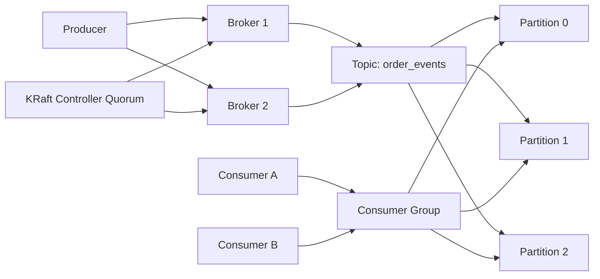
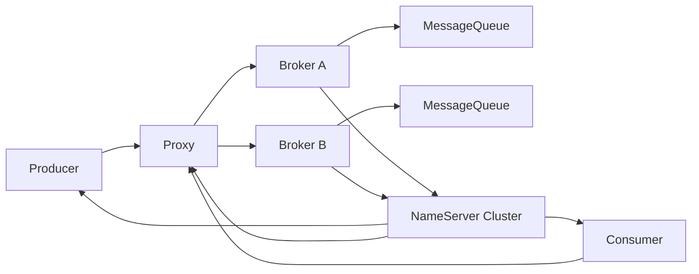
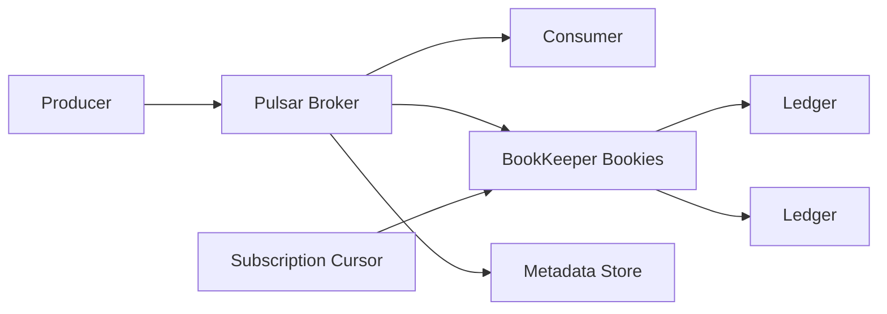

# Kafka、RocketMQ 与 Pulsar：功能、架构设计与核心实现原理

> 目标读者：已经了解后端开发或分布式系统基础，但希望系统理解 Kafka、RocketMQ、Pulsar 的初学者。
> 学习目标：不只是知道“它们都是消息队列”，而是理解消息系统解决什么问题，三者分别如何设计架构、如何存储消息、如何保证可靠性、如何扩展，以及工程上应该如何选型。
> 说明：本文依据 Apache Kafka、Apache RocketMQ、Apache Pulsar 官方文档、Kafka KIP 和项目源码目录做原理化整理。不同版本细节会变化，具体配置和 API 以官方最新文档为准。

---

## 目录

1. [消息系统到底解决什么问题](#1-消息系统到底解决什么问题)
2. [三类系统的一句话理解](#2-三类系统的一句话理解)
3. [通用概念：Topic、Partition、Queue、Offset、Ack](#3-通用概念topicpartitionqueueoffsetack)
4. [消息系统的核心设计维度](#4-消息系统的核心设计维度)
5. [Kafka：以分区日志为核心的事件流平台](#5-kafka以分区日志为核心的事件流平台)
6. [Kafka 的架构设计](#6-kafka-的架构设计)
7. [Kafka 的核心实现原理](#7-kafka-的核心实现原理)
8. [RocketMQ：面向业务消息的高可靠消息平台](#8-rocketmq面向业务消息的高可靠消息平台)
9. [RocketMQ 的架构设计](#9-rocketmq-的架构设计)
10. [RocketMQ 的核心实现原理](#10-rocketmq-的核心实现原理)
11. [Pulsar：存储计算分离的云原生消息与流平台](#11-pulsar存储计算分离的云原生消息与流平台)
12. [Pulsar 的架构设计](#12-pulsar-的架构设计)
13. [Pulsar 的核心实现原理](#13-pulsar-的核心实现原理)
14. [三者横向对比](#14-三者横向对比)
15. [典型场景如何选型](#15-典型场景如何选型)
16. [从一个订单系统理解三者差异](#16-从一个订单系统理解三者差异)
17. [初学者学习路线](#17-初学者学习路线)
18. [设计面试与工程自检问题](#18-设计面试与工程自检问题)
19. [官方资料](#19-官方资料)

---

## 1. 消息系统到底解决什么问题

消息系统的本质不是“存一段文本”，而是在分布式系统里提供一种可靠的中间层：

```text
生产者 -> 消息系统 -> 消费者
```

它让上游和下游不必直接同步调用。

没有消息系统时，常见调用方式是：

```text
订单服务 -> 库存服务
订单服务 -> 支付服务
订单服务 -> 物流服务
订单服务 -> 积分服务
```

这种方式有几个问题：

- 下游慢，上游也慢。
- 下游挂了，上游也容易失败。
- 流量高峰会直接打爆下游。
- 新增一个下游系统，上游要改代码。
- 失败重试、顺序、幂等、追踪都容易混乱。

加入消息系统后，调用方式变成：

```text
订单服务 -> 订单消息 Topic -> 库存服务
                         -> 支付服务
                         -> 物流服务
                         -> 积分服务
```

消息系统主要解决五类问题：

| 问题 | 消息系统的作用 |
| --- | --- |
| 服务解耦 | 上游只发消息，不直接依赖每个下游 |
| 异步处理 | 上游快速返回，下游稍后处理 |
| 削峰填谷 | 高峰流量先进入队列，消费者按能力处理 |
| 广播分发 | 一个事件可以被多个消费方独立订阅 |
| 可恢复处理 | 消费失败后可以重试、回放或进入死信队列 |

### 1.1 队列和事件流的区别

很多初学者会把 Kafka、RocketMQ、Pulsar 都叫“消息队列”。这个说法不完全错，但容易掩盖差异。

更准确地说：

- 消息队列更强调任务分发和异步消费。
- 发布订阅更强调一个 Topic 被多个订阅方独立消费。
- 事件流更强调消息作为持续追加的事件日志，可以保留、回放、分析。

三者都支持发布订阅和异步通信，但设计重心不同。

```text
传统队列思维：消息被消费后就算完成。
事件流思维：消息是可保留、可回放、可被多个系统独立读取的事实记录。
```

Kafka 更偏事件流。

RocketMQ 更偏业务消息。

Pulsar 同时强调消息、流、多租户和存储计算分离。

## 2. 三类系统的一句话理解

| 系统 | 一句话理解 |
| --- | --- |
| Kafka | 把 Topic 分成多个有序追加日志，用分区并行和顺序磁盘写实现高吞吐事件流 |
| RocketMQ | 围绕业务消息场景提供普通、顺序、事务、延迟、过滤、重试等强消息语义 |
| Pulsar | 用无状态 Broker 加 BookKeeper 持久日志实现存储计算分离、多租户和多订阅模型 |

更形象地说：

```text
Kafka 像一套高吞吐事件日志系统。
RocketMQ 像一套为复杂业务流程准备的可靠消息中间件。
Pulsar 像一套云原生、多租户、存储计算分离的消息与流平台。
```

### 2.1 不要只按“性能”理解三者

选型时只问“谁最快”通常是不成熟的。

更关键的问题是：

- 你的业务是日志采集、事件流、业务交易，还是多租户平台？
- 你需要严格顺序、延迟消息、事务消息、消息过滤吗？
- 你需要保留多久，是否要反复回放？
- 你是否需要跨地域复制？
- 运维团队更熟悉哪套生态？
- 下游消费失败时希望如何重试？
- Topic 数量是几十个、几千个，还是可能上百万？

消息系统不是单点工具，而是业务链路的基础设施。

## 3. 通用概念：Topic、Partition、Queue、Offset、Ack

先理解通用概念，再学习三个系统会轻松很多。

### 3.1 Message：消息

Message 是传输的最小数据单位。

通常包含：

- payload：业务数据。
- key：用于分区、顺序或压缩。
- headers/properties：元数据。
- timestamp：时间戳。
- message id 或 offset：定位信息。

例如：

```json
{
  "event": "OrderCreated",
  "order_id": "O202606260001",
  "user_id": "U10086",
  "amount": 199.00
}
```

消息系统只负责可靠传递和存储，业务语义仍然要由应用定义。

### 3.2 Topic：主题

Topic 是消息的逻辑分类。

例如：

```text
order_created
payment_success
inventory_changed
user_registered
```

设计 Topic 时要避免两个极端：

- 太粗：所有业务都塞到 `events`，下游过滤复杂。
- 太细：每个小动作一个 Topic，管理和运维成本高。

好的 Topic 通常表示一类稳定业务事实。

### 3.3 Partition / MessageQueue：并行与顺序的基本单位

Kafka 使用 Partition。

RocketMQ 使用 MessageQueue。

Pulsar 支持 non-partitioned topic 和 partitioned topic。

它们解决的问题类似：

```text
一个 Topic 的流量太大，单个队列或日志扛不住，于是拆成多个独立顺序流。
```

核心规律：

```text
分区或队列越多，并行度越高，但顺序、调度和运维复杂度也越高。
```

通常只能保证单个 Partition 或单个 Queue 内有序，不能天然保证整个 Topic 全局有序。

### 3.4 Producer：生产者

Producer 负责发送消息。

它通常要处理：

- 选择 Topic。
- 选择分区或队列。
- 序列化消息。
- 批量发送。
- 压缩。
- 重试。
- 幂等。
- 发送确认。

生产者不是简单调用 `send()` 就结束。生产者配置会直接影响可靠性、延迟和吞吐。

### 3.5 Consumer：消费者

Consumer 负责接收和处理消息。

它通常要处理：

- 订阅 Topic。
- 拉取或接收消息。
- 反序列化。
- 执行业务逻辑。
- 提交消费进度。
- 失败重试。
- 幂等处理。
- 死信消息。

消费者逻辑比生产者更容易出错，因为它真正修改业务状态。

### 3.6 Consumer Group / Subscription：消费身份

多个消费者组成一个消费组，可以共同消费同一份消息。

同一个 Topic 可以被多个消费组独立消费。

例如：

```text
Topic: order_created

Consumer Group A: inventory-service
Consumer Group B: coupon-service
Consumer Group C: analytics-service
```

三个消费组都能看到订单创建事件，但各自的消费进度独立。

Pulsar 中类似概念叫 Subscription，而且提供多种订阅类型。

### 3.7 Offset / Cursor：消费进度

Offset 或 Cursor 表示消费到了哪里。

可以理解为：

```text
这条消息流里，我已经处理到第几个位置。
```

Kafka 使用 offset 描述分区内位置。

RocketMQ 记录 consumer offset。

Pulsar 使用 cursor 描述 subscription 的消费位置。

消费进度是可靠性的关键。

如果业务处理成功但进度没提交，可能重复消费。

如果进度先提交但业务处理失败，可能丢消息。

所以工程上常见原则是：

```text
先完成业务处理，再提交消费进度。
业务处理必须支持幂等。
```

### 3.8 Ack：确认

Ack 是消费者告诉消息系统：

```text
这条消息我处理完成了。
```

不同系统的 Ack 模型不同：

- Kafka 更偏消费者主动提交 offset。
- RocketMQ 支持消费成功、失败重试、死信等业务消息语义。
- Pulsar 有 individual ack、cumulative ack、negative ack、ack timeout 等机制。

## 4. 消息系统的核心设计维度

理解 Kafka、RocketMQ、Pulsar，不能只看 API，要看设计取舍。

### 4.1 吞吐与延迟

高吞吐通常依赖：

- 批量发送。
- 顺序写磁盘。
- 零拷贝或减少拷贝。
- 压缩。
- 分区并行。
- 网络批处理。
- 操作系统 page cache。

低延迟通常要求：

- 更小批次。
- 更快刷盘。
- 更少网络跳数。
- 更短排队时间。
- 更快调度。

吞吐和延迟经常互相牵制。

```text
批量越大，吞吐越好，但单条消息等待时间可能更长。
刷盘越严格，可靠性越强，但写入延迟可能更高。
```

### 4.2 可靠性

可靠性主要看：

- 消息是否持久化。
- 是否有副本。
- 副本写入确认策略。
- Broker 宕机后能否恢复。
- 消费失败能否重试。
- 消费进度是否可靠保存。

不要笼统说“消息不丢”。要具体问：

```text
生产者收到成功前，消息写到了哪里？
写了几个副本？
刷盘了吗？
消费者处理失败后，消息会怎样？
消费进度什么时候提交？
```

### 4.3 顺序性

顺序性一般分三层：

| 顺序级别 | 含义 | 成本 |
| --- | --- | --- |
| 单消息无序 | 只要求可靠传递 | 成本低 |
| 分区/队列内有序 | 同一个 key 进入同一分区或队列 | 常见选择 |
| 全局有序 | 整个 Topic 只有一个顺序 | 并行能力弱 |

大多数系统选择分区内有序，而不是全局有序。

### 4.4 消费语义

常见语义：

| 语义 | 含义 | 常见代价 |
| --- | --- | --- |
| At most once | 最多一次，可能丢 | 简单但风险高 |
| At least once | 至少一次，可能重复 | 最常用，需要幂等 |
| Exactly once | 精确一次效果 | 条件严格，成本更高 |

工程上最常见的是：

```text
消息系统提供 at-least-once，业务系统通过幂等实现最终正确。
```

### 4.5 存储模型

消息系统的存储模型大致有三类思路：

- 每个分区一条日志。
- 全局日志加队列索引。
- Broker 负责路由，独立存储层负责持久化日志。

Kafka 更接近第一类。

RocketMQ 经典 Broker 存储更接近第二类。

Pulsar 更接近第三类。

## 5. Kafka：以分区日志为核心的事件流平台

Kafka 的核心抽象是：

```text
Topic = 多个 Partition
Partition = 有序追加日志
Message = 日志中的一条 Record
Offset = Record 在 Partition 内的位置
```

Kafka 适合把业务事件、日志、指标、CDC 数据作为持续事件流进行收集、存储、分发和处理。

### 5.1 Kafka 的主要功能

Kafka 常用于：

- 日志采集。
- 用户行为事件流。
- 数据管道。
- CDC 数据同步。
- 实时指标。
- 事件驱动架构。
- 流处理。
- 事件溯源。

生态上，Kafka 还包括：

- Producer API。
- Consumer API。
- Admin API。
- Kafka Connect。
- Kafka Streams。
- MirrorMaker。

初学者可以先把 Kafka 看成：

```text
一个高吞吐、可持久化、可回放的分布式事件日志系统。
```

### 5.2 Kafka 最重要的思想：日志即数据结构

Kafka 的分区日志是 append-only 的。

写入时追加到末尾。

读取时从某个 offset 开始顺序读取。

这带来几个好处：

- 写入顺序化，磁盘效率高。
- offset 简单稳定。
- 消费者可以独立记录进度。
- 旧消息可以保留一段时间，便于回放。
- 多个消费组可以独立读取同一份日志。

这也是 Kafka 和传统“消费后删除”的队列不同的地方。

在 Kafka 中，消息是否删除通常由保留策略控制，而不是某个消费者是否已经消费。

## 6. Kafka 的架构设计

### 6.1 组件关系



Kafka 集群由多个 Broker 组成。

每个 Topic 被拆成多个 Partition。

每个 Partition 有一个 Leader 副本和若干 Follower 副本。

生产者写 Leader。

消费者读 Leader。

Follower 从 Leader 复制数据。

### 6.2 Broker

Broker 是 Kafka 的服务节点。

它负责：

- 接收生产者写入。
- 保存分区日志。
- 向消费者提供读取。
- 复制分区副本。
- 参与消费者组协调。
- 暴露元数据和管理能力。

一个 Broker 上可以有多个 Topic 的多个 Partition 副本。

### 6.3 Partition

Partition 是 Kafka 扩展能力的核心。

它决定：

- 写入并行度。
- 读取并行度。
- 单个消费者组最大并行度。
- 单个 key 的顺序边界。

如果一个 Topic 有 12 个 Partition，一个消费者组中最多可以有 12 个消费者并行消费这些分区。超过分区数的消费者通常会空闲。

### 6.4 Consumer Group

Kafka Consumer Group 的核心规则是：

```text
同一个消费者组内，一个 Partition 同一时刻通常只分配给一个 Consumer。
不同消费者组之间互不影响。
```

这使得 Kafka 同时支持：

- 队列模式：同一组内多个消费者分摊消息。
- 发布订阅模式：多个组独立消费同一 Topic。

### 6.5 Controller 与 KRaft

现代 Kafka 4.x 使用 KRaft 元数据仲裁来管理集群元数据，新版本已经不再把 ZooKeeper 作为核心元数据依赖。学习历史资料时仍会看到 ZooKeeper 模式，但理解新架构应以 KRaft 为主。

KRaft 的思想来自 Kafka KIP-500：

- 元数据不再由外部 ZooKeeper 作为唯一存储。
- Kafka 自己维护元数据日志。
- Controller 节点组成 Raft quorum。
- Active Controller 处理元数据变更。
- Broker 从 Controller 拉取元数据更新。

这让 Kafka 部署和元数据管理更统一。

## 7. Kafka 的核心实现原理

### 7.1 顺序写与分段日志

每个 Partition 对应一组日志段。

写入路径可以简化为：

```text
Producer Record -> Broker -> Partition Leader -> Active Log Segment -> Page Cache / Disk
```

Kafka 把随机写转换为顺序追加写。

日志段达到一定大小或时间后滚动成新段。

旧段根据 retention 或 compaction 策略清理。

### 7.2 Offset

Offset 是消息在 Partition 内的逻辑位置。

注意：

```text
Offset 只在单个 Partition 内有意义。
不同 Partition 的 offset 不能直接比较。
```

消费者提交 offset，本质是在记录：

```text
我这个消费组在这个 Partition 处理到了哪里。
```

### 7.3 Page Cache 与零拷贝

Kafka 性能高的重要原因之一是充分利用操作系统能力。

常见思路包括：

- 顺序写入让磁盘更高效。
- 依赖 page cache 缓存热数据。
- 发送文件数据时尽量减少用户态和内核态拷贝。
- 批量和压缩减少网络请求次数。

因此 Kafka 的高性能不是靠“所有数据放内存”，而是靠日志结构和操作系统 I/O 机制配合。

### 7.4 副本与 ISR

Kafka 的 Partition 有多个副本。

其中：

- Leader 处理读写。
- Follower 从 Leader 拉取数据。
- ISR 表示与 Leader 保持同步的一组副本。

生产者的 `acks` 和 Broker 的 `min.insync.replicas` 会共同影响可靠性。

常见理解：

| 配置倾向 | 含义 |
| --- | --- |
| `acks=0` | 不等 Broker 确认，吞吐高但风险大 |
| `acks=1` | Leader 写入成功就返回 |
| `acks=all` | 等待 ISR 中足够副本确认 |

可靠性强弱不能只看副本数，还要看确认策略。

### 7.5 Consumer Pull 模型

Kafka Consumer 主动拉取消息。

优点：

- 消费者可以按自身能力控制速度。
- 批量拉取容易优化吞吐。
- 消费进度由消费者管理。

代价是：

- 消费者要正确处理 offset 提交。
- 重平衡期间可能出现短暂停顿。
- 业务必须处理重复消费。

### 7.6 Exactly-once 的边界

Kafka 支持幂等 Producer 和事务能力，可以在 Kafka 到 Kafka 的流处理场景中实现精确一次效果。

但初学者必须理解：

```text
消息系统的 exactly-once 不等于你的整个业务系统天然 exactly-once。
```

如果消费者处理消息时还要写外部数据库，仍然要考虑：

- 数据库写入是否幂等。
- offset 提交是否和业务写入一致。
- 失败恢复时是否会重复执行。

工程上通常用：

- 唯一业务键。
- 去重表。
- 状态机。
- 事务 outbox。
- 幂等更新。

来保证端到端正确性。

## 8. RocketMQ：面向业务消息的高可靠消息平台

RocketMQ 的定位更贴近复杂业务消息中间件。

它不仅支持普通消息，还强调：

- 顺序消息。
- 延迟消息。
- 事务消息。
- 消息过滤。
- 消费重试。
- 死信队列。
- 消息轨迹。
- 多协议和代理层。

初学者可以先把 RocketMQ 理解为：

```text
一套围绕业务交易链路设计的高可靠消息平台。
```

### 8.1 RocketMQ 的主要功能

RocketMQ 常用于：

- 电商订单异步处理。
- 支付状态通知。
- 库存扣减。
- 交易事务最终一致性。
- 延迟关单。
- 微服务异步解耦。
- 业务消息重试。
- IoT 或多协议消息接入。

相比 Kafka，RocketMQ 在业务消息特性上更丰富。

例如，延迟消息和事务消息是 RocketMQ 很常见的使用场景。

### 8.2 RocketMQ 的概念映射

| RocketMQ 概念 | 含义 | 类比 |
| --- | --- | --- |
| Topic | 业务消息分类 | Kafka Topic |
| MessageQueue | Topic 下的存储和传输单元 | Kafka Partition |
| Producer | 发送消息的实体 | Producer |
| ConsumerGroup | 同一消费逻辑的消费者组 | Consumer Group |
| Consumer | 消费消息的实体 | Consumer |
| Subscription | 消费规则、过滤、重试和进度配置 | Subscription/消费配置 |
| MessageTag | Topic 内更细粒度分类 | 简单过滤标签 |

RocketMQ 官方领域模型强调消息生命周期：

```text
生产 -> 存储 -> 消费
```

这很适合理解业务链路。

## 9. RocketMQ 的架构设计

### 9.1 组件关系



RocketMQ 5.0 文档中，基本消息收发涉及：

- NameServer。
- Broker。
- Proxy。
- Producer。
- Consumer。

### 9.2 NameServer

NameServer 负责路由发现。

可以理解为：

```text
NameServer = RocketMQ 的轻量级服务发现和路由中心。
```

Broker 向 NameServer 注册 Topic 路由信息。

Producer 和 Consumer 通过 NameServer 获取路由，再访问 Broker 或 Proxy。

### 9.3 Broker

Broker 负责消息存储和投递。

它承担：

- 接收消息。
- 持久化消息。
- 维护队列索引。
- 管理消费进度。
- 处理重试和死信。
- 与主从副本同步。

Broker 是 RocketMQ 的核心数据节点。

### 9.4 Proxy

RocketMQ 5.0 引入或强化 Proxy 作为接入层。

Proxy 可以和 Broker 同进程部署，也可以单独部署。

部署模式包括：

- Local mode：Broker 和 Proxy 在同一进程。
- Cluster mode：Broker 和 Proxy 分开部署。

Proxy 的价值在于：

- 简化多语言 SDK 接入。
- 提供更统一的访问层。
- 让接入层和存储层可以独立扩展。

### 9.5 MessageQueue

MessageQueue 是 RocketMQ 中 Topic 的存储和消费并行单位。

一个 Topic 可以有多个 MessageQueue。

顺序消息通常要求同一业务 key 进入同一个 MessageQueue。

## 10. RocketMQ 的核心实现原理

### 10.1 CommitLog、ConsumeQueue、IndexFile

RocketMQ 经典 Broker 存储可以简化理解为三层：

```text
CommitLog   : 保存完整消息内容的顺序追加日志
ConsumeQueue: 按 Topic + Queue 建立的逻辑消费索引
IndexFile   : 按消息 key 建立的查询索引
```

写入时，消息先顺序追加到 CommitLog。

然后 Broker 根据 Topic 和 Queue 生成 ConsumeQueue 索引。

消费者读取时，先通过 ConsumeQueue 找到 CommitLog 中的物理位置，再读取消息内容。

这种设计的好处是：

- 写入可以集中顺序追加。
- 消费可以按 Topic 和 Queue 快速定位。
- 消息 key 查询可以走索引。
- 存储和消费视图分离。

可以把它和 Kafka 做一个对比：

```text
Kafka：每个 Partition 自己就是主要日志。
RocketMQ：全局 CommitLog 保存消息，ConsumeQueue 提供按队列消费的逻辑视图。
```

### 10.2 MappedFile 与顺序写

RocketMQ Broker 存储实现中可以看到 `CommitLog`、`ConsumeQueue`、`MappedFileQueue` 等核心类。

这反映了它和 Kafka 一样重视：

- 顺序追加。
- 文件分段。
- 内存映射。
- 异步刷盘或同步刷盘。
- 后台清理。

高性能消息系统很少依赖复杂随机写。它们通常会把写入组织成顺序追加，再用索引解决读取定位问题。

### 10.3 刷盘策略

RocketMQ 常见刷盘策略包括：

- 异步刷盘：性能更好，极端故障下可能损失少量已返回或未刷盘数据。
- 同步刷盘：可靠性更高，写入延迟更大。

刷盘策略不能脱离副本策略讨论。

一个严谨的问题应该是：

```text
消息返回成功时，写到了主节点内存、主节点磁盘、从节点内存，还是从节点磁盘？
```

### 10.4 主从复制与高可用

RocketMQ 支持多种部署和复制方式。

常见模式包括：

- 多 Master 无 Slave。
- 多 Master 多 Slave 异步复制。
- 多 Master 多 Slave 同步双写。
- 基于 DLedger/Raft 的高可用方案。

取舍很清楚：

```text
同步复制可靠性更强，但延迟更高。
异步复制性能更好，但极端故障下可能丢少量消息。
```

### 10.5 事务消息

RocketMQ 事务消息常用于解决：

```text
本地数据库事务和消息发送如何保持最终一致？
```

典型流程可以理解为：

```text
发送半消息 -> 执行本地事务 -> 提交或回滚消息
```

如果 Producer 在本地事务后崩溃，Broker 可以通过事务检查机制回查 Producer，判断应该提交还是回滚。

这不是传统数据库的全局强一致分布式事务，而是一种面向消息场景的最终一致性方案。

### 10.6 延迟消息

RocketMQ 支持延迟或定时消息，适合：

- 订单 30 分钟未支付自动关闭。
- 几分钟后重试。
- 定时触发业务补偿。

延迟消息的关键是：

```text
消息先进入时间调度结构，到达时间后再投递给真正消费者。
```

这类能力在业务消息系统里非常常见。

### 10.7 消息过滤

RocketMQ 支持基于 Tag 等方式做消息过滤。

作用是：

```text
同一个 Topic 下，不同消费者只接收自己关心的细分类消息。
```

但不要滥用过滤。

如果两类消息生命周期、权限、保留策略、消费方完全不同，拆成不同 Topic 可能更清楚。

## 11. Pulsar：存储计算分离的云原生消息与流平台

Pulsar 的核心特点是：

```text
Broker 负责接入和调度，BookKeeper 负责持久化存储。
```

它不是简单把消息存到 Broker 本地磁盘，而是将消息持久化到 BookKeeper bookies。

因此 Pulsar 很适合讨论：

- 存储计算分离。
- 多租户。
- 多订阅模型。
- 跨集群复制。
- 大量 Topic。
- 分层存储。

初学者可以先把 Pulsar 理解为：

```text
一套用无状态 Broker 加分布式日志存储构建的云原生消息与流平台。
```

## 12. Pulsar 的架构设计

### 12.1 组件关系



Pulsar 集群主要包括：

- Broker。
- BookKeeper bookies。
- Metadata store。
- Producer。
- Consumer。
- 可选 Proxy。

### 12.2 Broker

Pulsar Broker 是相对无状态的接入和调度层。

它负责：

- 接收 Producer 消息。
- 将消息写入 BookKeeper。
- 向 Consumer 派发消息。
- 处理 topic lookup。
- 管理 dispatcher。
- 与 metadata store 协调。
- 维护缓存和复制任务。

Broker 不把本地磁盘作为主要持久消息存储。

这让 Broker 扩缩容和故障迁移更灵活。

### 12.3 BookKeeper

BookKeeper 是 Pulsar 的持久化日志存储层。

它由多个 bookie 组成。

消息会写入 ledger。

ledger 是 append-only 的日志结构。

Pulsar 通过 BookKeeper 获得：

- 持久化。
- 多副本。
- 顺序写。
- 读一致性。
- 横向扩展存储容量和吞吐。

### 12.4 Metadata Store

Metadata store 保存元数据和协调信息。

Pulsar 4.2.x 文档中提到支持多种元数据后端，例如 ZooKeeper、etcd、RocksDB、Oxia 等。

它保存：

- Topic 元数据。
- Namespace 配置。
- Schema 信息。
- Broker 负载信息。
- Ownership 信息。
- BookKeeper ledger 元数据。

### 12.5 Tenant、Namespace、Topic

Pulsar 的多租户模型是重要特征。

层级是：

```text
Tenant -> Namespace -> Topic
```

例如：

```text
persistent://finance/payment/order_events
```

其中：

- `finance` 是 tenant。
- `payment` 是 namespace。
- `order_events` 是 topic。

Namespace 可以承载策略：

- 保留策略。
- 复制策略。
- 权限。
- 限流。
- Schema。

这让 Pulsar 更适合多团队、多业务、多租户平台。

### 12.6 Subscription 类型

Pulsar 提供多种订阅类型：

| 类型 | 含义 | 适用场景 |
| --- | --- | --- |
| Exclusive | 一个 subscription 只能有一个 consumer | 强顺序、简单消费 |
| Failover | 多个 consumer 主备，主失败后切换 | 高可用顺序消费 |
| Shared | 多个 consumer 共享消费消息 | 任务队列、高并发 |
| Key_Shared | 同 key 有序，不同 key 并行 | 按业务 key 保序 |

这比 Kafka 的传统 Consumer Group 模型更灵活。

## 13. Pulsar 的核心实现原理

### 13.1 Managed Ledger

Pulsar 在 BookKeeper ledger 上构建 Managed Ledger。

可以理解为：

```text
Managed Ledger = 单个 Topic 的消息流抽象
```

一个 Managed Ledger 内部会使用多个 BookKeeper ledger。

这么做的原因包括：

- ledger 关闭后不能继续写，需要创建新 ledger。
- 已被所有 cursor 消费的旧 ledger 可以删除。
- 可以滚动、清理、恢复。

### 13.2 Cursor

Cursor 是 subscription 的消费位置。

一个 Topic 可以有多个 subscription。

每个 subscription 有自己的 cursor。

这意味着：

```text
同一个 Topic 的消息可以被多个订阅方以不同速度独立消费。
```

Kafka 用消费组 offset 实现类似能力。

Pulsar 把 cursor 作为存储层的一等对象，由 BookKeeper 持久保存。

### 13.3 Ack 与重投递

Pulsar Ack 模型比较细。

常见机制：

- individual acknowledgment：逐条确认。
- cumulative acknowledgment：累计确认到某个位置。
- negative acknowledgment：明确告诉 Broker 重新投递。
- acknowledgment timeout：超时未确认后重投递。
- retry topic 和 dead letter topic：失败消息进入重试或死信流程。

这让 Pulsar 很适合构建复杂消费模型。

### 13.4 分层存储

Pulsar 支持 Tiered Storage。

思想是：

```text
热数据留在 BookKeeper，冷数据卸载到对象存储或长期存储。
```

这样可以降低长期保留成本。

对于需要长时间保留、回放、审计的业务，这是一个重要能力。

### 13.5 Geo-replication

Pulsar 原生强调多集群和跨地域复制。

典型场景：

- 多地域容灾。
- 全球业务接入。
- 本地写入、跨区同步。
- 多数据中心消费。

Kafka 也可以通过 MirrorMaker 或其它复制方案实现跨集群复制，但 Pulsar 在模型层更早把 multi-cluster 和 geo-replication 放进设计重点。

## 14. 三者横向对比

### 14.1 总体定位

| 维度 | Kafka | RocketMQ | Pulsar |
| --- | --- | --- | --- |
| 主要定位 | 事件流平台 | 业务消息平台 | 云原生消息与流平台 |
| 核心抽象 | Partition log | Topic + MessageQueue + CommitLog | Topic + Subscription + Managed Ledger |
| 存储模型 | Broker 本地分区日志 | Broker CommitLog + ConsumeQueue | Broker 无状态接入，BookKeeper 持久化 |
| 强项 | 高吞吐、生态、回放、流处理 | 事务、延迟、过滤、业务重试 | 多租户、订阅模型、存储计算分离、geo-rep |
| 学习难点 | 分区、offset、ISR、rebalance | 事务消息、延迟、存储索引、主从 | BookKeeper、cursor、多订阅、namespace |

### 14.2 存储结构对比

```text
Kafka:
Topic -> Partition -> Segment files

RocketMQ:
Topic -> MessageQueue -> ConsumeQueue index -> CommitLog

Pulsar:
Topic -> Managed Ledger -> BookKeeper Ledgers -> Bookies
Subscription -> Cursor
```

### 14.3 顺序性对比

| 系统 | 常见顺序边界 |
| --- | --- |
| Kafka | Partition 内有序 |
| RocketMQ | MessageQueue 内有序，顺序消息按队列保序 |
| Pulsar | 单 topic 或 partition 内顺序，Key_Shared 可按 key 保序 |

全局顺序通常意味着牺牲并行度。

### 14.4 消费模型对比

| 系统 | 消费模型 |
| --- | --- |
| Kafka | Consumer Group 分配 Partition，消费者提交 offset |
| RocketMQ | ConsumerGroup 订阅 Topic，支持 Push/Simple/Pull 等消费方式 |
| Pulsar | Subscription 抽象更强，支持 Exclusive、Failover、Shared、Key_Shared |

### 14.5 可靠性机制对比

| 系统 | 可靠性核心 |
| --- | --- |
| Kafka | 副本、ISR、高水位、acks、事务与幂等 Producer |
| RocketMQ | 刷盘策略、主从复制、DLedger/Raft、重试、死信、事务检查 |
| Pulsar | BookKeeper 多副本 ledger、cursor 持久化、ack/redelivery、metadata store |

### 14.6 运维复杂度对比

| 系统 | 运维关注点 |
| --- | --- |
| Kafka | Partition 规划、磁盘、broker 均衡、KRaft、consumer lag |
| RocketMQ | NameServer、Broker、Proxy、主从、刷盘、消息堆积、重试死信 |
| Pulsar | Broker、BookKeeper、metadata store、namespace、ledger、bookie 容量 |

Pulsar 架构更分层，能力强，但组件也更多。

Kafka 架构相对直接，生态成熟，但分区规划很关键。

RocketMQ 对业务消息友好，但要理解它的消息类型和 Broker 存储机制。

## 15. 典型场景如何选型

### 15.1 更适合 Kafka 的场景

选择 Kafka 的常见理由：

- 数据管道和日志采集。
- CDC 和数据湖写入。
- 实时指标和行为事件。
- 需要成熟生态。
- 需要 Kafka Streams 或 Connect。
- 需要大量下游回放同一事件流。
- 团队已经有 Kafka 运维经验。

典型例子：

```text
用户行为日志 -> Kafka -> Flink/Spark -> 数仓/实时画像
```

### 15.2 更适合 RocketMQ 的场景

选择 RocketMQ 的常见理由：

- 电商交易链路。
- 订单、支付、库存等业务消息。
- 需要事务消息。
- 需要延迟或定时消息。
- 需要 Tag 或 SQL 风格过滤。
- 需要业务友好的重试和死信机制。
- 团队更关注可靠业务投递而不是流处理生态。

典型例子：

```text
订单创建 -> RocketMQ 事务消息 -> 库存扣减 / 优惠券 / 物流 / 积分
```

### 15.3 更适合 Pulsar 的场景

选择 Pulsar 的常见理由：

- 多租户平台。
- 大量 Topic。
- 需要存储计算分离。
- 需要多种订阅模型。
- 需要跨地域复制。
- 需要长期保留和分层存储。
- 需要同一平台同时支持队列和流。

典型例子：

```text
多业务线事件接入 -> Pulsar tenant/namespace 隔离 -> 多订阅消费 -> 跨地域复制
```

### 15.4 不要脱离团队能力选型

一个系统是否适合，不只取决于功能。

还取决于：

- 团队是否会运维。
- 监控告警是否成熟。
- 故障恢复是否演练过。
- 客户端生态是否满足语言栈。
- 公司已有基础设施是否兼容。
- 业务是否真的需要高级特性。

复杂能力不是免费的。

## 16. 从一个订单系统理解三者差异

假设订单服务需要发布订单创建事件：

```text
OrderCreated(order_id, user_id, amount, created_at)
```

下游有：

- 库存服务。
- 支付风控。
- 积分服务。
- 数据分析。
- 30 分钟未支付自动关单。

### 16.1 用 Kafka 设计

可能设计：

```text
Topic: order_events
Partitions: 按 order_id hash
Consumer Groups:
- inventory-service
- risk-service
- points-service
- analytics-service
```

优点：

- 事件可长期保留和回放。
- 数据分析和流处理很自然。
- 多个消费组互不影响。
- 高吞吐适合大量事件。

注意：

- 延迟关单通常需要额外调度系统或应用逻辑。
- 同一个订单的事件要按同一 key 进入同一 Partition。
- 消费者写数据库要做幂等。

### 16.2 用 RocketMQ 设计

可能设计：

```text
Topic: order_event
Tags:
- created
- paid
- cancelled

事务消息:
- 订单本地事务和 OrderCreated 消息保持最终一致

延迟消息:
- 30 分钟后检查订单是否支付
```

优点：

- 事务消息适合订单创建。
- 延迟消息适合超时关单。
- Tag 过滤适合业务消息分类。
- 重试和死信更贴近业务处理。

注意：

- 需要理解半消息和事务回查。
- 顺序消息要谨慎设计 MessageQueue 选择。
- 不要把所有业务都塞进一个 Topic 后只靠 Tag 过滤。

### 16.3 用 Pulsar 设计

可能设计：

```text
Tenant: ecommerce
Namespace: order
Topic: persistent://ecommerce/order/order_events

Subscriptions:
- inventory-sub: Key_Shared
- risk-sub: Shared
- analytics-sub: Shared
- audit-sub: Failover
```

优点：

- 多租户和 namespace 策略清晰。
- Key_Shared 可以按 order_id 保序同时并行。
- Cursor 让多个 subscription 独立消费。
- 可以配合 geo-replication 和 tiered storage。

注意：

- 组件更多，运维复杂度更高。
- 要理解 Broker、BookKeeper、metadata store 的职责边界。
- 延迟、重试、死信等机制要和订阅模型一起设计。

## 17. 初学者学习路线

### 17.1 第一阶段：先学通用模型

先掌握：

- Producer。
- Consumer。
- Topic。
- Partition/Queue。
- Consumer Group/Subscription。
- Offset/Cursor。
- Ack。
- Retention。
- Retry。
- DLQ。

能够画出：

```text
Producer -> Topic -> Partition/Queue -> Consumer Group -> Offset/Ack
```

再进入具体系统。

### 17.2 第二阶段：分别抓住核心数据结构

学习 Kafka 时记住：

```text
Partition log 是中心。
```

学习 RocketMQ 时记住：

```text
CommitLog 保存消息，ConsumeQueue 组织消费。
```

学习 Pulsar 时记住：

```text
Broker 负责服务，BookKeeper 负责持久日志，Cursor 记录订阅进度。
```

### 17.3 第三阶段：用失败场景倒推机制

不要只看正常流程。

要问：

```text
Producer 发送后立刻崩溃会怎样？
Broker 写入后没刷盘会怎样？
Leader 宕机会怎样？
Consumer 处理完但没提交进度会怎样？
Consumer 提交进度后业务写库失败会怎样？
消息重复投递会怎样？
消息积压会怎样？
```

能回答这些问题，才算真正理解消息系统。

### 17.4 第四阶段：做小实验

建议每个系统至少做：

1. 创建 Topic。
2. 发送消息。
3. 多消费者组消费。
4. 暂停消费者制造积压。
5. 重启 Broker。
6. 模拟消费失败。
7. 观察 offset、lag、重试和死信。

纸面理解必须通过实验校验。

### 17.5 第五阶段：读源码或设计文档

读源码时不要从入口随便跳。

按问题读：

```text
消息写入到哪里？
索引如何建立？
消费位置如何保存？
副本如何同步？
失败如何恢复？
过期消息如何清理？
```

这样源码不会变成迷宫。

## 18. 设计面试与工程自检问题

### 18.1 基础问题

```text
Topic 和 Partition 的关系是什么？
为什么大多数系统只能保证分区内顺序？
消费者组解决什么问题？
Offset 和 Ack 的区别是什么？
为什么消息系统通常要求消费者幂等？
```

### 18.2 Kafka 问题

```text
Kafka 为什么使用 append-only log？
Partition 数量过多有什么问题？
ISR 是什么？
acks=all 是否一定不丢消息？
Consumer rebalance 为什么可能影响消费？
KRaft 解决了 ZooKeeper 模式的什么问题？
```

### 18.3 RocketMQ 问题

```text
CommitLog 和 ConsumeQueue 分别解决什么问题？
事务消息为什么需要半消息和回查？
延迟消息适合什么场景？
Tag 过滤和拆 Topic 应如何选择？
同步刷盘和异步刷盘如何取舍？
```

### 18.4 Pulsar 问题

```text
为什么说 Pulsar Broker 相对无状态？
BookKeeper ledger 和 Managed Ledger 是什么关系？
Cursor 为什么适合多 subscription？
Exclusive、Shared、Failover、Key_Shared 有什么区别？
存储计算分离带来什么好处和复杂度？
```

### 18.5 工程自检清单

上线消息系统前，至少回答：

```text
消息是否允许重复？
业务是否幂等？
消息最大体积是多少？
Topic 如何命名？
Partition 或 Queue 数量如何确定？
保留时间多长？
失败重试几次？
死信消息谁处理？
积压如何告警？
消费者扩容是否会影响顺序？
Broker 宕机如何恢复？
跨机房或跨地域是否需要复制？
安全认证和权限如何控制？
```

## 19. 官方资料

建议优先阅读官方资料：

- [Apache Kafka Documentation](https://kafka.apache.org/documentation/)
- [Apache Kafka 4.3.0 Release Announcement](https://kafka.apache.org/blog/2026/05/22/apache-kafka-4.3.0-release-announcement/)
- [Kafka KIP-500: Replace ZooKeeper with a Self-Managed Metadata Quorum](https://cwiki.apache.org/confluence/display/KAFKA/KIP-500%3A%2BReplace%2BZooKeeper%2Bwith%2Ba%2BSelf-Managed%2BMetadata%2BQuorum)
- [Apache RocketMQ Concepts](https://rocketmq.apache.org/docs/introduction/02concepts/)
- [Apache RocketMQ Domain Model](https://rocketmq.apache.org/docs/domainModel/01main/)
- [Apache RocketMQ Deployment Method](https://rocketmq.apache.org/docs/deploymentOperations/01deploy/)
- [Apache RocketMQ Store Source Directory](https://github.com/apache/rocketmq/tree/develop/store/src/main/java/org/apache/rocketmq/store)
- [Apache Pulsar Overview](https://pulsar.apache.org/docs/4.2.x/concepts-overview/)
- [Apache Pulsar Messaging](https://pulsar.apache.org/docs/4.2.x/concepts-messaging/)
- [Apache Pulsar Architecture Overview](https://pulsar.apache.org/docs/4.2.x/concepts-architecture-overview/)
- [Apache Pulsar Tiered Storage](https://pulsar.apache.org/docs/4.2.x/tiered-storage-overview/)
- [Apache Pulsar Transactions](https://pulsar.apache.org/docs/4.2.x/txn-why/)

最后用一句话收束：

```text
Kafka 的核心是分区日志。
RocketMQ 的核心是业务消息语义和 CommitLog/ConsumeQueue 存储模型。
Pulsar 的核心是无状态 Broker、BookKeeper 持久日志和多订阅 Cursor。
```
